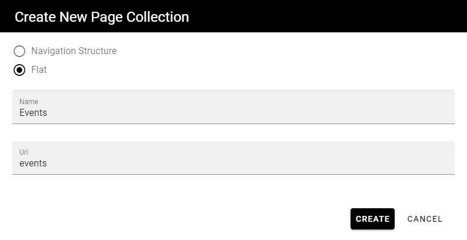
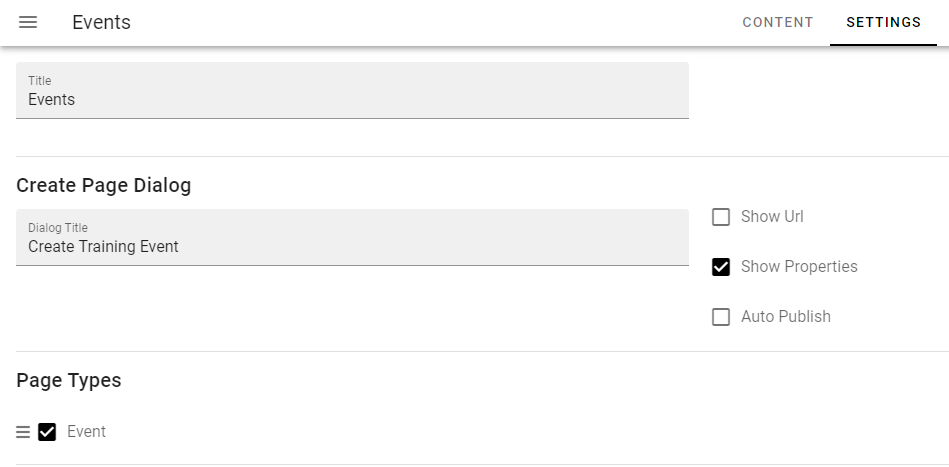
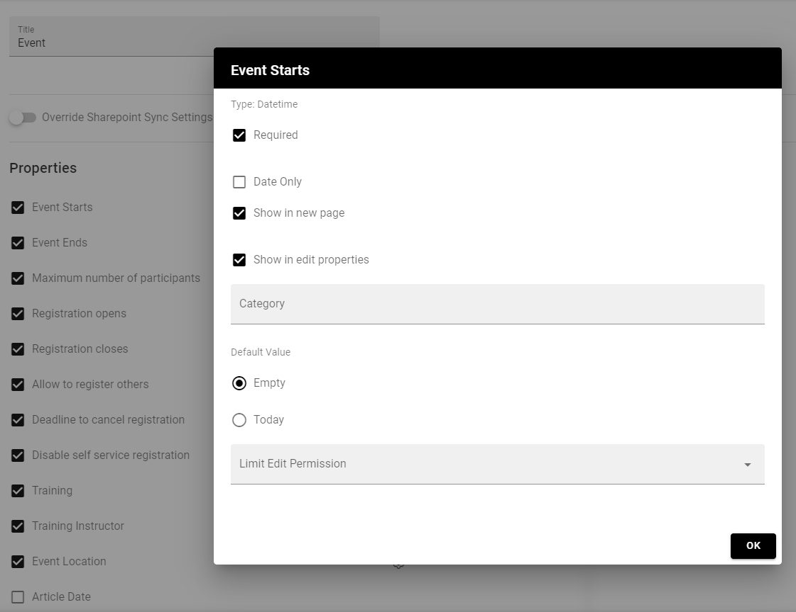
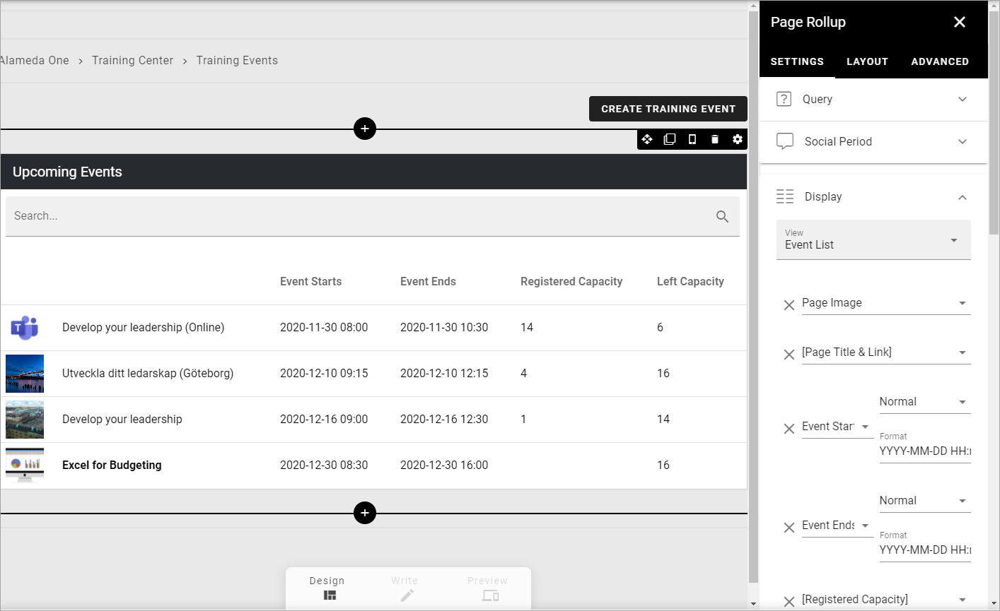
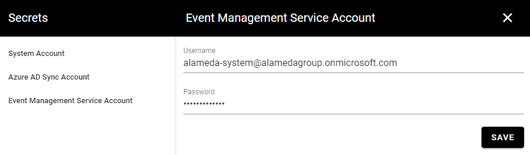
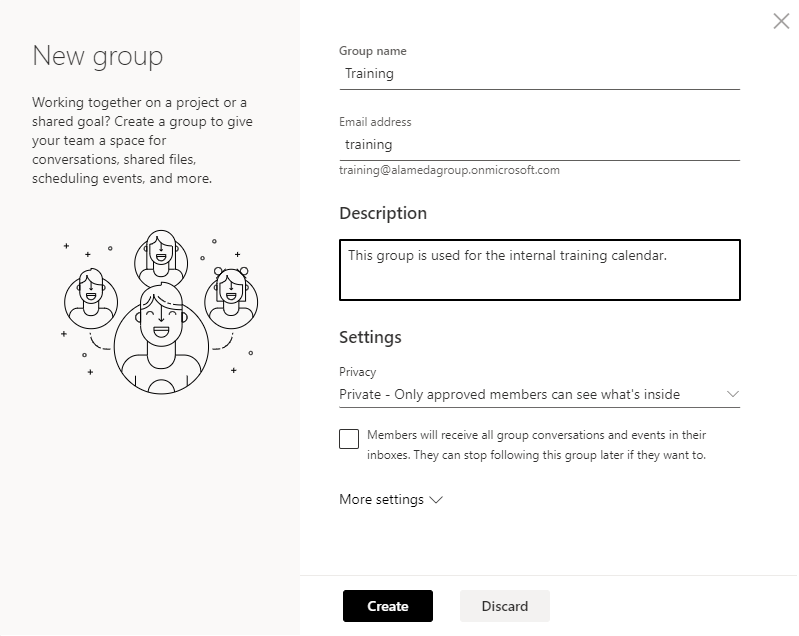
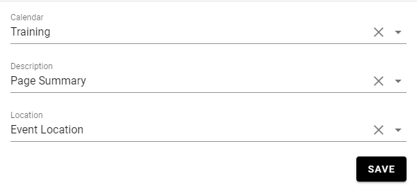

Setup Event management
===========================================

**This page is being edited. Will be finsihed soon.**

Below you will find the steps needed in order to create a basic setup of Event Management.

1. Go to Omnia Admin and activate the tenant feature "Default Enterprise Properties for Event Management".
2. Create a new Publishing App where you want events to be administrated. In this example, we create a publishing app for internal training.

.. image:: create-publishingapp-for-training.png

3. Go to the newly created Publishing App and add a new flat Page Collection for events.

4. Set the newly created Page Collection as default in the Publishing App settings.
5. Set reader and author permissions on the Page Collection.
6. Go to Omnia Admin in context of the new Publishing App and activate the app instance feature "Default Page types for Event Management".
7. Refresh the page and go to the Page Collection settings.
8. Add a Create Page Dialog title, uncheck the box "Show Url" and check the box "Show Properties".
9. Add the page type "Event".

10. Go to the page type "Event". The blocks that define an event has been added to the layout. Redesign the layout and change the block settings according to your needs.

.. image:: event-pagelayouts.png

.. image:: event-page-readmode.png

11. Configure the page type settings according to needs. Make sure to configure which properties that should be displayed in new and edit forms respectively.

12. Create some sample events in the page collection.
13. Go to the start page of the page collection and configure a page rollup for the events.

Connect to Outlook
-------------------
Follow these steps to enable integration with Outlook.

14. Go to Omnia Admin > Security > Secrets.
15. Click on Event Management Service Account and fill in an account that should be used to read/write from event calendars in Outlook.

16. Go to Outlook > People.
17. Create a new Group that can be used to host an event calendar.

18. Add the service account as a member to the new Group. (Note! If the service account doesn't have an Outlook license, you have to add the account to the group using Entra ID).

19. Go to Omnia Admin in context of the publishing app.
20. Go to the current business profile and click on Event Management > Publishing Apps.
21. Select the publishing app and page collection where your event management solution is located and map the properties.

