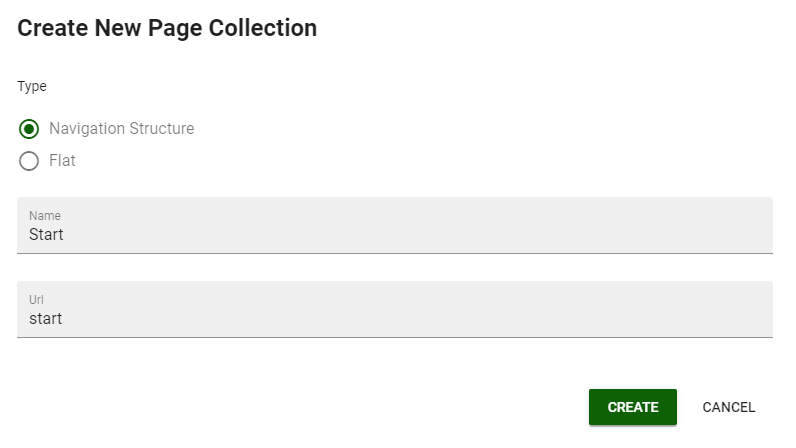
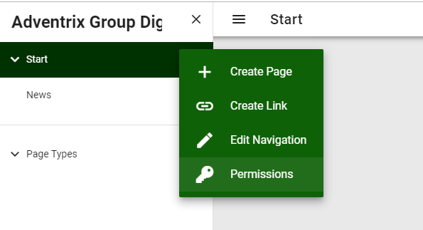
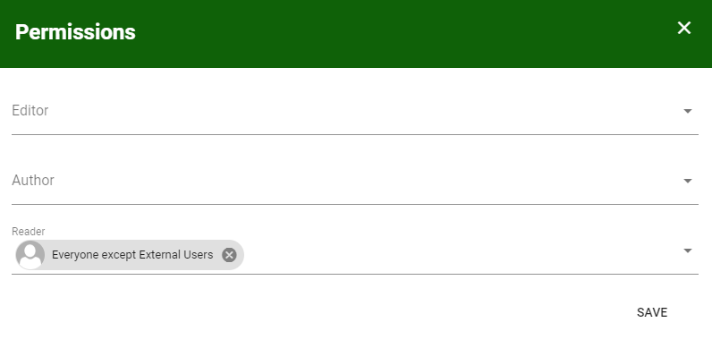
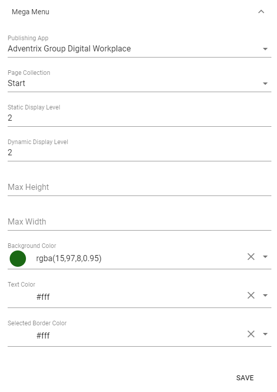

6. Page Collections
===========================================

1. Go into the Editor of the newly created Publishing App.
2. Click on "Settings" in the left-hand bottom corner.
3. Click on "+ Page Collection" to add a new page collection with navigation structure.

4. Click on the "Settings" tab of the page collection.
5. Check "Page with Navigation" and publish the start page of the page collection.
6. Add readers to the page collection using the context menu of the page collection.

7. Create an additional Page Collection for news.

.. image:: wcm-createpagecollection-flat.png

8. Click on the “Settings” tab of the page collection.
9. Check “News Article”.
10. Publish the start page of the page collection.

11. Set reader access on the news page collection.
12. Create and publish one page in each page collection with full content. (The reason for this is to create crawled properties in SharePoint Search.)
13. Go to the publishing app settings again.
14. Select a default page collection.

15. Go to Omnia Admin and settings for the current business profile.
16. Click on "Header" and configure the Mega Menu.

