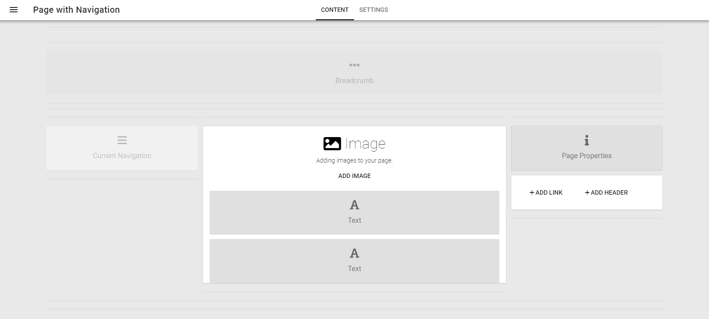

5. Page Types
===========================================

1. Browse to the newly created publishing app.
2. Open the Editor either by pressing Shift + O + E or browse via the editor navigation.

.. image:: wcm-openeditor.png

3. Create a Page Type for regular web pages: Page with Navigation.

.. image:: wcm-pagetypes-pagewithnavigation-settings.png

4. Create a Page Type for news articles: News Article.

.. image:: wcm-pagetypes-newsarticle.png

.. image:: wcm-pagetypes-newsarticle-settings.png

5. Publish the Page Type.

General information about Page Types is found here: :doc:`Page Types </pages/page-types/index>`