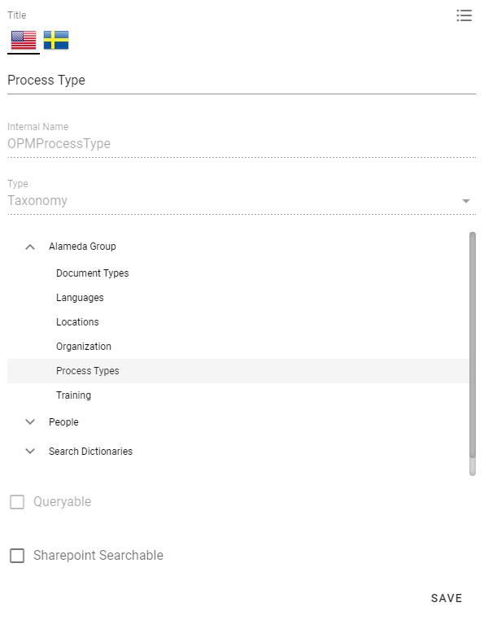
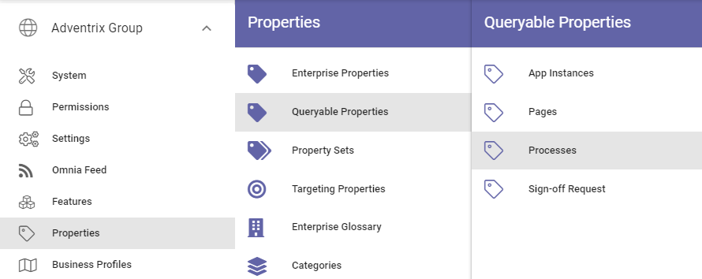
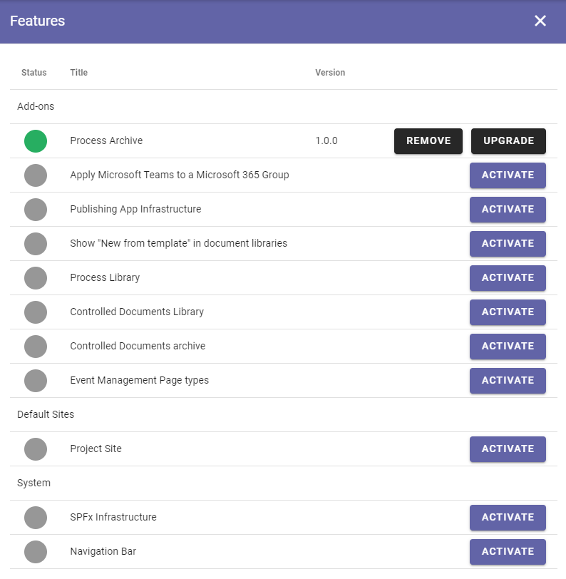
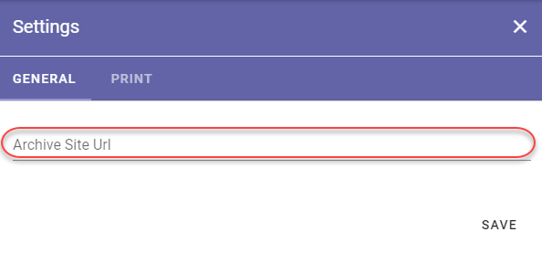
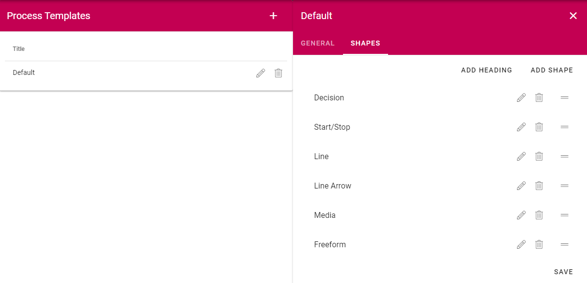
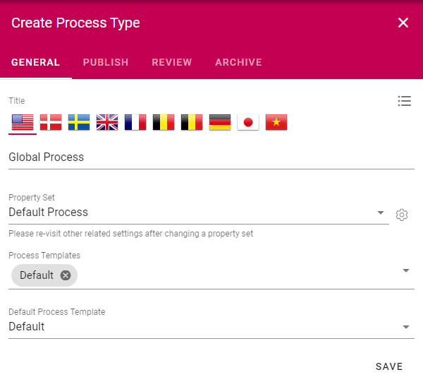
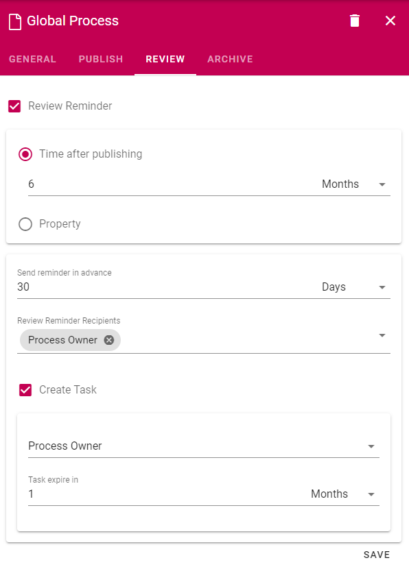
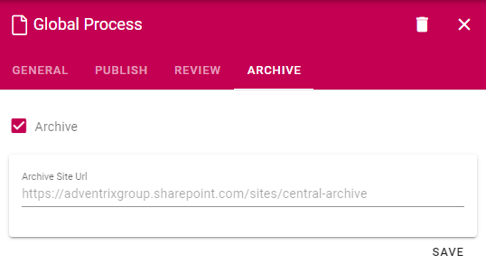

Setup Process Management
===========================================

.. note:: In order for Process Managemnet features to appear in the UI, the Process Management feature needs to be activated. Please consult with your local partner to set up these prerequisites.

Below you will find the steps needed in order to create a basic setup of Process Management.

Process Types
--------------------------------------------

1. Go to the SharePoint admin center.
2. Click on Content Services > Term store in the left-hand navigation.
3. Make sure to add the Working Languages that you would like to support in the Document Management System. Note! This is a global setting. It will affect all services dependent on the term store.

.. image:: termstore-workinglanguages.png

4. Create a new term set for Process Types.

.. image:: processtypes.png

5. Go to Omnia Admin > Properties > Enterprise Properties.
6. Find the property Process Type and click on the edit icon.
7. Connect the property to the terms set Process Types and save.

Title property
---------------
In order for the Process Picker to be able to work as expected, the property "Title" must be present in the queryable properties for Process.

.. image:: title-quey-2.png

Process Archive
-------------------------------------------

.. note:: If you have Document Management setup, you can ignore step 16 - 17.

16. Go to the Business Profile in which you want to host the process archive.
17. Go to Teamwork > Templates and create a new template that can be used for system sites.

(A Publishing Template can be used as well, but using a Teamwork Template is the more common solution).

.. image:: provisioningtemplate-system-613.png

18. Click on Teamwork > Apps and create a new site for the process archive based on the System Site template.

.. image:: create-process-archive-613.png

19. Activate the feature Process Archive on the newly created site.

20. Click on Process Management in Omnia Admin and click on Settings.
21. Add the full url to the newly created site in the Archive Site Url and save.

Process Type Templates
---------------------------------------------

22. Go to Omnia Admin > Process Management > Process Templates.
23. Create a new Process Template and add a number of shapes to the template. Make sure to include Media and Freeform if you want the process author to be able to create their own shapes when designing the process.

24. Go to Omnia Admin > Properties > Enterprise Properties. Create a new Person property for Process Owner. An example:

.. image:: setup-processowner-new.png

25. Go to Omnia Admin > Properties > Queryable Properties. Add the new Person property for Process Owner as a queryable property under Processes.

25. Go to Omnia Admin > Properties > Property Sets. Create a new Property Set that can be used for your processes. Include the new Process Owner property.

.. image:: setup-process-propertyset.png

26. Go to Omnia Admin > Process Management > Process Types.
27. Create a new Process Type.

.. image:: setup-processtype-publish.png

.. toctree::
   :titlesonly:

   processlibrary/index
   processdirectory/index

