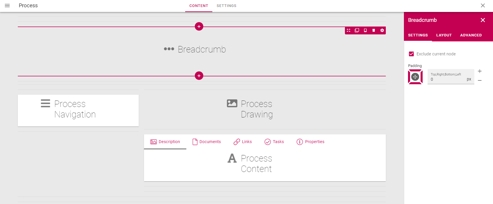

Setup Process Directory
===========================================

1. Create a new page in a publishing app where you want the Process Directory to be located.
2. Create a Page Type called Process and add all relevant process blocks to the page and the property Process. 

**Note!** Make sure to "Exclude current node" on the Breadcrumb block.

3. Create a sub page to the Process Directory page called Process based on the newly created Page Type.
4. Go to the Process Directory page and add the Process Rollup block. Set the View Page Url to the newly created process page.

.. image:: setup-processdirectory
