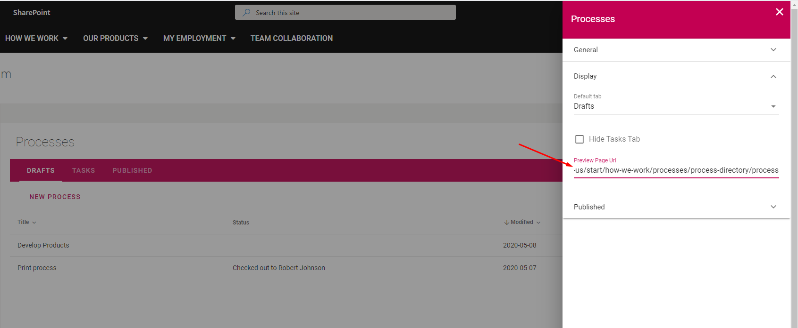

Setup a Process Library
===========================================

1. Go to Omnia Admin > Teamwork > Apps and find the site where you want to add a process library.
2. Click on the features icon and activate the Process Library feature.

.. image:: setup-processlibrary-activatefeature-new2.png

3. Browse into the site > Processes.
4. Click on Permissions in the right-hand side of the Process Library and add the appropriate users/groups.

Note! Once you have setup the Process Directory and a common web page to view processes on, you can use this page as the preview URL in the Process Library.

