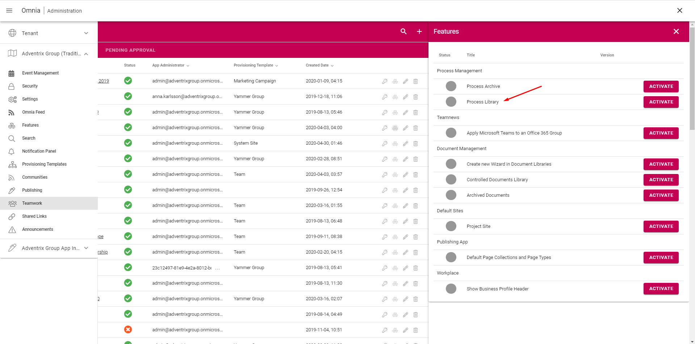

Setup a Process Library
===========================================

1. Go to Omnia Admin > Teamwork and find the site where you want to add a process library.
2. Click on the features icon and activate the Process Library feature.

3. Browse into the site > Processes.
4. Click on Permissions in the right-hand side of the Process Library and add the appropriate users/groups.