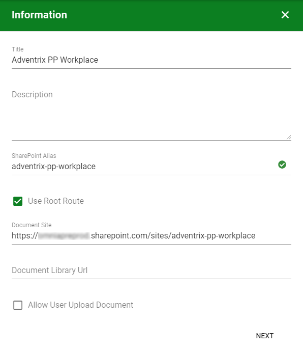

4. Publishing App
===========================================

1. Go into Omnia Admin.
2. Click on "Business Profiles" in the left-hand navigation and select the newly created Business Profile in the previous step.
3. Click on "Provisioning Templates".
4. Create a new template:

- Base Definition: Publishing App
- Title: Publishing
- Description: Use this template to create a new blank publishing app
- Icon Type: Office 365
- Icon: ms-Icon ms-Icon-PublishCourse
- Enabled: Checked
- Site Creation Mode: Self-Service

**Note!** You can leave the Properties and Features steps blank.

5. Click on "Publishing Apps" in the left-hand navigation.
6. Create a new publishing app.

