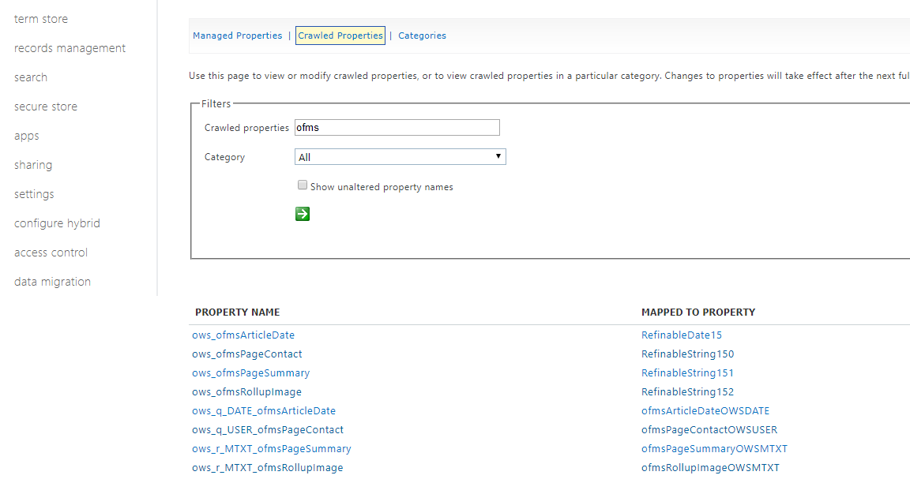

7. Search
===========================================

1. Go to SharePoint Central Admin (Classic Mode) > Search > Crawled Properties.
2. Search for "ofms".
3. Map the Crawled Properties to Managed Properties according to the setup in Properties in Omnia Admin.

4. Republish all pages. (This is to make the SharePoint Search crawler map the property values to the managed properties.)
5. Go to Omnia Admin.
6. Click on "Search" on the current business profile.
7. Add a new Search Category. Select the search result source "Local SharePoint Results".

.. image:: bpsearch-searchcategory-pages.png
