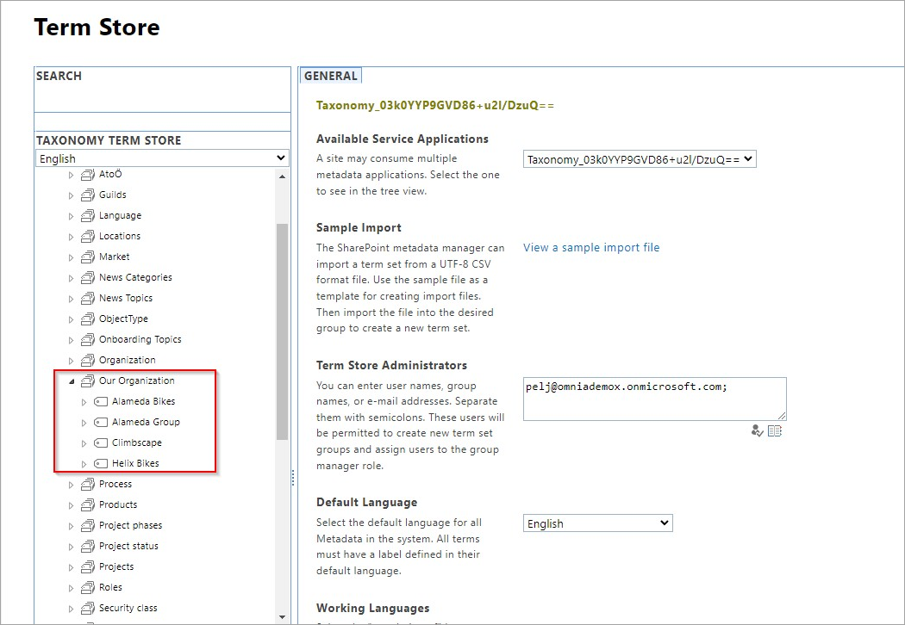
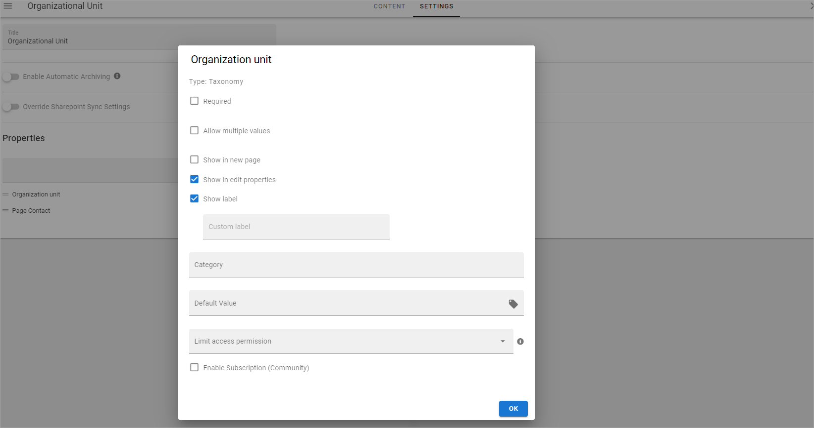
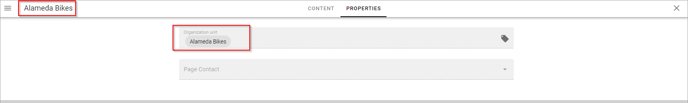
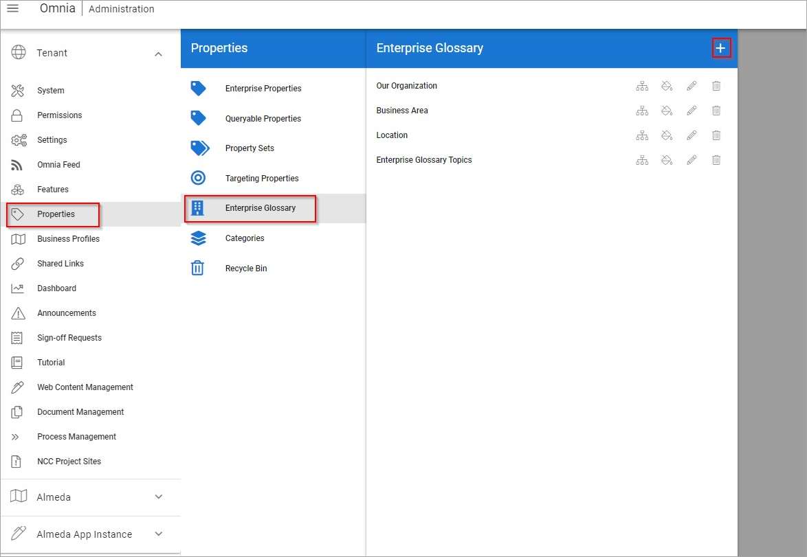
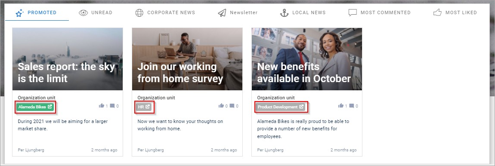
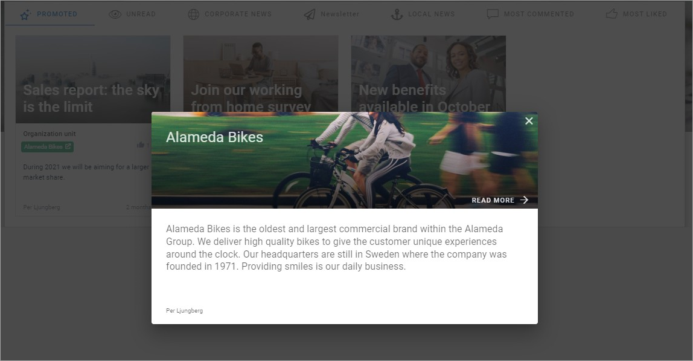
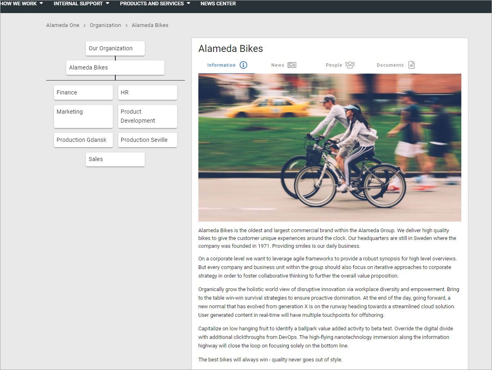

Setup Enterprise Glossary
=====================================

**Step 1**: Go to the term store and create a new term set with the terms you wish to use as tags.

**Step 2**: Go back to Omnia Admin tenant settings, go to Properties, then Enterprise properties, and create a new property of the type Taxonomy that is then mapped to the same term set that you’ve created in the term store:
 
.. image:: Enterprise-2.png

**Step 3**: Now we start creating the pages that will be matched to each of the terms. To do that, start off by creating a page type that has our new created property “Organization unit” as a page property with the following settings:

.. image:: Enterprise-3.png
 
.. image:: Enterprise-4.png
 

**Step 4**: Start creating pages that will be used as the home for each tag, and make sure to match the term from our new property with the page you wish to display when you click on the matching tag:
 
.. image:: Enterprise-6.png

**Step 5**: Once you’ve finished creating the pages, go to Omnia admin to tie it all together and create the tags:
 

Then make sure to select the correct term set, add page as details provider, and fill in the rest of the properties correctly:
 
.. image:: Enterprise-9.png 

Keep in mind that properties like “image ratio” are subjective, you experiment with different image ratios and see what you like best. You can always come back to the enterprise glossary section and modify the properties you have selected in each box, or even taxonomy.

**Step 6**: Map each page that you’ve created with the correct taxonomy, by clicking on the tree structure icon of your enterprise glossary, and then clicking on each tree structure icon next to each term and selecting the matching page
 
.. image:: Enterprise-10.png 

Make sure to select the correct publishing app and page collection to be able to find your page:

.. image:: Enterprise-11.png 

And with that you will have successfully created your tags.
 
Optional: Once you're finished with mapping your pages, you will have successfully created your tags. You can now either give the tags some colors and icons if you wish to do so:

What does it look like when tags are implemented successfully? Here we have an example of a news page rollup that utilizes tags:

When you click on each tag, you will see a highlighted small pop-up window with information from the associated page with the tag:

These are the properties we have selected in step 5 that are displayed here. When you click on the Read More button, you will be teleported to the page associated with the tag:
 

If you wish to implement tags in your pages, you can simply do so by adding the property “organization unit” that we have created to the page type of the page you wish to tag. Here we have a news article for example:
 

.. image:: Enterprise-15.png 

.. image:: Enterprise-16.png

And then in the page rollup where these pages will be displayed, make sure to select “Organization unit” as the term property:
  
.. image:: Enterprise-17.png 

And you are all set!

