Setup Omnia in Microsoft Teams
===============================

**(This instruction is just started. Text and images will be edited.)**

Create app manifest using Microsoft App Studio
************************************************
1. Add the App Studio app to Microsoft Teams.

.. image:: app-studio.png

2. Open App Studio and select "Manifest editor", and then "Create a new app".

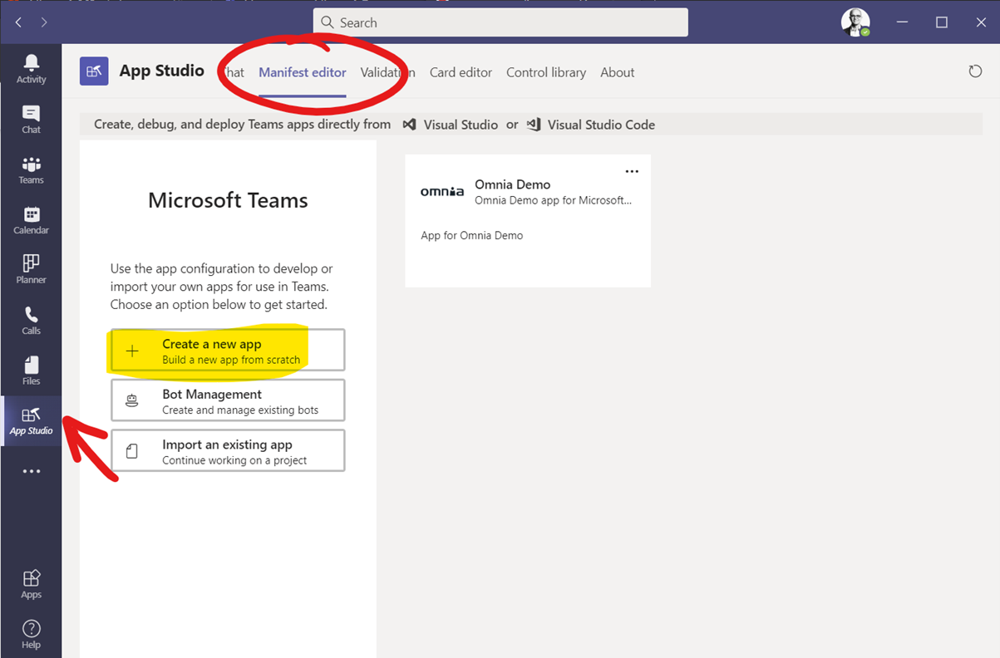

3. Enter short name and Full name for the app (can not be the same).

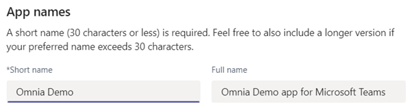

4. Click "Generate" to generate a GUID for the app. 

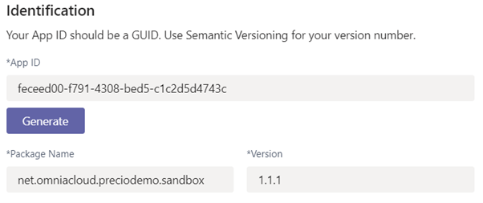

Package Name can be anything, but best practice is to use the reverse URL for Omnia. Version number should follow a logic – possibly let it follow Omnia version number.

5. Fill in both Short description and Full description. 

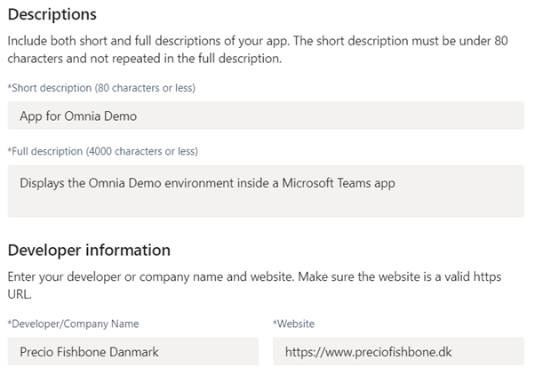

Under Developer information it may be up to the customer what they want. The information is displayed under About information app. 

6. Partner Information is optional, but here Precio Fishbone's Microsoft Partner ID can be inserted.

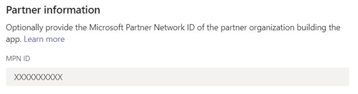

7. If necessary, insert the Privacy statement url and Terms of use.

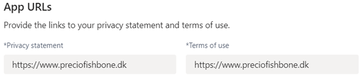

8. Two different icons are needed. 192x192 appears in the information about the app, and 32x32 is used as an app icon on the left side of Teams. 

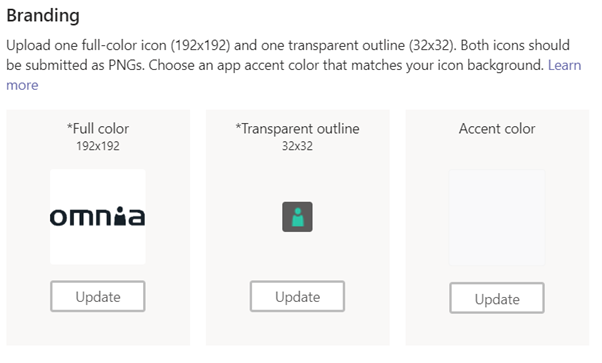

9. Select "Full Screen Mode" to display the app without a header bar. 

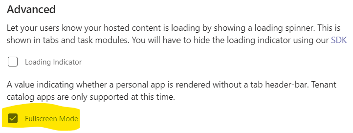

10. Under Capabilities, click "Tabs", and then "add" under Add a personal tab. 

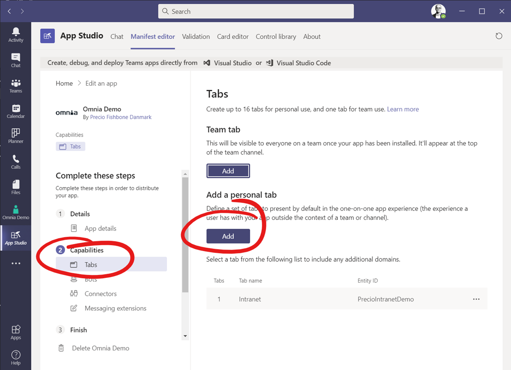

11. Fill in the following information:

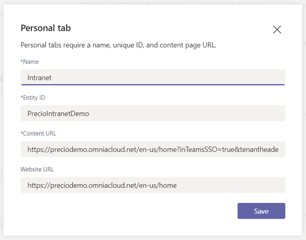

+ **Name**: Tab name.
+ **Entity ID**: unique ID without spaces.
+ **Content URL**: Omnia URL including any parameters for displaying top navigation and mega menu. Example: https://preciodemo.omniacloud.net/en-us/home?inTeamsSSO=true&tenantheader=false&bpheader=true
+ **Website URL**: Parameter home page URL. Example: https://preciodemo.omniacloud.net/en-us/home (Might leave out the language code depending on your needs).
 
12. Click "Domains and permissions". 

.. image:: domains-png

13. To find Omnia's Application ID in Azure AD, sign in to https://portal.azure.com/#blade/Microsoft_AAD_IAM/ActiveDirectoryMenuBlade/Overview
14. Click "Enterprise applications".

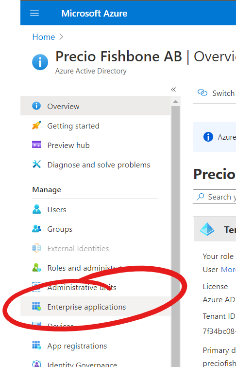

15. Search for Omnia and find the right app that points to https://auth.omniacloud.net.

.. image:: points.png

16. Copy Application ID from properties. 

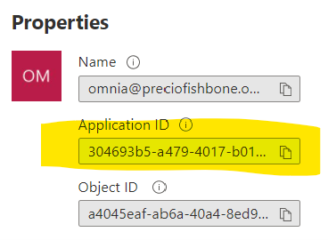

17. Back in app studio under Domains and permissions, the copied Azure AD App ID and Single-Sign-On URL are inserted in the format: api://<tenant>.omniacloud.net/<AAD App ID>.

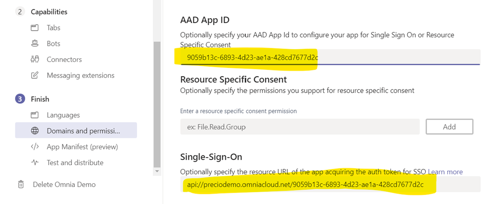

18. Switch to Test and Distribute and select "Install". 

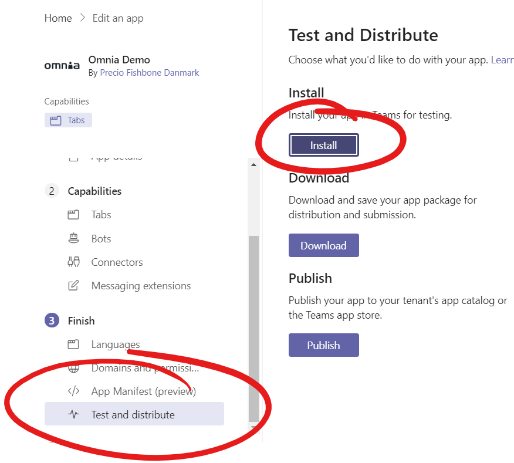

Now the app will be installed in the user's personal Teams and can be viewed on the left side navigation in Teams. 
 
Installing for all users in Teams
***********************************
1. In "Test and distribute", select "Download" and save the zip file which contains all resource files for the app.
2. Open https://admin.teams.microsoft.com/dashboard. Here you have to have Micorosoft 365 admin permissions.
3. In the navigation, click "Manage apps", and then select "Upload".

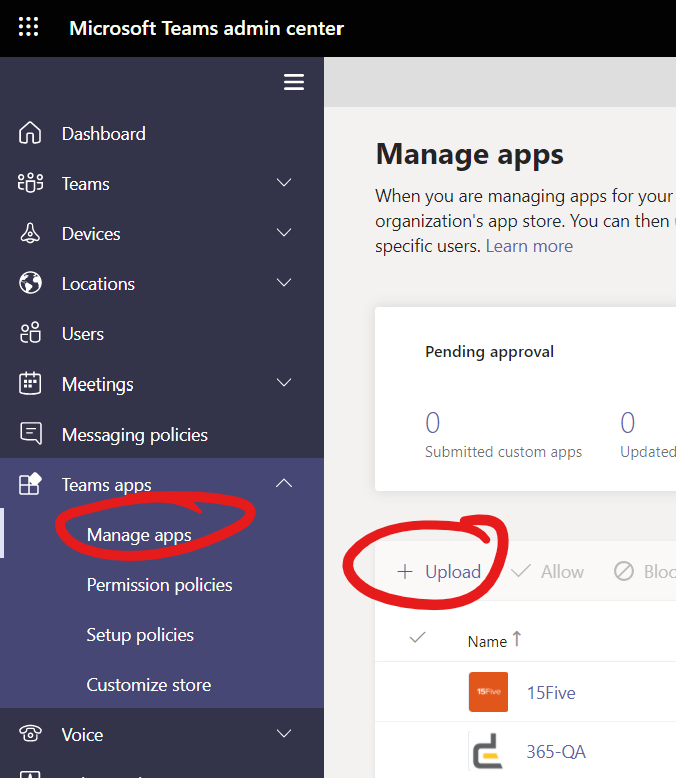

4. Now upload the file you downloaded in step 1.

All users can now add the app to Teams themselves, but if you want to install it automatically and pin it for all users, complete the steps below.

5. Click "Setup policies".

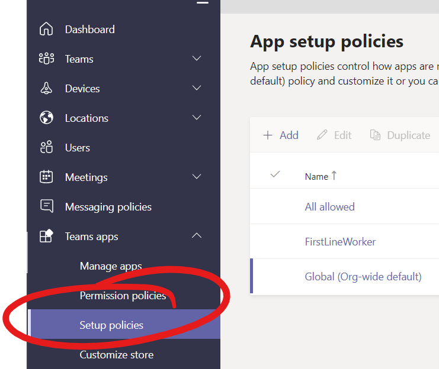

6. Click "Global (Org-wide default)" or an alternative policy if you only want to install for selected users. 
7. Under Pinned apps, click "Add apps" to install the app for all users and pin it to the left side of Teams. 
8. In the app permission policy, select "Global" and search for the app. Click Add to add it.

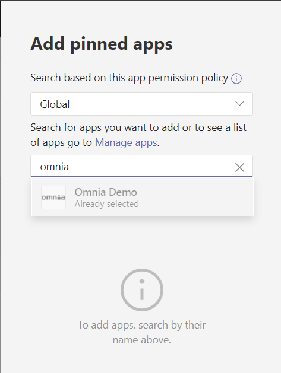

The app is now under Pinned apps and can be moved up and down in the order.

It may take some time before is available for users. If that still doesn't happen, check that users are members of the right Permission policy in Teams admin.
