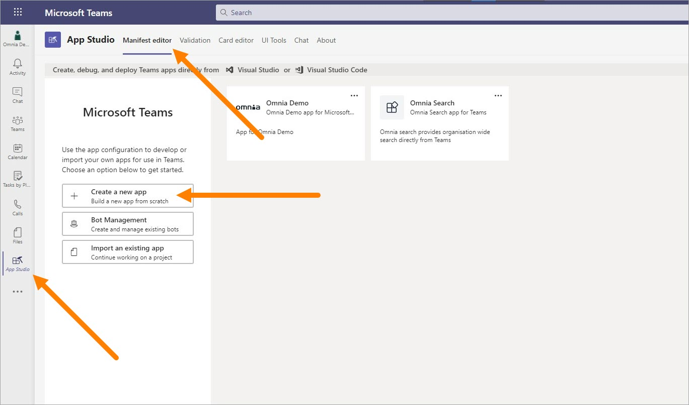
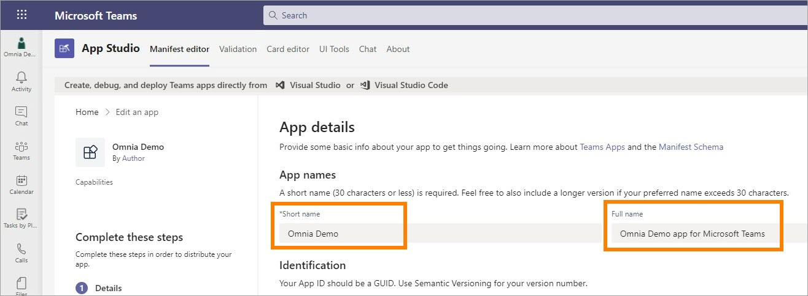
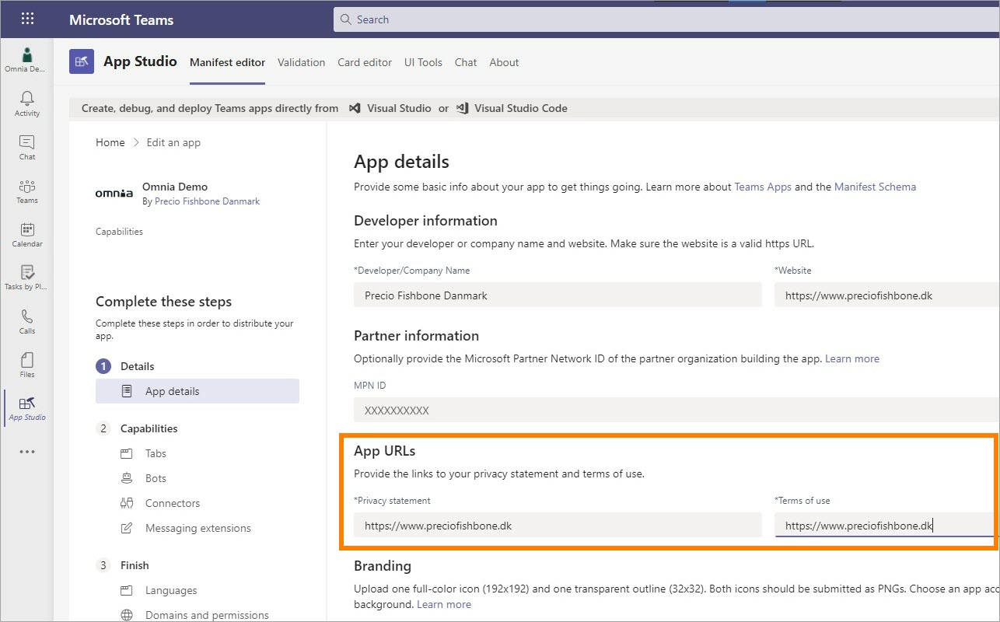
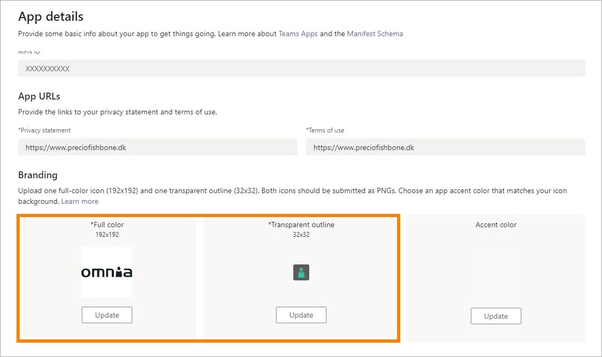
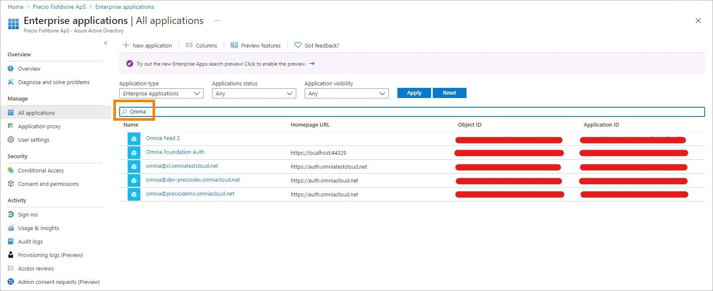
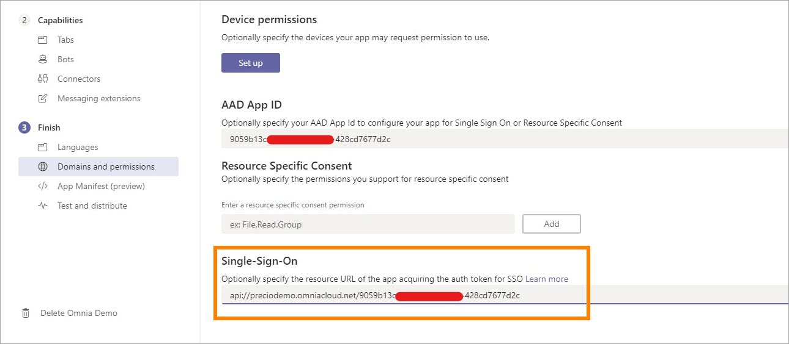
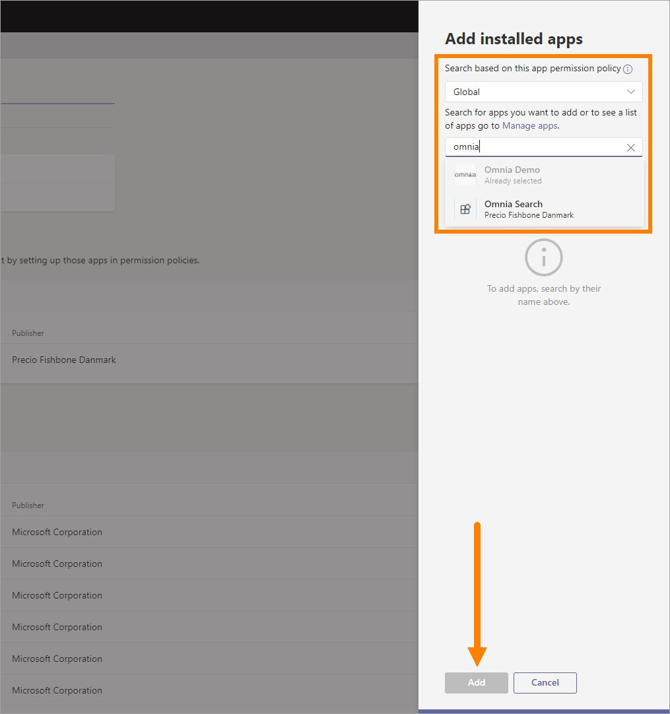

Setup Omnia in Microsoft Teams
===============================

Here's how to setup Omnia in Microsoft Teams.

**Note!** App Studio, used in this instruction is being deprecated. You should now use Developer Portal instead. There are some smaller differences but you should still be able to use this instruction as a guideline.

**Also Note!** There's now a much simpler way for a basic setup in Teams. See this page for more information: :doc:`Teams App Generator </admin-settings/tenant-settings/system/microsoft-365/teams-appgenerator-612/index>`

1. Add the App Studio (Developer Portal) app to Microsoft Teams.

.. image:: app-studio-new2.jpg

2. Open App Studio (Developer Portal) and select "Manifest editor", and then "Create a new app", or "Apps" and "Create new app". In Developer portal, select "Apps" and "Create new app".

3. Enter Short name and Full name for the app (can not be the same).

4. Click "Generate" to generate an App ID (GUID) for the app, if needed. In App Studio, most likely the App ID will be generated automatically.

.. image:: generate-new2.jpg

5. Add Package Name and Version.

Package Name can be anything, but best practice is to use the reverse URL for Omnia. Version number should follow a logic – possibly let it follow Omnia version number.

6. Enter both a Short description and a Full description. 

.. image:: descriptions-new2.jpg

7. Add Developer information and Partner Information.

Developer information - here it may be up to the customer what they want. The information is displayed under About information app. 

Partner Information is optional, but here Precio Fishbone's Microsoft Partner ID can be inserted.

.. image:: partner-info-new2.jpg

8. If necessary, insert the Privacy statement url and Terms of use.

9. Two different icons are needed. 192x192 appears in the information about the app, and 32x32 is used as an app icon on the left side of Teams. 

10. Select "Full Screen Mode" for display without a header bar. 

.. image:: screen-mode-new2.jpg

11. Under Capabilities, click "Tabs", and then "Add" under Add a personal tab. 

.. image:: capabilites-new2.jpg

12. Add the following information:

.. image:: personal-tab-new2.jpg

+ **Name**: Tab name.
+ **Entity ID**: unique ID without spaces.
+ **Content URL**: Omnia URL including any parameters for displaying top navigation and mega menu. Example: https://preciodemo.omniacloud.net/en-us/home?inTeamsSSO=true&tenantheader=false&bpheader=true
+ **Website URL**: Parameter home page URL. Example: https://preciodemo.omniacloud.net/en-us/home (Might leave out the language code depending on your needs).

13. Save when you're done.

14. Select "Domains and permissions". 

.. image:: domains-new2.jpg

15. To find Omnia's Application ID in Azure AD/Entra ID, sign in to https://portal.azure.com/#blade/Microsoft_AAD_IAM/ActiveDirectoryMenuBlade/Overview
16. Click "Enterprise applications".
17. Search for Omnia and find the right app that points to https://auth.omniacloud.net.

18. Copy Application ID from properties. 

.. image:: application-id-new2.jpg

19. Go back to Domains and permissions and insert the copied Azure AD/Entra ID App ID and Single-Sign-On URL, format: api://<tenant>.omniacloud.net/<AAD App ID>.

20. Click "Download" to download the manifest. 
21. In MS Teams, click "Apps" and then "Manage your apps".
22. Upload the custom app to test the app.
23. Select the downloaded manifest file.

Now the app is installed in the user's personal Teams and is displayed in the Teams navigation to the left. 

**Note!** If you receive a sign-in error you should contact support. Then some manual settings probably needs to be done in the Azure AD app.
 
Installing for all users in Teams
***********************************
1. In "Test and distribute", select "Download" and save the zip file which contains all resource files for the app.
2. Open https://admin.teams.microsoft.com/dashboard. Here you have to have Micorosoft 365 admin permissions.
3. In the navigation, click "Manage apps", and then select "Upload".

.. image:: navigation2.jpg

4. Now upload the file you downloaded in step 1.

All users can now add the app to Teams themselves, but if you want to install it automatically and pin it for all users, complete the steps below.

5. Click "Setup policies".

.. image:: setup-policies-new.jpg

6. Click "Global (Org-wide default)" or an alternative policy if you only want to install for selected users. 
7. Under Pinned apps, click "Add apps" to install the app for all users and pin it to the left side of Teams. 
8. In the app permission policy, select "Global" and search for the app. Click "Add" to add it.

The app is now under Pinned apps and can be moved up and down in the order.

.. image:: add-pinned-apps-example.jpg

It may take some time before it's available for users. If it doesn't work, check that users are members of the right Permission policy in Teams admin.
