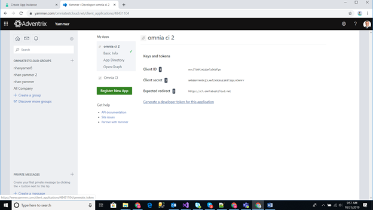
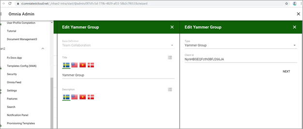
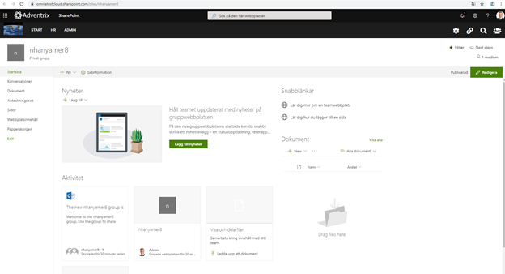

Setup Viva Engage in Omnia
============================

Follow these steps to setup Viva Engage (former Yammer) in Omnia Online. (The images here still says Yammer, but the process is the same).

**1**. The account used to create the Viva Engage App needs to be at least Verified Admin in Viva Engage (Network Admin level is not enough), or alternatively Global Administrator in Microsoft 365. We recommend using a non-personal service account for creating the Viva Engage App, as the app stops working if the account used to create the app is deleted.

**2**. Navigate to the following URL (replace m365x249588 with your tenant), as the new Viva Engage does not have a direct link to client applications.

https://www.yammer.com/m365x249588.onmicrosoft.com/client_applications

**3**. Create the Viva Engage App.

.. image:: yammer-1.png

**4**. After creating the new app, click the link to generate the app token.

.. image:: yammer-3.png

**5**. Go to Network admin -> Security settings to enable Office 365 Identity Enforcement. You need it for the Viva Engage group auto to create a Sharepoint site when the Viva Engage group is created.

.. image:: yammer-4.png
	 
**6**. Setup a Viva Engage group template in omnia. Add above viva angage app -> client id to the Viva Engage group template as below:

**7**. Setup omnia Secret key for the Business Profile scope and the same with that provisioning template. Add above Viva Engage app token to Secret key as below.

.. image:: yammer-6.png
 
**8**. Finally create app provisioning from Viva Engage group template.

Example: Result when done creating Viva Engage group name like nhanyamer8:
 
.. image:: yammer-7.png

And Sharepoint site:

**Note!** If you want to use the new, improved Viva Engage integration, the Viva Engage integration Tenant Feature must also be activated, see: :doc:`Features - Tenant </admin-settings/tenant-settings/features/index>`
