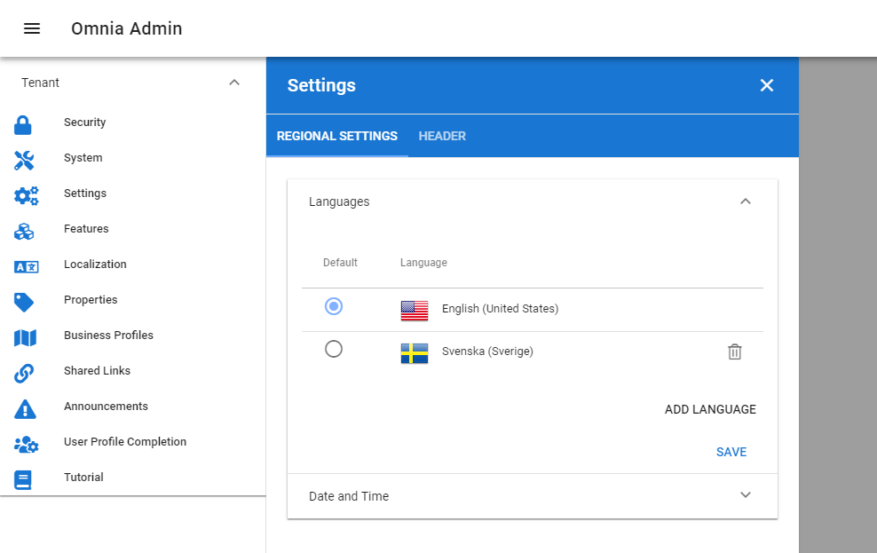
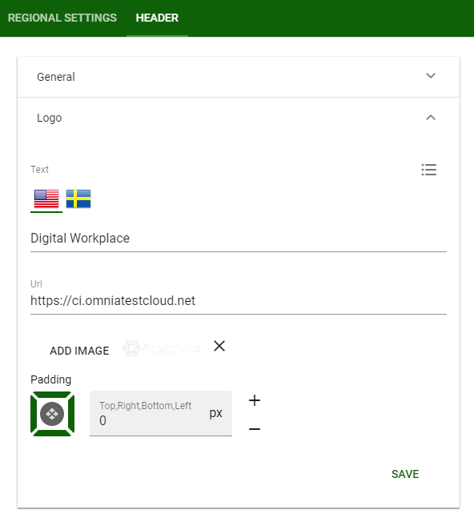

1. Tenant Settings
===========================================

1. Browse to the url provided by the product team (https://[tenant].omniacloud.net).
2. You will come to a 404 page, but don't worry, just press Shift + O + A to go into Omnia Admin.
3. Click on Settings in the left-hand navigation and setup regional settings such as Language and Date/Time format for the tenant.

4. Go to the Header tab and select a background and icon color for the top tenant chrome.
5. Select a logo and but in the url provided by the product team.

