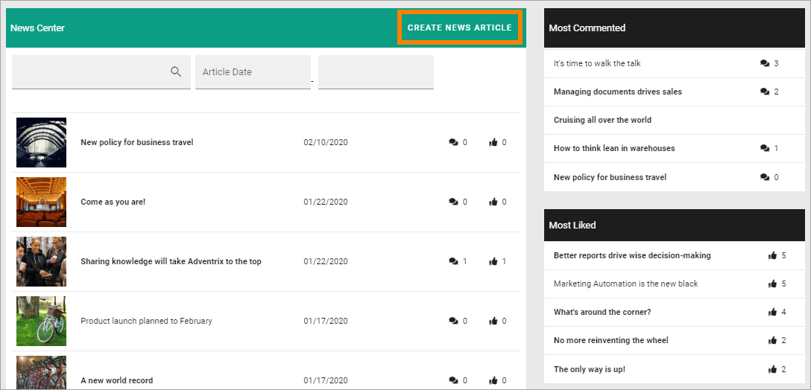
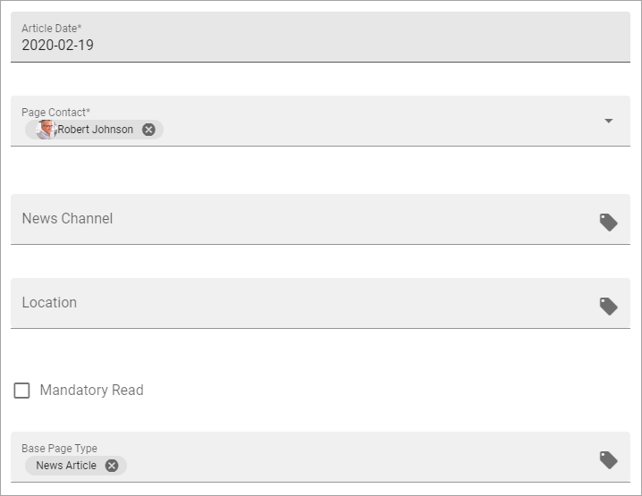
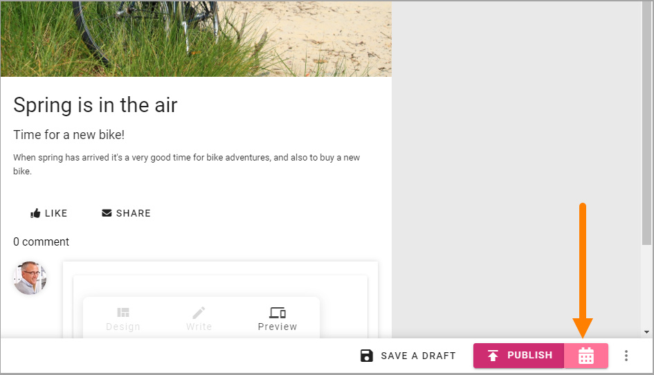
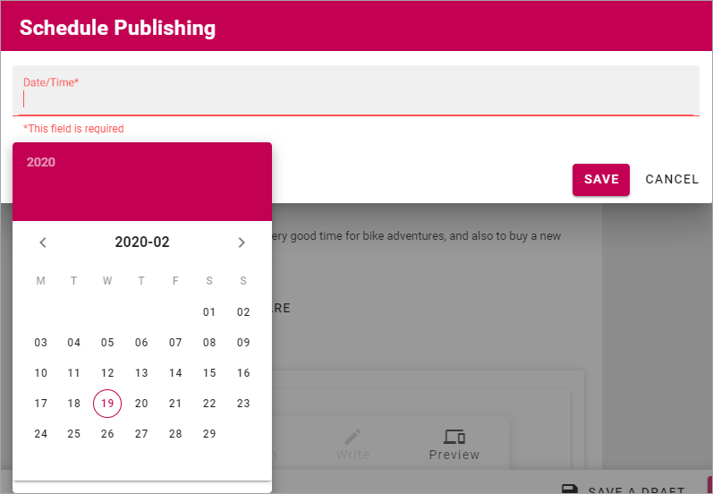
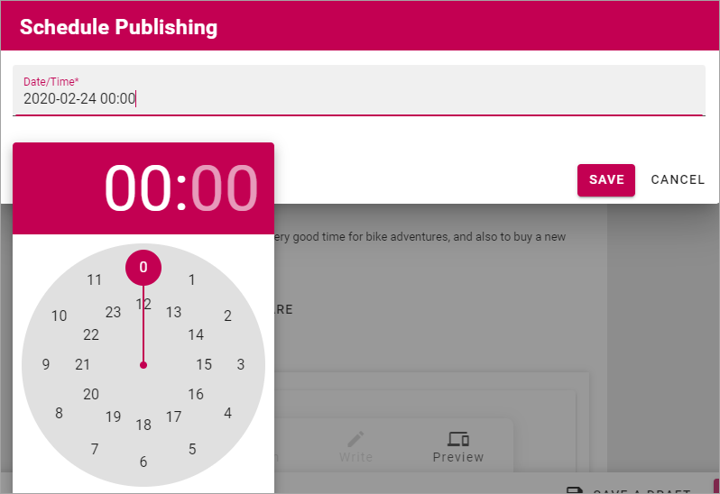
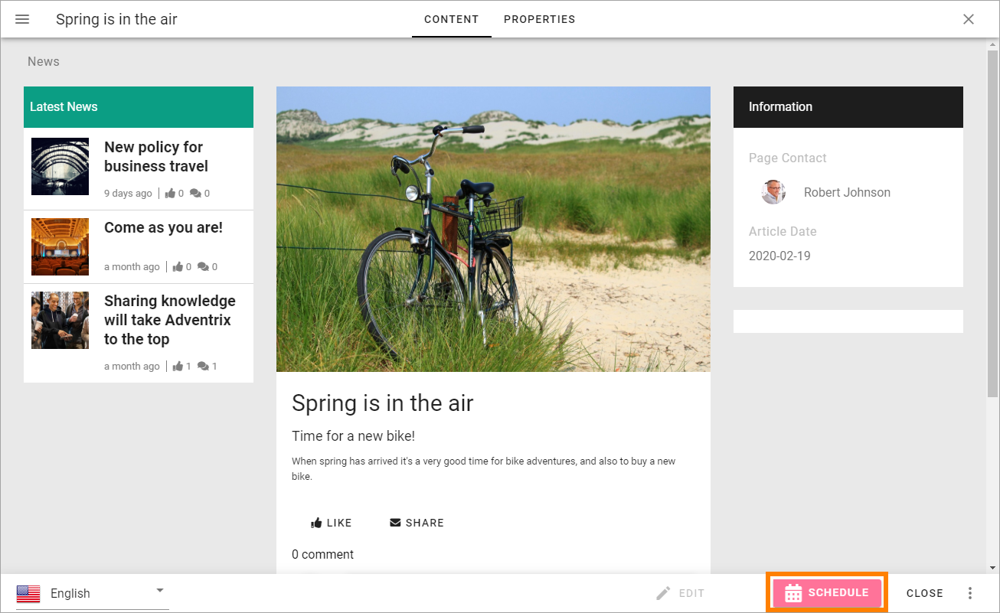
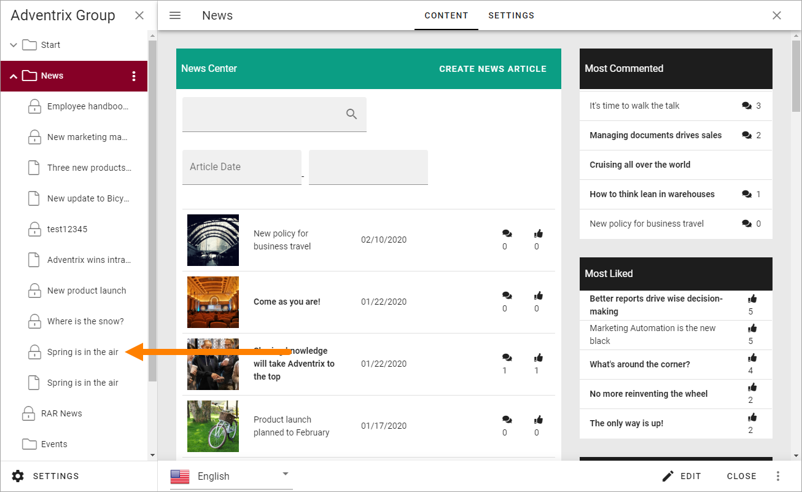

Create News
===========================================

Colleagues with the right permission can create and publish news in a specific News Center. It's very common that only a dedicated group of authors can do that but it's also possible that all colleagues have this permission.

If you have the permission necessary to create news, this button is shown in the News Archive. The button can alos be made available on other pages.

1. To create a new news article, click the button.

The following is shown:

.. image:: news-file-name.png

2. Type a file name for the new News article (page) and click "Create".

+ **Advanced**: For advanced settings, available for App Administrators only.

Something like the following is shown:

.. image:: create-news-template-new.png

Available blocks and more are dependant on how the Page Type fo news is set up. 

You can see that the file name you entered in the previous step is suggested as the News Articles heading ("Spring is in the air" in this example). It can be edited if needed.

What you actuallt need to do depends on the Page Type (template) for news is set up. Here's som common steps:

3. Add an image for  the News Article. A part of that image can also be used as the image in a News list (which is automatic if used).
4. Add a short introduction in the third block ("Put your news summary here ..."), under the heading, just click and write.
5. Add the content in the Text block below the introduction.

.. image:: news-content-new.png

6. Add content to other blocks as necessary.

Creating and editing a News Article works the same way as working with a publishing page regarding adding, removing and moving blocks and adding content. The difference is that this is special Page Type (Page Template) for News Articles only.

All general instrtuctions apply for working with blocks, see: :doc:`Working-with-blocks </blocks/working-with-blocks/index>`

For more information about a specific block, select the block in this list: :doc:`About blocks </blocks/index>`

7. When you're finished here, click "Next".

.. image:: news-next-border-new.png

8. Set the Properties.

Available properties depends on how the Page Type for News is set up. Here's an example:

+ **Article Date**: Todays date is added to the field. The date can be edited if needed. In a News list, the articles are sorted on Article Date. If you're working on an article for a while, the date will not be updated automatically, so you may have to edit before publishing.
+ **Page Contact**: This is shown under the image on the News Article's page. Your name is added automatically. If someone else should be the Page Contact, remove your name and add the colleague's name.
+ **Base Page Type**: Several Page Types (templates) for news can be available, for example to be suitable for different types os lists. You can change Page Type here if necessary, but be aware that all blocks. 

Metadata tagging for News can be set up in many ways and also used in many ways, for example to display different news articles for different user groups. "News Channel", "Location" and "Mandatory Read" are examples of metadata.

9. When you're done here, click "Next".

A preview is now shown. Note that you can test how the News article will look on different devices:

.. image:: news-devices-new.png

10. Save the News Article as a draft to continue working on it later, or publish it directly.

.. image:: news-publish-new.png

If you decide to publish you can choose to publish now by clicking "Publish", or you can use "Scheduled Publishing", if available, to set a date and time for the publication.

To schedule Publishing, click here:

11. Click in the "Time" field and first set date:

and then set time, if you wish:

12. When you're done setting scheduled publishing (if you did), click "Save".

The color and name of the Publish-button changes to reflect that a Scheduled Publishing is set:

To edit the schedule, or remove the Scheduled Publishing all together, click the button.

Continue working on a saved News Article
*****************************************
Do the following:

1. Go to the News Center/News Archive.
2. Click the icon to open the editor.

.. image:: news-open-editor-new.png

3. Find the News Article in the list and click it.

You can now edit the contents and the Scheduled Publishing (or remove it) as described above.

