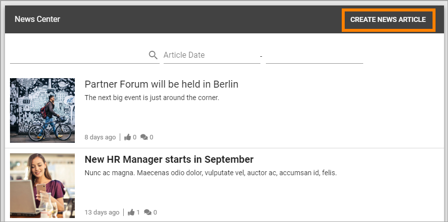
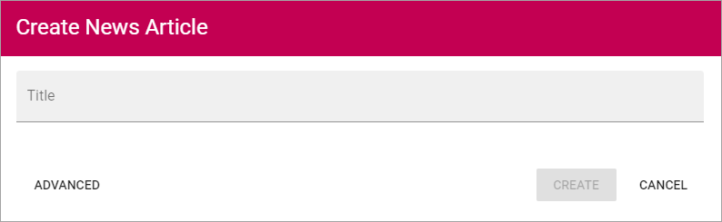
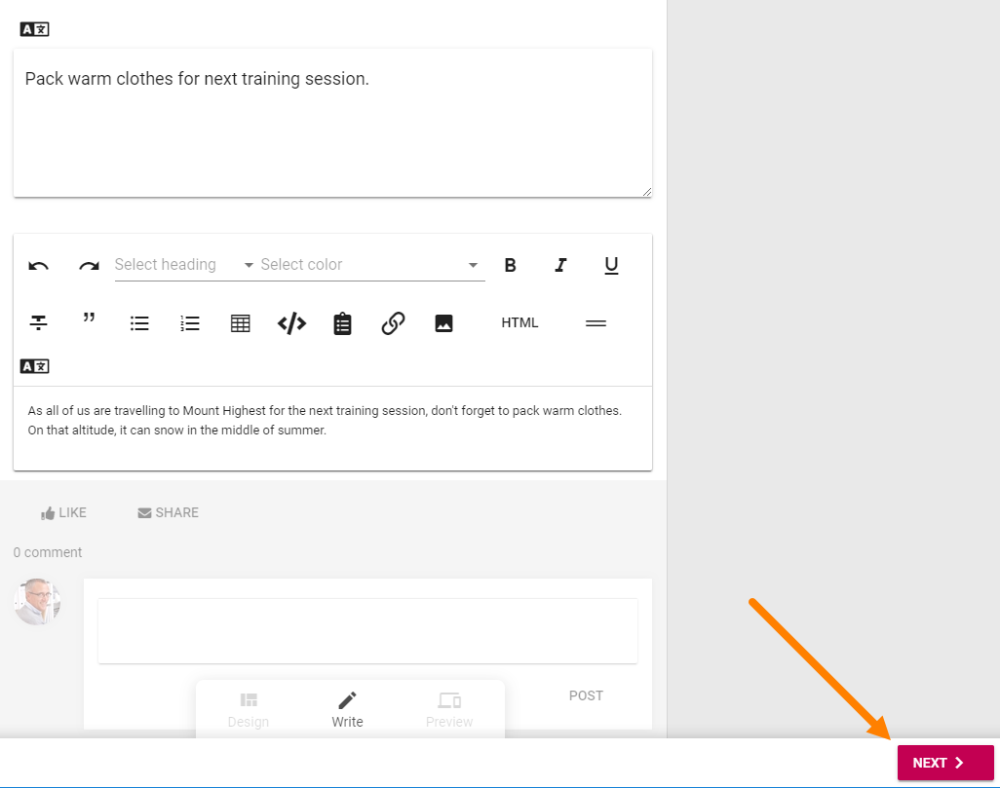
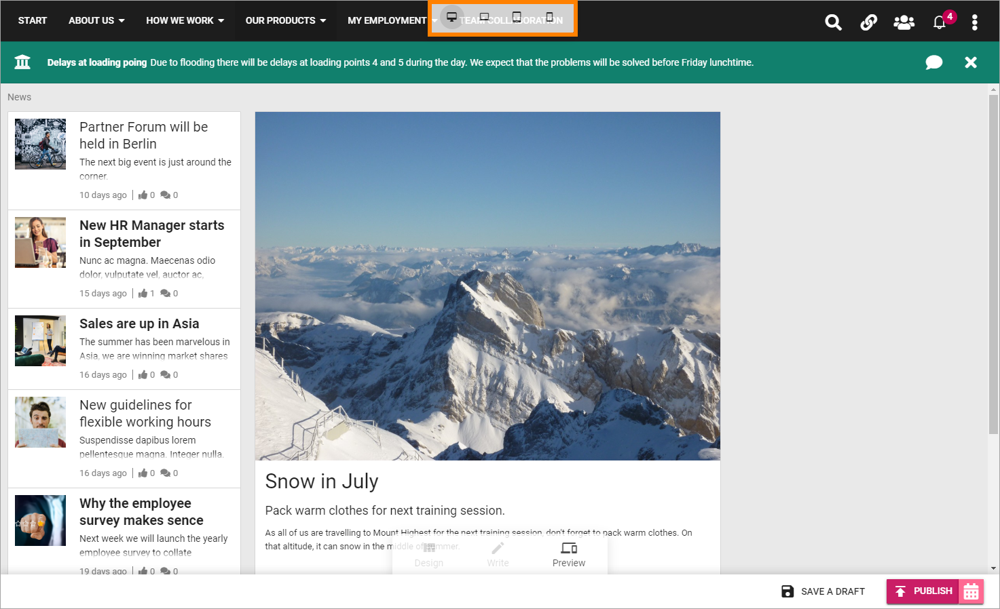
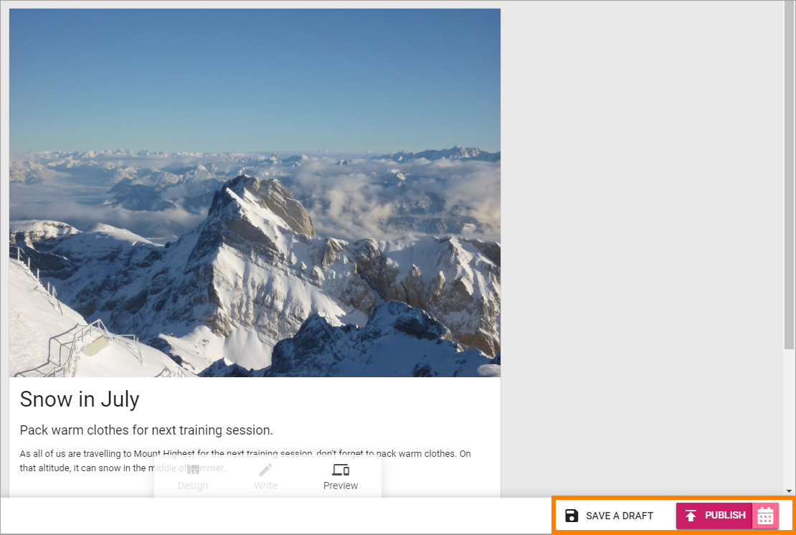
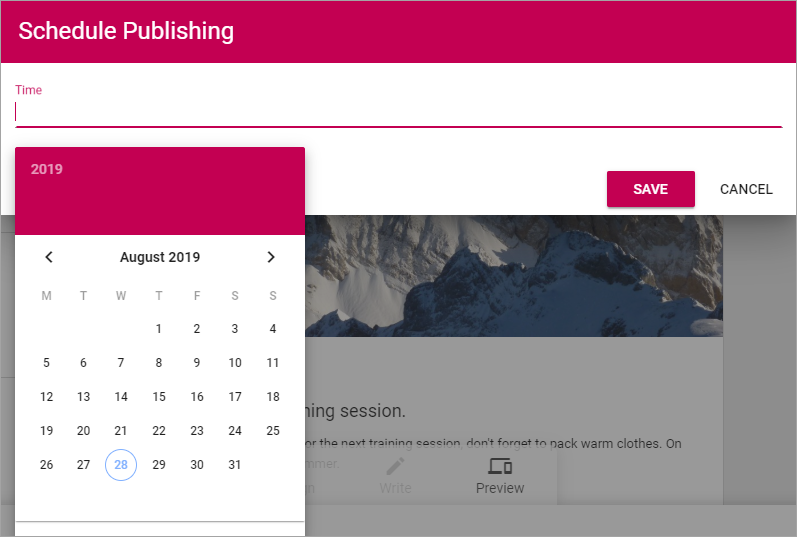
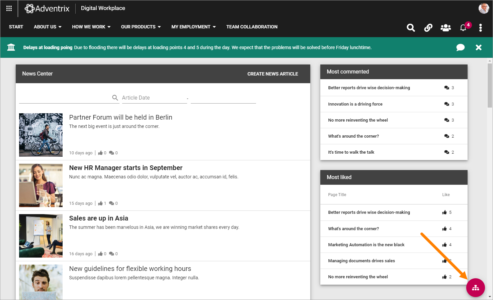
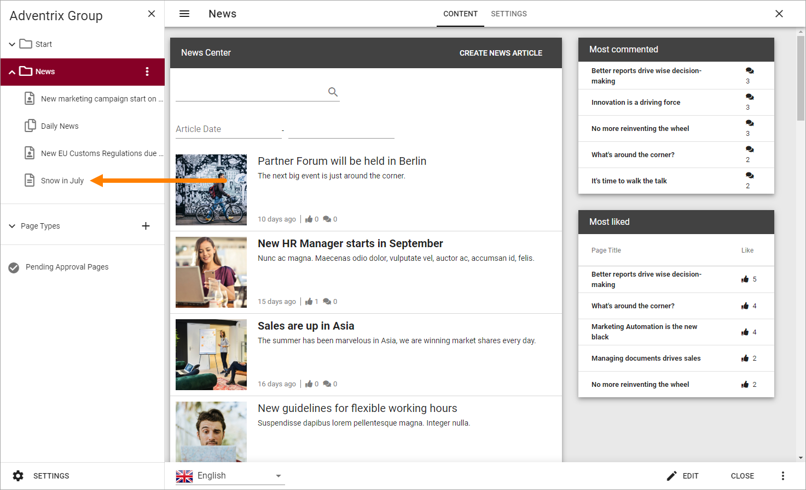

Create News
===========================================

Colleagues with the right permission can create and publish news in a specific News Center. it's very common that only a dedicated group of authors can do that but it's also possible that all colleagues have this permissions.

If you have the permission necessary to create news, this button is shown in the News Archive:

1. To create a new news article, click the button.

The following is shown:

2. Type a file name for the new News article (page) and click "Create".

+ **Advanced**: For advances settings. click this. Normally not necessary.

Something like the following is shown:

.. image:: create-news-template.png

You can see that the file name you entered in the previous step is suggested as the News Articles heading. It can be edited if needed.

3. Add an image for  the News Article. A part of that image can also be used as the image in a News list.
4. Add a short introduction in the third block, under the heading, just click and write.
5. Add the content in the Text block below the introduction.

Creating and editing a News Article works the same way as working with a publishing page regarding adding, removing and moving blocks and adding content. The difference is that this is special Page Type (Page Template) for News Articles only.

All general instrtuctions apply for working with blocks, see: :doc:`Working-with-blocks </blocks/working-with-blocks/index>`

For more information about a specific block, select the block in this list: :doc:`About blocks </blocks/index>`

3. When you're finished here, click "Next".

4. Use the following Properties:

.. image:: news-properties.png

+ **Article Date**: Todays date is added to the field. The date can be edited if needed. In a News list, the articles are sorted on Article Date. If you're working on an article for a while, the date will not be updated automatically, so you may have to edit before publishing.
+ **Page Contact**: This is shown under the image on the News Article's page. You name is added automatically. If someone else should be the Page Contact, remove your name and add the colleague's name.
+ **Top Story**: A Top Story can be shown with a bigger image at the top of a News list, see example below. If it's a Topn  Story, select this option.
+ **Promote Until**: If the News article should be shown in News lists until a specific date, click the calendar and select the date. If no date is entered here, the article will be shown in the list continously, but remember that newer articles will push this article further down the lists.
+ **News Channel**: If several News Channels are setup, select one or more channelx here. Users can normally subscribe to any News Channel.
+ **Location**: A user can select Location in his or her Profile. You can select one or more locations here and this News article will be shown only for the colleagues at this Location.
+ **Mandatory Read**: (A description will be added soon.)

Here's an example with a News Article (Sales are up in Asia) set as a Top Story:

.. image:: news-top-story.png

5. When you're done here, click "Next".

A preview is now shown. Note that you can test how the News article will look on different devices:

6. Save the News Article as a draft to continue working on it later, or publish it directly.

If you decide to publish you can chooose to publish now but clicking "Publish", or you can use "Scheduled Publishing", if available, to set a date and time for the publication.

To schedule Publishing, click here:

.. image:: scheduled-publishing.png

7. Click in the "Time" field and first set date:

and then set time, if you wish:

.. image:: scheduled-time.png

8. When you're done setting scheduled publishing (if you did), click "Save".

The color and name of the Publish-button changes to reflect that a Scheduled Publishing is set:

.. image:: scheduled-button.png

To edit the schedule, or remove the Scheduled Publishing all together, click the button.

Continue working on a saved News Article
*****************************************
Do the following:

1. Go to the News Center/News Archive.
2. Click the icon to open the editor.

3. Find the News Article in the list and click it.

You can now edit the contents and the Scheduled Publishing (or remove it) as described above.

