Create news
===========================================

Colleagues with the right permission can create and publish news in a specific news center. It's common that only a dedicated group of authors can do that but it's also possible that all colleagues have this permission.

If you have the permission to create news, this button is shown in the news archive (the name of the button can be something else). The button can also be made available on other pages.

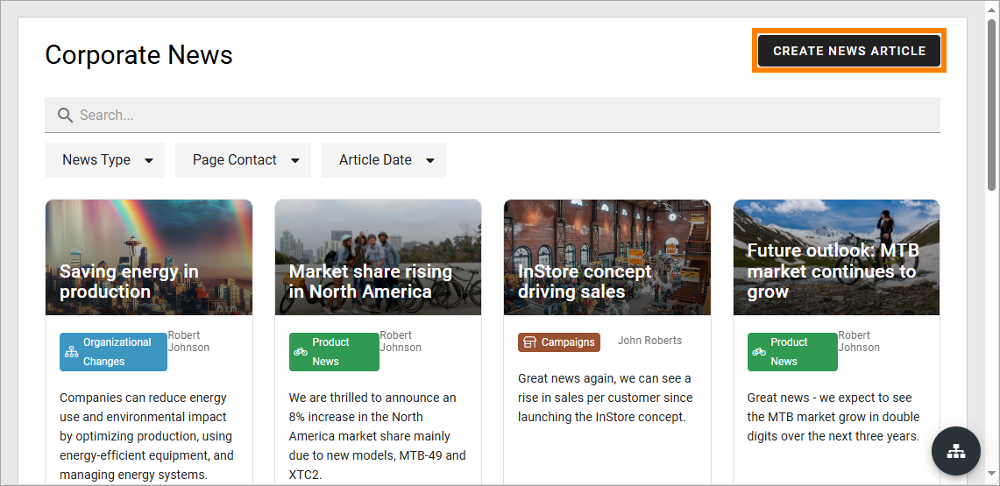

1. To create a new news article, click the button.

The following is shown:

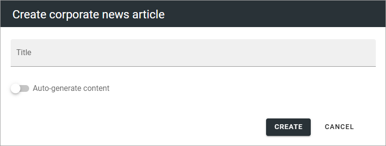

"Auto-generate content" is an AI option you can use, if it's activated in admin settings. Read more about this option at the bottom of the page.

2. Type a file name for the new news article (page) and click "Create".

This creates a page for the news article. All options for pages can be used for news article pages.

Something like the following is shown:

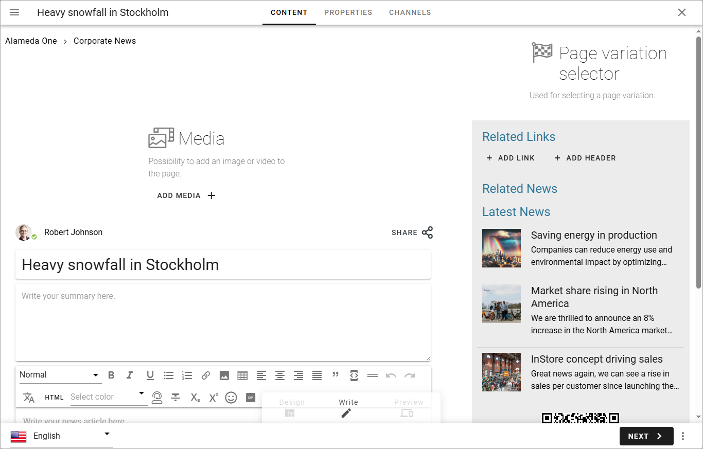

Available blocks and more depends on how the page type (page template) for news is set up. 

You can see that the file name you entered in the previous step is suggested as the news article's heading ("Heavy snowfall in Stockholm" in this example). It can be edited if needed.

What you actually need to do depends on the page type (template) for news. Here's some common steps that you should be able to do using Write mode:

3. Add an image. A part of that image can also be used as the image in a news list (which is automatic if used).
4. Add a short introduction in the third block ("Write summary here ..."), under the heading, just click and write.
5. Add the content in the text block below the introduction.

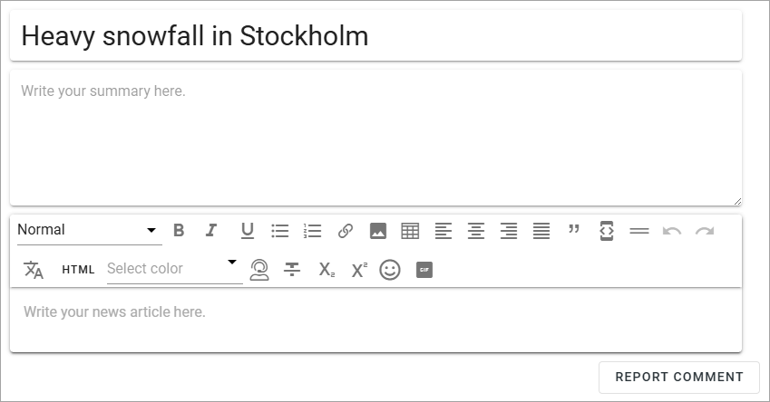

6. Add content to other blocks as necessary.

You most likely will just need permissions to use Write mode to be able to create and publish a news article. 

When you use the Media block to add an image (which you most likely will do), you use the Media picker. See this page for more information: :doc:`The Media picker </general-assets/media-picker/index>`

Regarding the Text block, see this page for more information about the available options for text, links and images: :doc:`The RTF editor </general-assets/rtf-editor/index>`

If you have permissions to use Design mode you can edit the settings for the blocks, see: :doc:`Working with blocks </blocks/working-with-blocks/index>`

For more information about a specific block, select the block in this list: :doc:`About blocks </blocks/index>`

7. When you're finished here, click "Next".

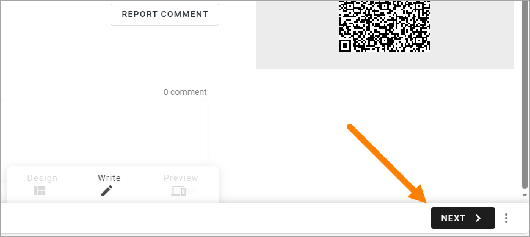

8. Set the properties.

Available properties depends on how the page type for news is set up. Here's an example:

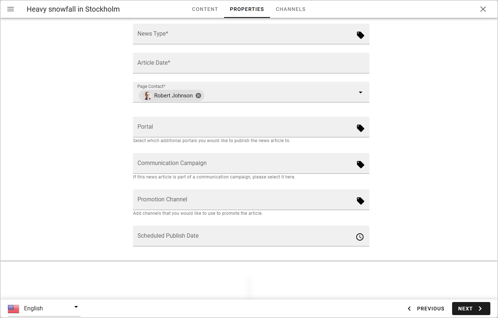

Comments on two fields that are normally present:

+ **Article date**: Add a publishing date here. In a news list, the articles are sorted on Article date. If you're working on an article for a while, the date will not be updated automatically, so you may have to edit it before publishing. Note that this field is mandatory. Also note that this is information only, it doesn't have anything to do with when the article actually is published.
+ **Page contact**: This is shown under the image on the news article's page. Your name is added automatically. If someone else should be the page contact, remove your name and add the colleague's name. This field is mandatory.

Metadata tagging for news can be set up in many ways and are also used in many ways, for example to display different news articles for different user groups. In this example, "News type", "Portal", "Communication campaign" and "Promotion channel" are examples of metadata, and you will receive information from your organization about how to use them. "Scheduled publishing date" is shown if scheduled publishing is activated for the news site. If present, you can use it the set the date and time when this article should be published. It's the same functionality as for other pages in Omnia. For more information about this, see: :doc:`Publish page changes </pages/publish-page-changes/index>`

9. When you're done here, click "Next".

A preview is now shown. Note that you can test how the News article will look on different devices:

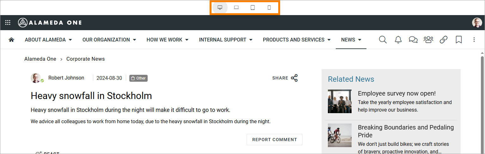

If Publishing channels are used in your organization (as in this example), something like the following can be shown:

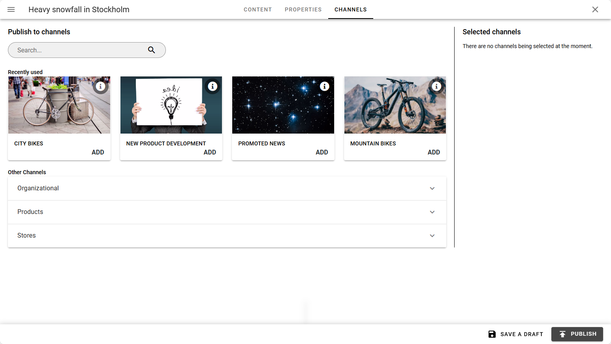

If Publishing channels are not used, this step is not shown at all.

10. Add one or more publishing channels if needed, and publish.

11. Save the news article as a draft to continue working on it later, or publish it directly. There can also be other publishing options available, as approval before a news article can be published. Scheduled publishing can also be available, depending on settings.

To get some more information about the publishing options, for example scheduled publishing, if available, see this page for more information: :doc:`Publish page changes </pages/publish-page-changes/index>`

Using AI support when creating an article
******************************************
If the AI options are activated in Omnia admin settings, they are available when creating a news article:

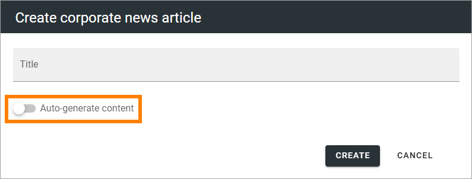

What it does, if you opt to use it, is to create a SUGGESTED text from your instructions, and even a suggested image, if you wish. You can always try it to see what the AI suggests. You can edit all text and use another image, or even delete it all, i the suggestion wasn't at all what you had in mind.

If you activate "Auto-generate content", the following is shown:

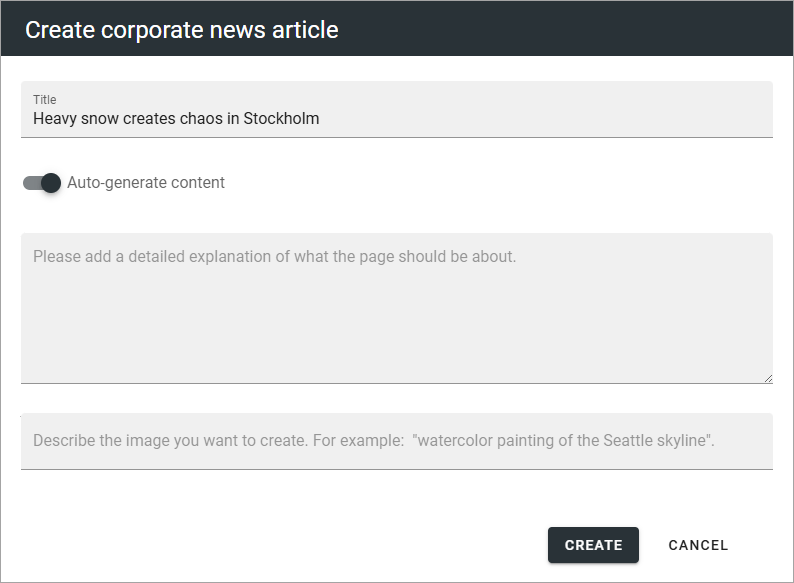

Here's an example how it may work:

From these instructions:

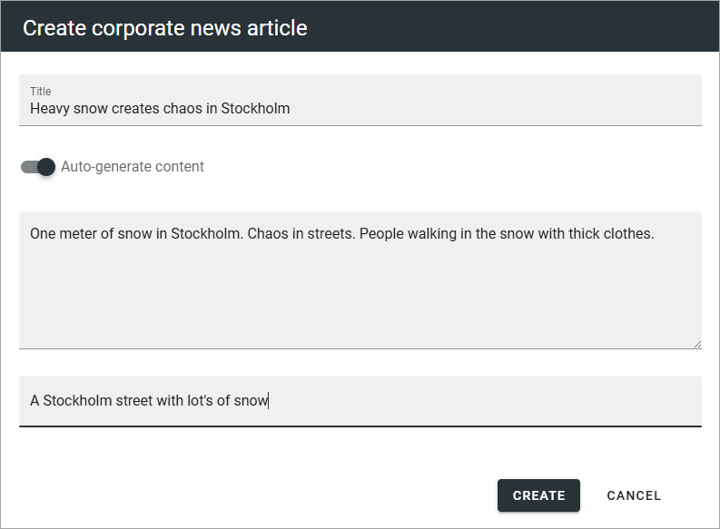

The AI may create the following suggested image:

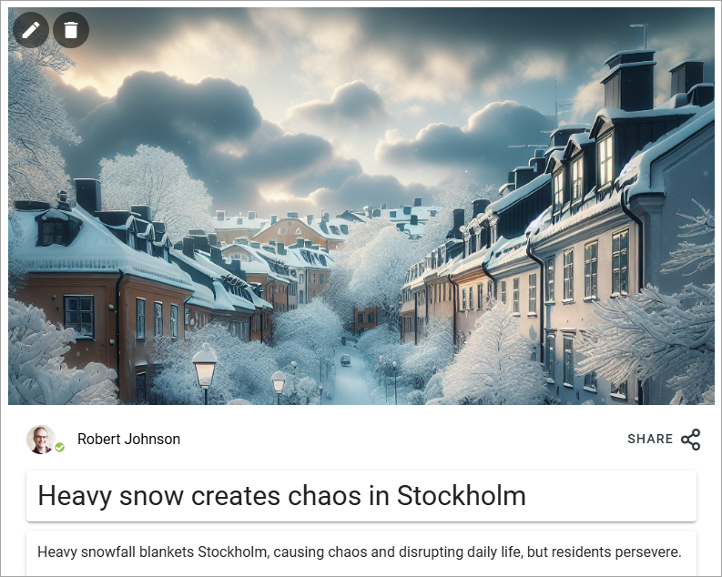

and this text:

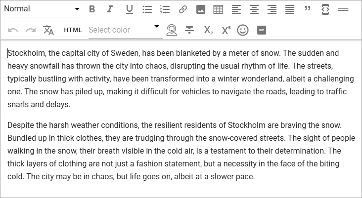

No it's up to you to use the suggested image or use another image, and to edit the text to your liking (or delete it). Nothing is saved until you publish.

Continue working on a saved news article
*****************************************
Do the following:

1. Go to the news center/news archive.
2. Click the icon to open the editor.

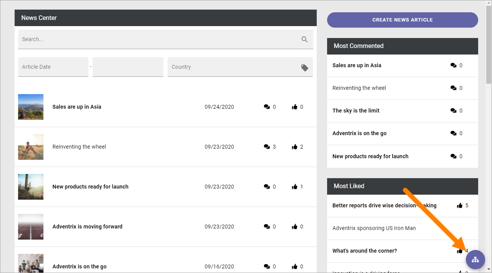

3. Find the news article in the list and click it.

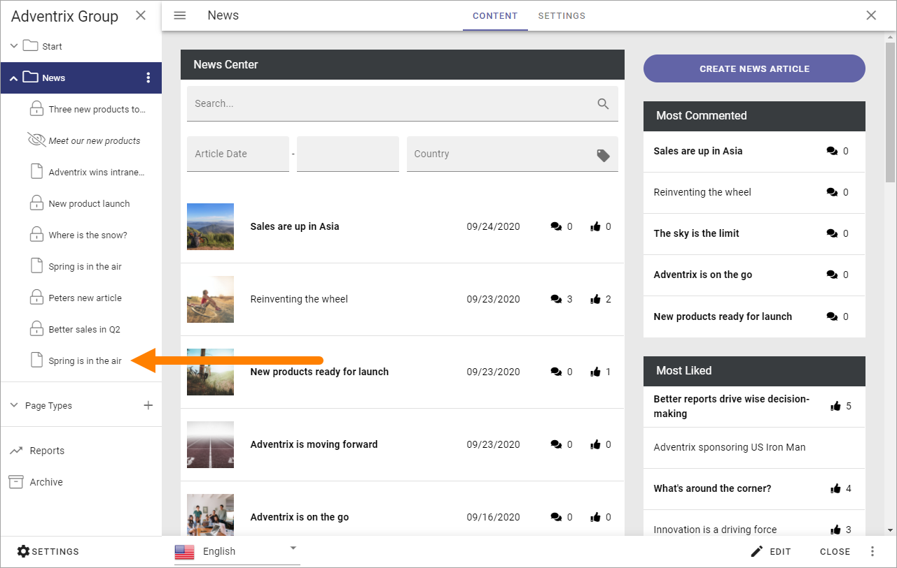

You can now edit the contents and publish it when it's finished, as described above.

