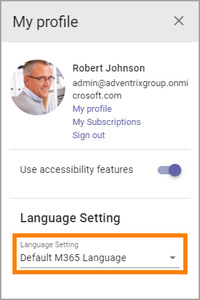

Current User Language
========================

Omnia users can themselves set the Current User Language, if needed.

**Note!** This setting is for system labels only, and (in Omnia 7.0 and later) for some other labels, for example:

+ Tenant and Business Profile names.
+ Publishing App title and description.
+ Navigation node titles.
+ Page Types titles.

This is how:

1. Open My Profile.

.. image:: my-profile-click.png

2. Open the list for Language Settings.

3. Select language.

.. image:: language-setting-select.png

The list contains all languages that are set up in Omnia Admin, see: :doc:`Regional Settings </admin-settings/tenant-settings/settings/regional-settings/index>`

All Omnia system labels are now shown in the selected language.

The setting is saved automatically and is valid over sessions, meaning til language is set next time.

Note that "Default M365 Language" is actually "User Profile Language". (Label will be updated in next version of Omnia).

Do you need to work with different language versions of pages? See this documentation page for more information: :doc:`Language versions of a page </pages/language-versions-of-a-page/index>`

