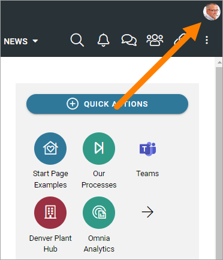
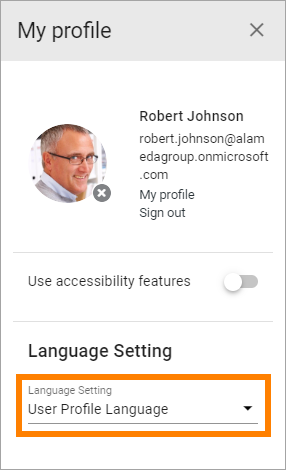
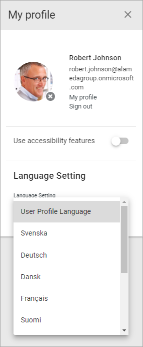

Current User Language
========================

Omnia users can themselves set the Current User Language, if needed.

**Note!** This setting is for system labels only, and (in Omnia 7.0 and later) for some other labels, for example:

+ Tenant and Business Profile names.
+ Publishing App title and description.
+ Navigation node titles.
+ Page Types titles.

This is how:

1. Open My Profile.

2. Open the list for Language Settings.

3. Select language.

The list contains all languages that are set up in Omnia Admin, see: :doc:`Regional Settings </admin-settings/tenant-settings/settings/regional-settings/index>`

The setting is saved automatically and is valid over sessions, meaning until language is set next time.

