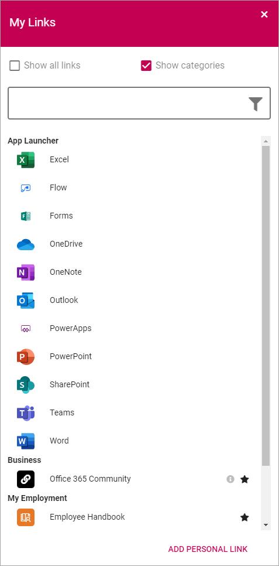
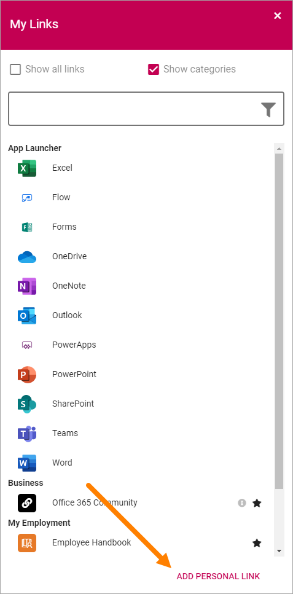
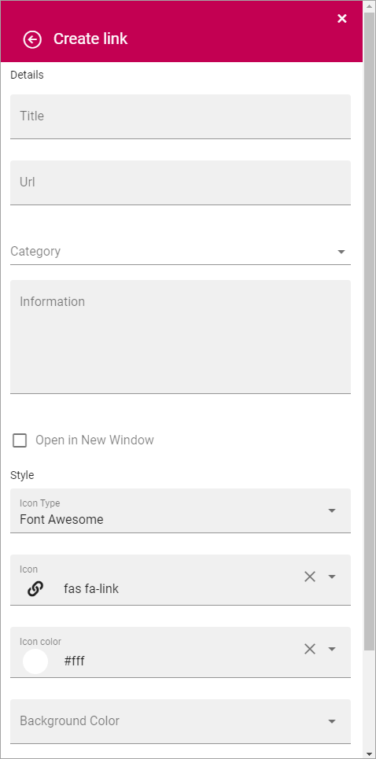
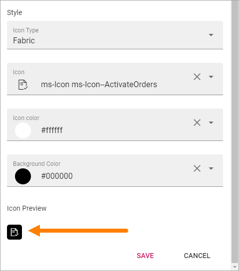

My Links
===========================================

Using My Links a user can access sites, documents and more, that has been setup in Omnia Admin.

All mandatory links, decided by the administrator when adding the links in Omnia Admin, are always shown.

Links can also be targeted to certain user groups, and only shown to them.

A search field is normally shown, which can be used to search for links. Search works from left to right.

Available options:

+ **Show all links**: When this option is selected all links, that the user is allowed to see, are shown. A user can select to show non mandatory links, or not. See below.
+ **Show categories**: Links can be categorized. If this option is selected categories (headings) are shown and the links are sorted byt the categories. See below for more information.
+ **Add personal link**: A user can add personal links as well, using this option. See below for an instruction.

In the above image "App Lancher", "Business" and "My emplyment" are categories. Here's the same My Links list without categories:

.. image:: my-links-no-categories.png

The administrator setting up the link can add additional information about a link (and additional information can be added to personal links as well). In that case an i-icon is shown for the link. To read the information, point at the i-icon.

.. image:: my-links-i-icon.png

Show a link or not
*******************
To decide which non mandatory links should be available, the stars will be used. In this image all links are shown (Show all links selected). When this option the gray stared links will not be shown. The black stared links will be shown.

.. image:: my-links-stars.png

To decide to show a ink or not, just click the star.

Add a personal link
********************
Users can normally add personal links to their My links list. Here's an instruction:

1. Click "Add personal link".

2. Use the following options:

+ **Title**: Type a text to be shown for the clickable link.
+ **Url**: Paste orli type the Url (link) in this field.
+ **Category**: Select an existing Category from the list or create a new Category by typing in the field.
+ **Information**: Add information about the link for your own use. If added, an i-icon is shown by the link, see noted above.
+ **Open in new window**: If the link should be opened in a new window, select this option. If not selected the link opens in th same window.
+ **Icon Type**: An Icon will be shown for each link. As the first step, you select Icon Type: "Font Awesome", "Fabric" or "Flags". 
+ **Icon**: When you have seleceted Icon Type, select the Icon using this list. See below for examples.
+ **Icon color**: For Font Awesome and Fabric, Icon color can be selected.
+ **Background color**: For Font Awesome and Fabric, a Background color for the icon, can be selcted.

Here are some examples of Font Awesome icons:

.. image:: font-awesome.png

Here are some examples of Fabric icons:

.. image:: fabric.png

And "Flags" are just that, flags, for example:

.. image:: my-links-flags.png

Note the "Icon Preview" at the bottom:

3. Click "Save".

Edit a personal link
*********************
All settings for a personal link can be edited. Click the pen to do that:

.. image:: personal-link-pen.png

Setting up links in Omnia Admin
*********************************
An administrator can set up links in Omnia Admin. Links can be applicable for the whole tenant, or for a business profile only. And, as already stated, links can be targeted.

See this page for more information: :doc:`Shared links </admin-settings/tenant-settings/shared-links/index>`

