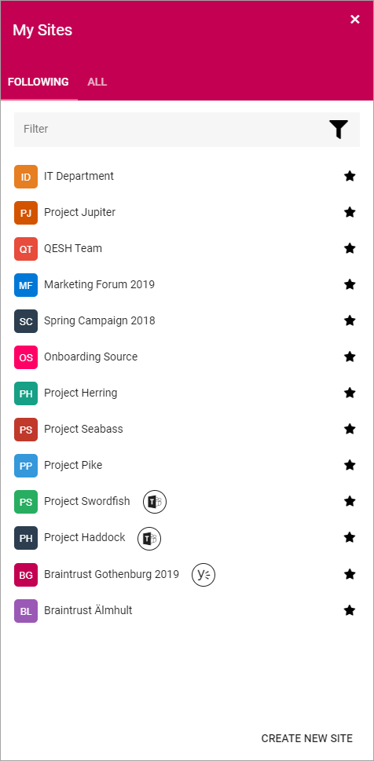
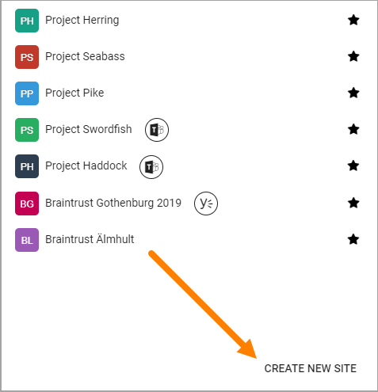
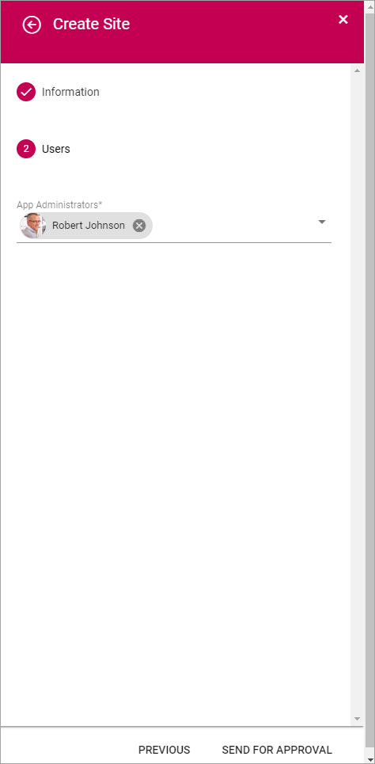

My Sites
===========================================

Using My Sites an end user can navigate to all Omnia sites that the user has access to. Settings in Omnia Admin states if My Sites should be shown or not.

Two tabs can be available:

+ **FOLLOWING**: If shown (according to settings in Omnia Admin), this tab lists all sites that the user is following. 
+ **ALL**: Can be used to search for any site the user has read access to. This tab is always shown.

A long list can be filtered by using the "Filter" field.

The user can follow or unfollow a site by clicking the star. A grey star indicates that the site is not followed and a black or colored star indicates that the user follows the site. 

Two things will happen when a user follows a site:

+ The site will be available as a quick link in the "Following" tab in the My Sites control.
+ Any conversations in the user feed on the site will be available in the user feed on the start page.

Create New Site
*************************
End users can be allowed to create a new site using the option here. The user can be allowed to create a site without approval, called "Self Service" or can send a request for a site to be created. In that case an administrator can approve or reject creation of the site.

Which fields and options will be available when creating a site can differ depending on settings in Omnia Admin.

Here's an example with some common fields and options:

1. Click "Create New Site".

2. Select the site to create.

.. image:: select-site-type.png

This example will create a "Team" site.

3. Set the following:

.. image: create-site-1.png

+ **Title**: This is the name that will be shown for the site in lists and when searching.
+ **Description**: A Description is not mandatory but is very helpful when colleagues search for sites.
+ **Sharepoint Alias**: The last part of the address to the site is created automatically but can be edited if necessary. If the name (address) already exists an alternative address is suggested.
+ **Languages**: The same language as the main Business Profile language is suggested. Another language can be selected if needed.  
+ **Time Zones**: Normally the correct Time Zone is already selected. Can be changed if needed.

4. Click "Next".
5. Set the following:

+ **Users**: In this example only an administrator for the site is set, but often you can set members and visitors as well, which are permission groups users can belong to. The administrator roll for a Team site is very importan. Normally only administrators can edit settings within the site and can add or remove users.
+ **Send for approval/Create site**: In this example new Team sites must be approved by an administrator, hence the option "Send for approval". If users are allowed to create site without approval, the options says "Create site" instead.

Templates for site creation
****************************
How site creation works and which options and fields will be available depends on the template used:

Templates for site creation, selected in step 2 above, are set up in Provisioning Templates in Omnia Admin, see: :doc:`Provisioning Templates </admin-settings/business-group-settings/provisioning-templates/index>`

