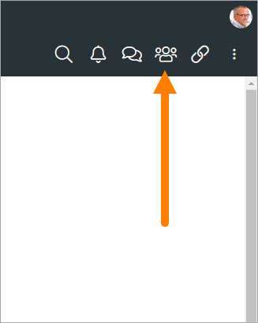
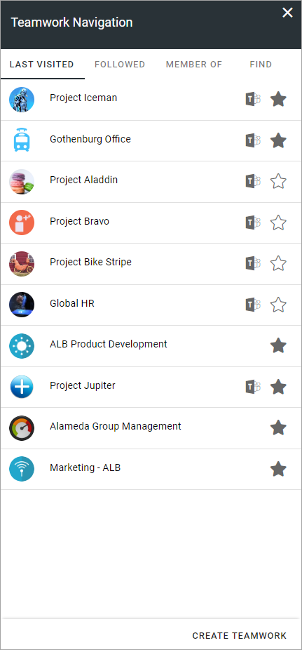
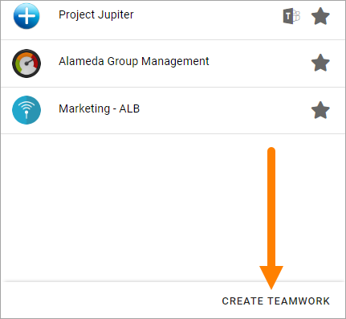
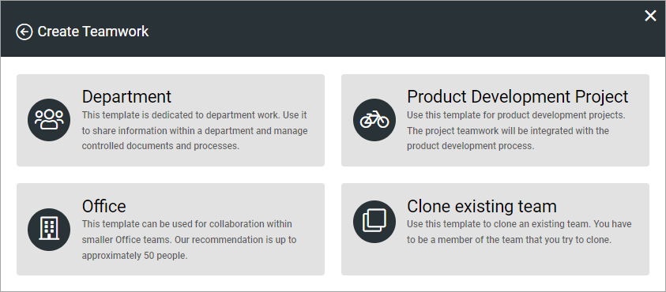
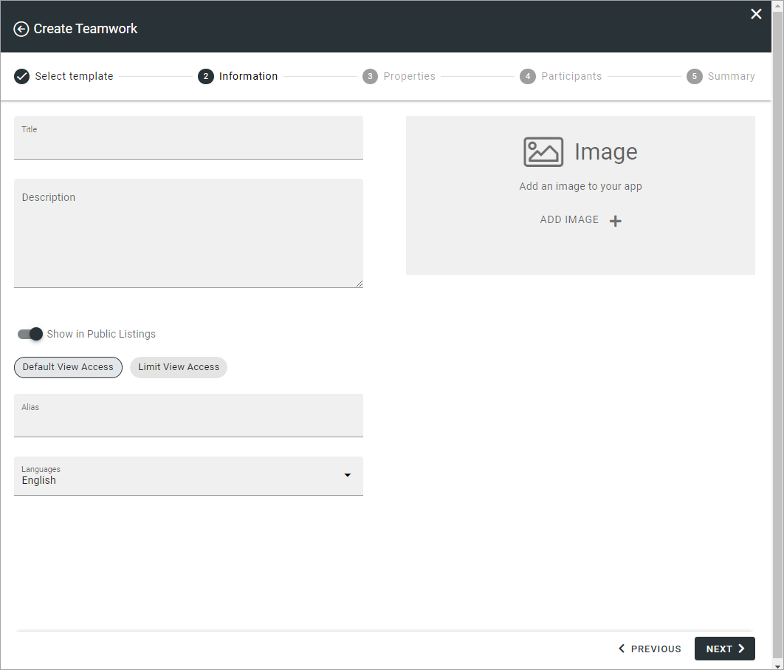
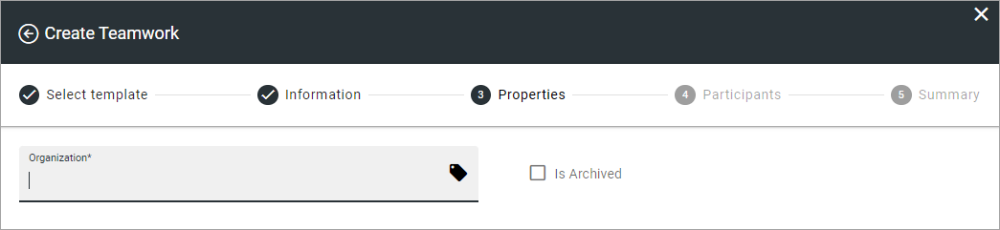
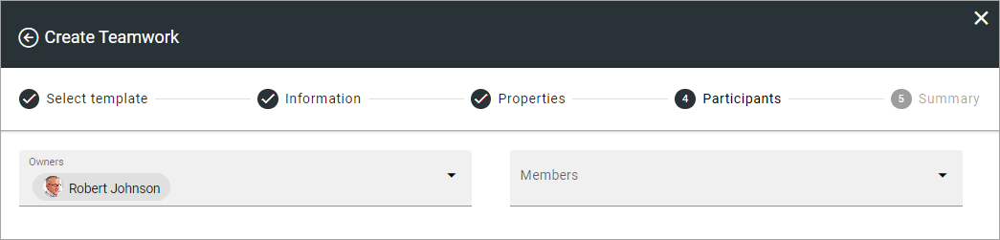
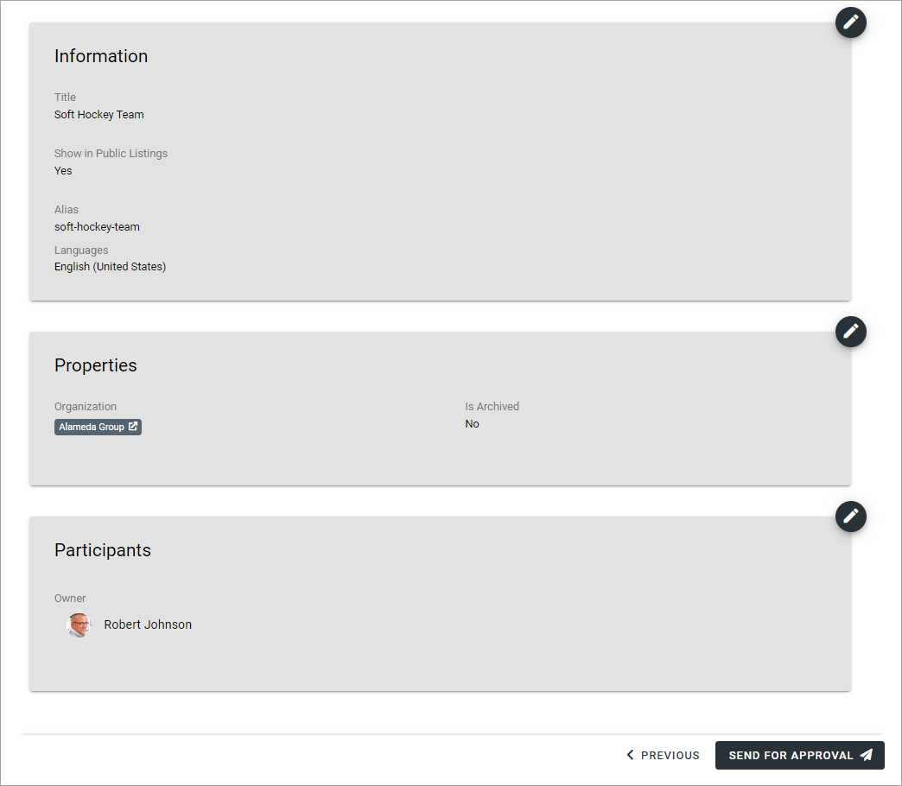

Teamwork navigation
===========================================

Teamwork navigation can display links to several types of sites and groups, including Yammer groups, Facebook Workplace and Microsoft Teams groups. Settings in Omnia admin states if Teamwork navigation should be shown or not in the top menu.

This is the icon used if teamwork navigation is shown in the top menu:

Here's an example of a teamwork Navigation list (image from Omnia v7):

Available tabs can be set up in a number of ways. 

The user can follow or unfollow a site by clicking the star. An unfilled star indicates that the site is not followed and a filled star indicates that the user follows the site. 

Two things will happen when a user follows a site:

+ The site may be available as a quick link in the "Following" tab in the My teams block, if such a tab is set up.
+ Any conversations in the user feed on the site will be available in the user feed on the start page.

If there is a Yammer group and/or Facebook Workplave or Teams group connected to a site, it is indicated by an icon. You can click the icon to go to the Yammer group, Facebook Workplace or Teams group.

In the image above you can see the Teams group icon. Here's an older example of a list with four facebook icons and one Yammer icon:

.. image:: teamwork-navigation-icons.png

Create Teamwork
*************************
End users can be allowed to create a new site or group using the option here. Depending on settings, approval can be needed. If it's not needed, the site or group will be created when the user clicks "Create". If approval is needed, a request is sent to an administrator for processing.

Another way users can be allowed to create teamworks, is through the Create app block. See this page for more information: :doc:`The Create app block </blocks/create-app/index>`

What the option is called and which fields and options will be available when creating a teamwork can differ depending on how the template used is set up.

Here's an example with some common fields and options:

1. Click CREATE TEAMWORK.

2. Select a template.

(What is available in this list depends on templates set up in Omnia admin.)

This example will create a "Department" site.

3. Select "Department".
4. Set the following:

(Again, what is shown here is an example, depends on the template).

+ **Title**: This is the name that will be shown for the site in lists and when searching.
+ **Description**: A description is not mandatory but is very helpful when colleagues search for sites.
+ **Show in public listings**: If this option is available, deselect if the site should not be shown in Omnia lists all colleagues has access to.
+ **Alias**: The last part of the address to the site is created automatically but can be edited if necessary. If the name (address) already exists an alternative alias is suggested.
+ **Languages**: The same language as the main business profile language is suggested. Another language can be selected if needed.  
+ **Image**: Adding an image is not mandator, but looks really noce in the lists.

5. Click "Next".
6. Set the following:

Properties has many uses in Omnia. This step can look very different - which properties the user has to or can fill in is set up in the template for the teamwork. Note that a star indicates that a setting is mandatory.

In this example this is used (mandatopry) to set which part of the organization this site will be used for. See for example this page for more information about properties: :doc:`Properties </admin-settings/tenant-settings/properties/index>`

7. As the next step, site owners and members can be added:

At least one administrator is mandatory, but it's recommended there should be at least two owners (administrators) of a teamwork. Normally there should only be a few, though, as site owners has extensive permissions to the teamwork's settings.

Members can be added now or later.

And now, this short example is finished. There can be additional parts of the process, depending on how the template is set up.

When all steps setup in the teamplet are done, a summary is shown:

Any step can be edited by clicking the pen.

8. Click CREATE or SEND FOR APPROVAL, depending on how the template is setup.

If the button's label is CREATE, the site/group is created when you click the button. If the button's label is SEND FOR APPROVAL, an administrator must approve your request before the site/group can be created. When the administrator has done his or her job, you will be notified.

Templates for teamwork creation
**********************************
How this wizard works and which options and fields will be available depends on the template used. Templates, selected in step 2 above, are set up as teamwork templates in Omnia admin.

For more information, see: :doc:`Teamwork templates </admin-settings/business-group-settings/team-collaboration/teamwork-v7/templates/index>`

