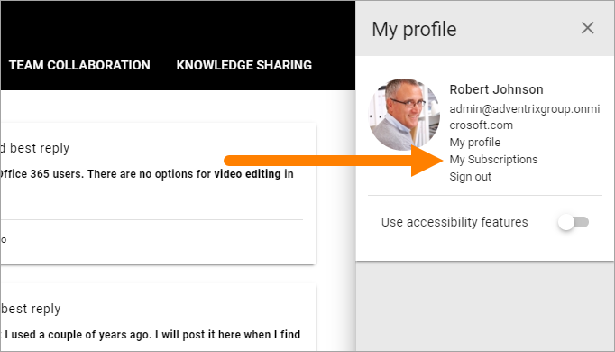
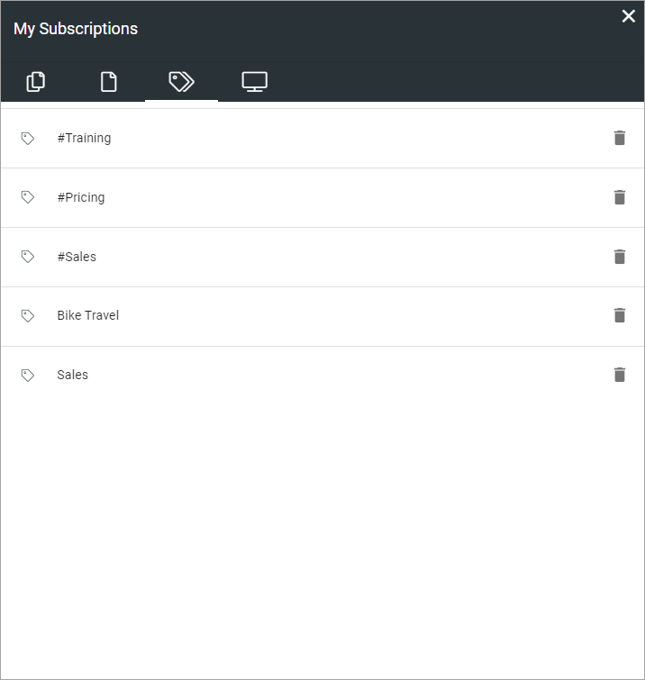
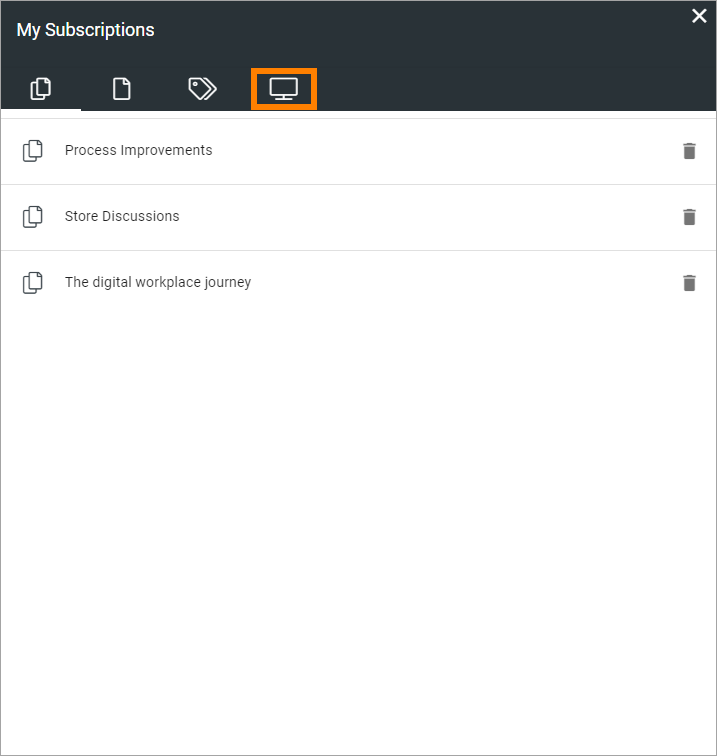
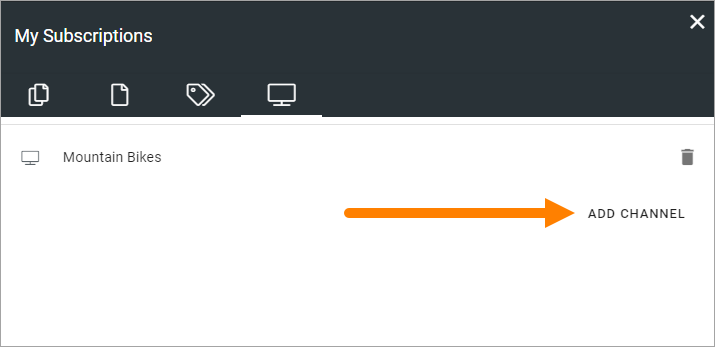
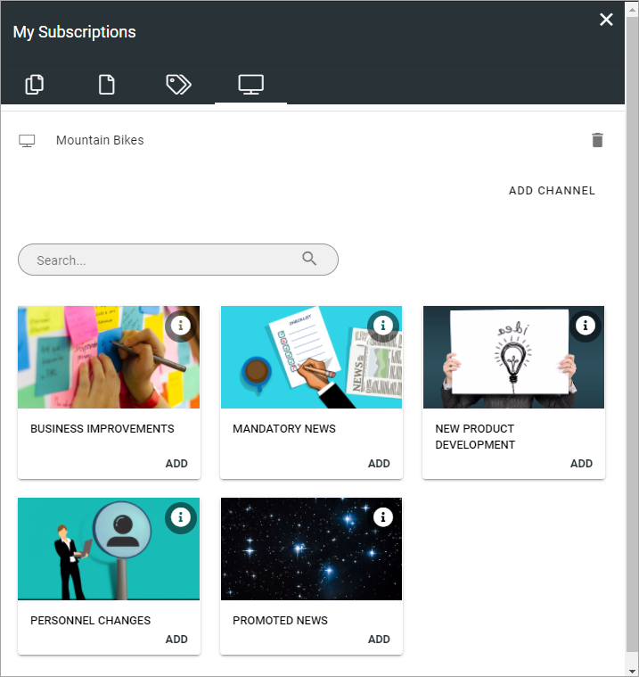

My Subscriptions
==================

You can subscribe to a community, articles and discussions in a community, to tags and to channels.

This page describes how this works in Omnia 6.12 and earlier. For Omnia 6.13 and later, see: :doc:`My Subscriptions in Omnia 6.13 </user-options/my-subscriptions-613/index>`

For information about subscriptions regarding communities, see: :doc:`Subscriptions in Communities </using-communities/subscriptions/index>`

For information about how to subscribe and unsubscribe to channels, see below.

Use My subscriptions for an overview of your subscriptions. You can unsubscribe using this as well.

My descriptions can be available in more than one way, for example under "My Profile":

.. image:: my-profile-menu-1.png

My Subscriptions can also be available in a block on any page.

Here's an example:

.. image:: my-subscriptions-1-new.png

The left tab (shown in the image above) lists all communities you subscribe to - meaning you subscribe to ALL activities in that community. 

The second tab lists all knowledge articles and discussion you subscribe to, for example:

.. image:: my-subscriptions-2-new.png

You can click the title to go to the page or discussion.

The third tab displays a list of all tags you subscribe to, for example:

You can unsubscribe to any subscription by clicking the dust bin.

Subscribing to channels and unsubscribing
********************************************
You can subscribe to channels, if any are setup. Use this tab:

To add a channel, do the following:

1. Select the tab and click ADD CHANNEL.

Available channels are shown, for example:

2. Click ADD to add a channel. 

It's also possible that subscription of a channel can be created automatically for specific colleagues or groups, if setup in the channel.

In the list of selected channels you can click the dust bin if you no longer want to subscribe to a channel.

