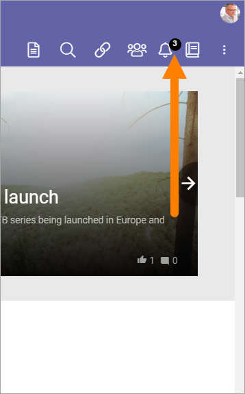
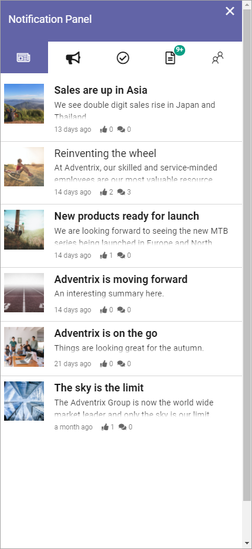
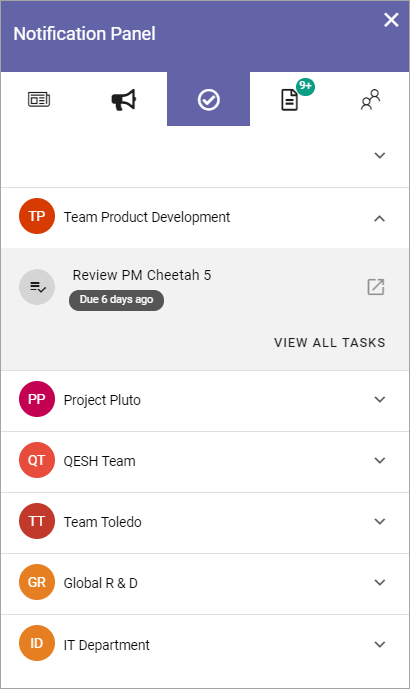

Notification panel
===========================================

A noticification panel can be present in the action panel or on any page. The purpose is to help users find out what information has been updated within different areas of the intranet.

Several different notification panels can be created for different purposes, where one of them can be displayed in the action menu. Others can be displayed through a block, on any page.

A number - 3 in the example below - indicates the number of new messages for the user:

Here's an example of what can be found in a notification panel:

What a notification panel will display depends on settings in Omnia admin. The following is an example, described from left to right:

+ **News**: (See image above). Latest News from the news archive, with the very latest at the top. Click to read the full news article. 
+ **Team news**: Latest news from the team sites the user is a member of. Messages are grouped by team site, for example:

.. image:: team-site-news-new2.png

To see the messages from a team site, click it. The latest messages from that team site are then shown, the very latest at the top. It can look like this:

.. image:: team-site-news-expanded-new2.png

Click the heading of a message to go the team site to read the full message. The author's name is also clickable here and will take you the author's user profile card, if it's used within your organization. If it's not, the author's delve page will be displayed.

+ **Tasks**: When tasks are assigned to the user in a team site, a notification will show up here. The tasks are grouped by team site: Here's an example with the list opened for one of the sites:

To go to the team site to see all tasks, click "View all tasks".

+ **Documents**: This lists all documents in team sites the user is a member of, that are new or has been updated recently, the newest at the top. Here's an example:

.. image:: documents-example-new2.png

Here, different actions can be taken:

- Click on the heading for a document to read the document. 
- Click the name of the Team site to go to the team site.
- Click the author's name to go to his or her delve page.

+ **Communities**: This is a list of new pages/articles in available communities, the latest at the top.

.. image:: external-news-new2.png

Click the heading or the image to read the page/article.

Notification panel as a block
******************************
A notification panel can be added to any page as a block, see: :doc:`Notification panel block </blocks/notification-panel/index>`

Settings for notification panels
*************************************
In Omnia admin, several different notification panels, for different purposes, can be created and administered. All settings for the notification panels are handled there, in Omnia admin, under the business profile, see: :doc:`Notification panel settings </admin-settings/business-group-settings/notification-panel/index>`

