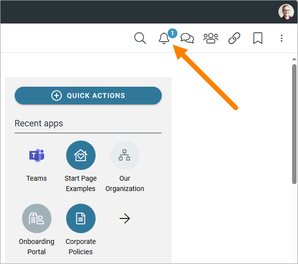
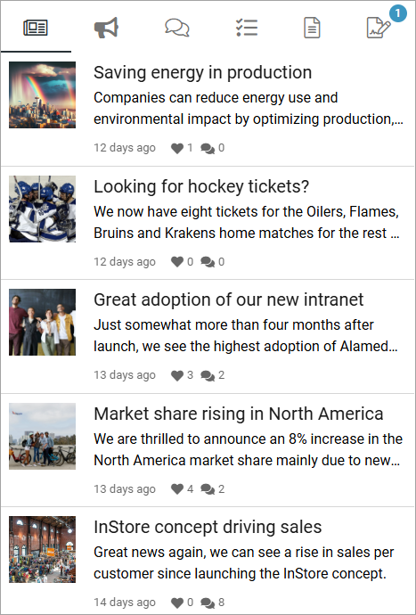
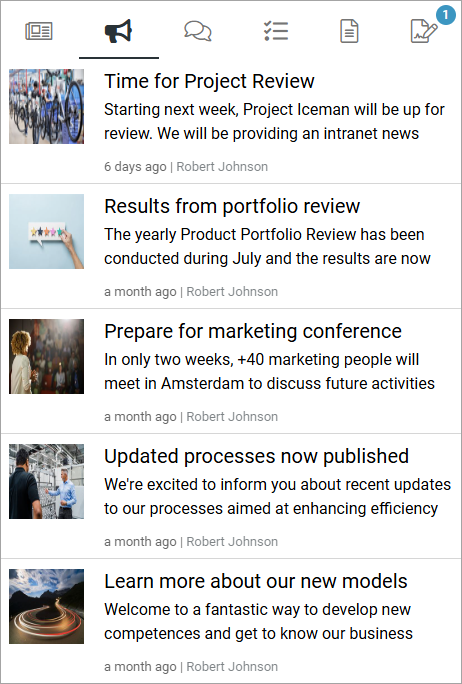
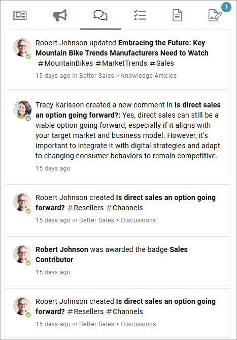
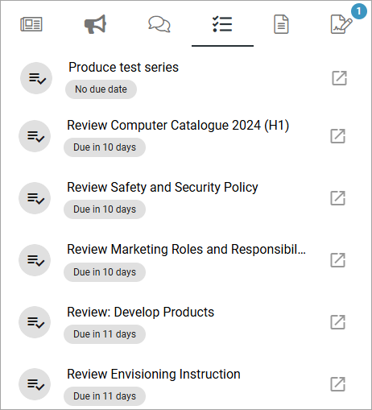
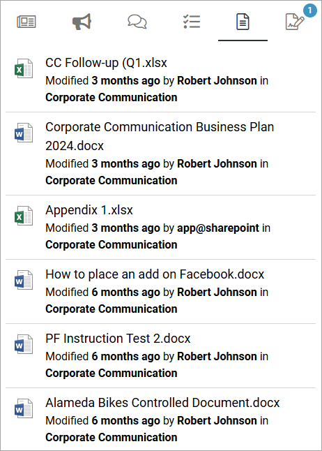
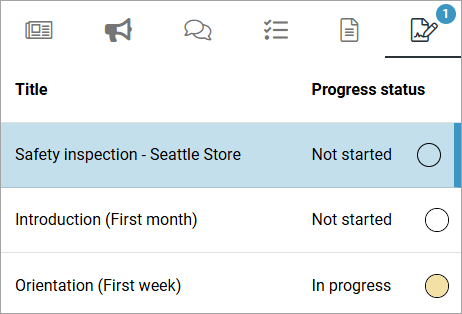

Notification panel
===========================================

A noticification panel can be present in the action panel or on any page. The purpose is to help users find out what information has been updated within different areas of the intranet.

Several different notification panels can be created for different purposes, where one of them can be displayed in the action menu. Others can be displayed through a block, on any page.

A number - 1 in the example below - indicates the number of new messages for the user:

Here's an example of what can be found in a notification panel:

What a notification panel will display depends on settings in Omnia admin. The following is an example, described from left to right:

+ **News**: (See image above). Latest News from the news archive, with the very latest at the top. Click to read the full news article. 
+ **Team**: Latest messages from the teamsites the user is a member of, for example:

Click the heading of a message to go the teamsite to read the full message. You can click the authors name for more information about hom or her.

+ **Communities**: Latest articles or comments from the communities the user is a member of, for example:

Click the heading or the image to read the page/article.

+ **Tasks**: When tasks are assigned to the user in a teamsite, a notification will show up here. 

To go to the task to read more and execute, click the heading.

+ **Documents**: This lists all documents in teamsites the user is a member of, that are new or has been updated recently, the newest at the top. Here's an example from a test environment:

Different actions can be taken for a document:

- Click on the heading for a document (the file name) to read the document. 
- Click the name of the teamsite to go to the team site.
- Click the author's name to see more information about him or her.

+ **Sign-off requests**: If there are any sign-off requests active for the user, they are shown here, for example:

Just click the request to work with it.

Notification panel as a block
******************************
A notification panel can be added to any page as a block, see: :doc:`Notification panel block </blocks/notification-panel/index>`

Settings for notification panels
*************************************
In Omnia admin, several different notification panels, for different purposes, can be created and administered. All settings for the notification panels are handled there, in Omnia admin, under the business profile, see: :doc:`Notification panel settings </admin-settings/business-group-settings/notification-panel/index>`

