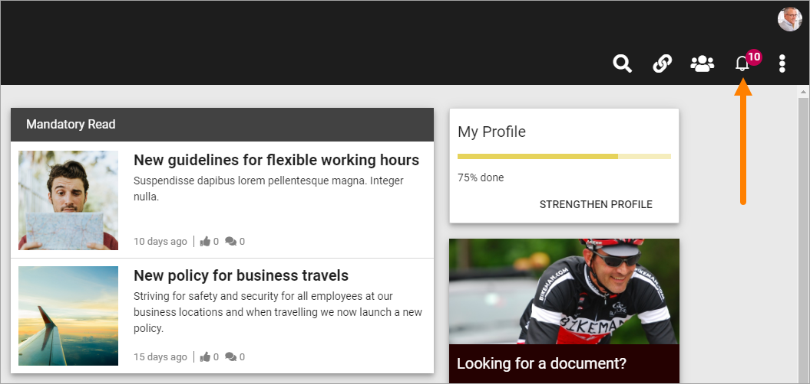
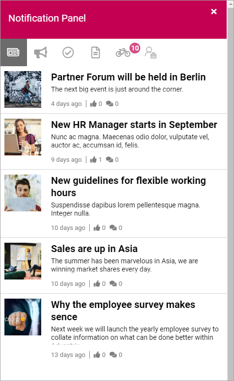
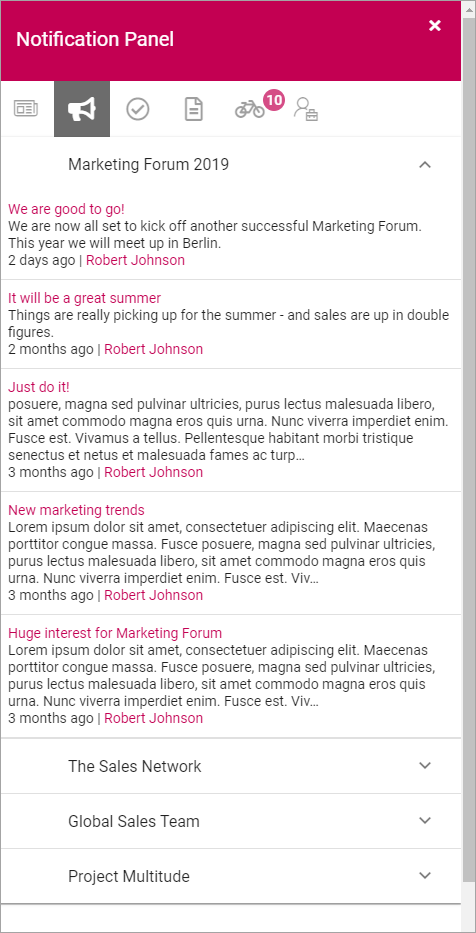
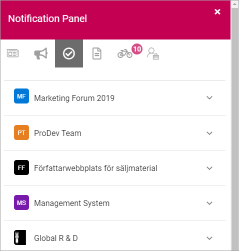
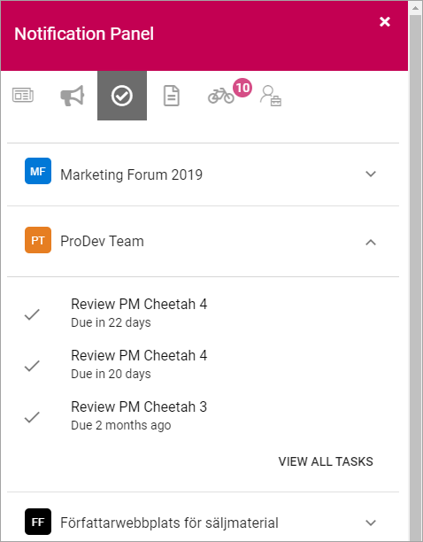

Notification Panel
===========================================

A Noticification Panel can, among other options, be present in the Action Panel. The purpose is to help users find out what information has been updated within different areas of the intranet.

Several different Notifications panels can be created for different purposes, where one of them can be displayed in the Action Menu. Others can be displayed through a block, on any page.

A number - 10 in the example above - indicates the number of new messages for the user.

Here's an example of what a Notification Panel can look like:

What a Notification Panel will display depends on settings in Omnia Admin, but typical examples are the ones shown in the image above, from left to right:

+ **News**: Latest News from the News Archive, with the very latest at the top. Click to read the full news article. See example in the image above.
+ **Team News**: Latest News from the Team sites the user is a member of. Messages are grouped by Team site, for example:

.. image:: team-site-news.png

To see the messages from a Team site, click it. The latest messages from that Team site are then shown, the very latest at the top. It can look like this:

Click the heading of a message to go the Team site to read the full message. The author's name is also clickable here and will take you the author's Delve page.

+ **Tasks**: When tasks are assigned to the user in a Team site, a notification will show up here. The tasks are grouped by Team site, for example:

To work with a task the user expands the list for the Team site, and then clicks the task.

To go to the Team site to see all tasks, click "View all tasks".

+ **Documents**: This lists all documents in Team sites the user is a member of, that are new or has been updated recently, the newest at the top. Here's an example:

.. image:: documents-example.png

Here, you can take different actions depending on the link you click on:

- Click on the heading for a document to read the document. 
- Click the name of the Team site to go to the Team site.
- Click the author's name to go to his or her Delve page.

+ **External**: Can display news form various external sources.

.. image:: external-news.png

+ **Subscription**: (Information will added soon)

.. image:: subscription-example.png

Notification panel as a block
******************************
A Notification Panel can be added to any page as a block, see: :doc:`Notification Panel block </blocks/notification-panel/index>`

Settings for the Notification panel
*************************************
In Omnia Admin, several different Notification Panels, for different purposes, can be created and administered. All settings for the Notification panels are handled there, in Omnia Admin, under the Business Profile, see: :doc:`Notification Panel settings </admin-settings/business-group-settings/notification-panel/index>`

