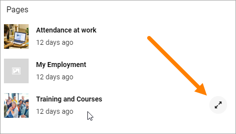
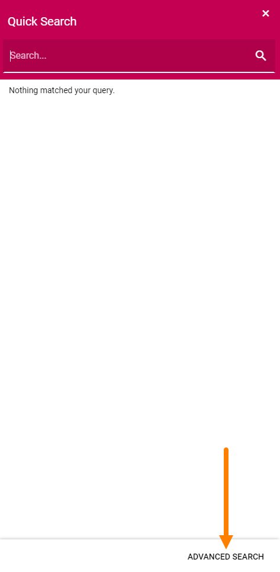
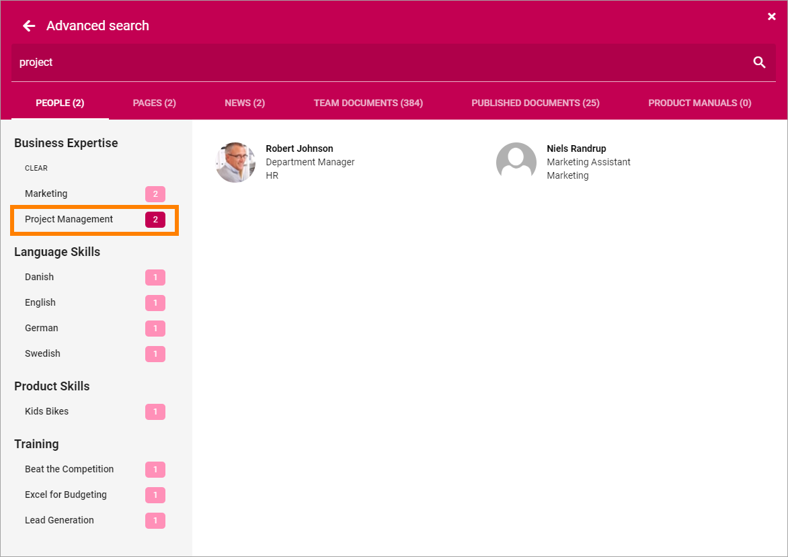
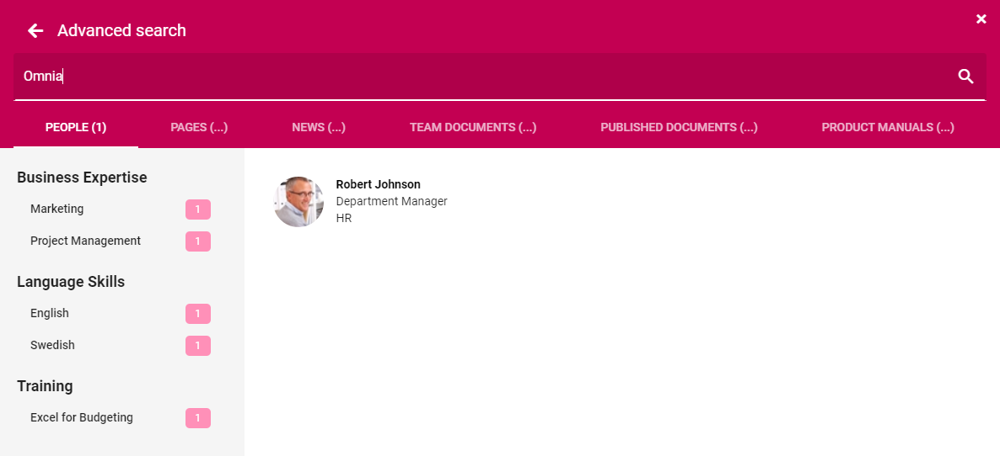

Quick Search and Advanced Search
===========================================

Using Quick Search users can find information in a quick and convenient way. 

Here's an example of a search result:

.. image:: quick-search-example.png

Note the headings "People", "Pages" and "Documents".

Previews are available for pages and documents. To preview a page, point at the page and click this icon:

To see a proview of a document, point at the document and click thins icon:

.. image:: quick-search-preview-document.png

Advanced Search
****************
To search with more options, users can go to the Advanced Search by clicking here:

When conducting an Advanced Search more tabs are available at the top and refiners are available to the left. Here's an example:

.. image:: advanced-search-result.png

If, for example, the user would be interested in project managment only, the refiner could be used to just show search results related to project management.

This is what the search result above would look like filtered on Project Management:

Advanced Search can also be added as a block to any page, see: :doc:`Advanced Search Block </blocks/search/index>`

Go from Quick Search to Advanced Search
*****************************************
When having conducted a Quick Search, the user can then go to Advanced Search to refine the search result, if needed, by clicking "See more results for ....".

.. image:: more-search-results.png

Advanced Search would then look something like this:

Settings for Search
********************
The settings for Search are found in Omnia Admin, for Business Profiles, see: :doc:`Search settings </admin-settings/business-group-settings/search/index>`

