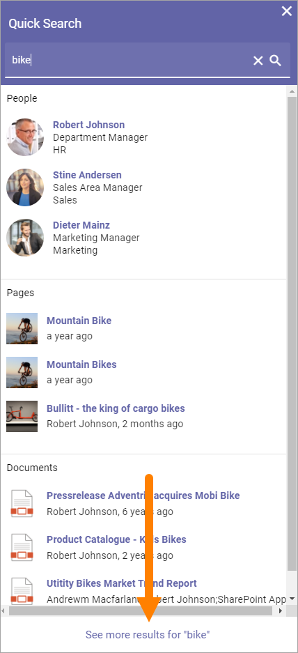

Quick Search and Advanced Search
===========================================

Using Quick Search users can find information in a quick and convenient way. How it will work is set up in Omnia Admin. 

Here's an example of a search result:

.. image:: quick-search-example-new2.png

Note the headings "People", "Pages" and "Documents".

Previews are available for pages and documents. For a preview, point at the page or document and click this icon:

.. image:: quick-search-preview-page-new3.png

Advanced Search
****************
To search with more options, users can go to the Advanced Search by clicking here (the text for this link can be edited):

When conducting an Advanced Search more tabs are available at the top and refiners can be available. Note the number of search hits for each tab (category).

The refiners available (if refiners are shown) depends on what is available in the search result and the tab selected. Here's an example:

.. image:: advanced-search-result-new2.png

If, for example, the user would be interested in product manuals only, the tab "PUBLISHED DOCUMENTS" could be selected and the refiner "Product Manual" chosen.

.. image:: advanced-search-refined-new2.png

Promoted Search results
------------------------
In Omnia 6.7 and later, a search administrator can set up promoted search results using keywords. A promoted search result can be shown this way in Quick Search:

.. image:: quick-search-promoted-example.png

And this way in Advanced Search:

.. image:: advanced-search-promoted-example.png

Promoted search results are set up in Omnia Admin, see: :doc:`Promoted Search Results </admin-settings/business-group-settings/search/promoted-search-results/index>`

Search feedback
-----------------
In Omnia 6.7 and later it is poosible for users to send feedback on a search result (see image above).

For information on how this works for the user, see: (link to be added).

For information on how this works for administrators, see: (link to be added).

Settings for Search
********************
The settings for Search are found in Omnia Admin, for Business Profiles, see: :doc:`Search settings </admin-settings/business-group-settings/search/index>`

