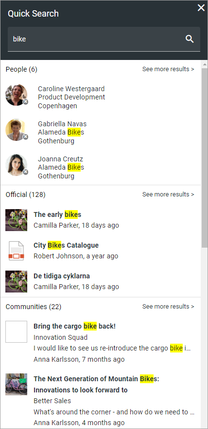
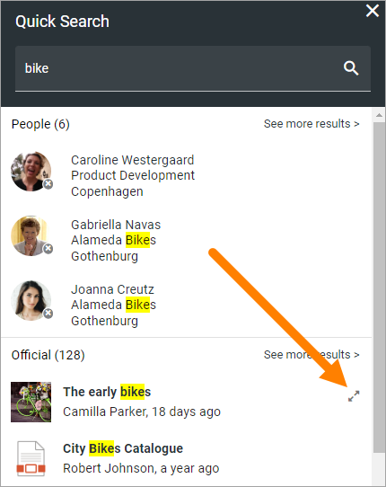
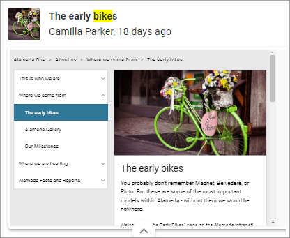
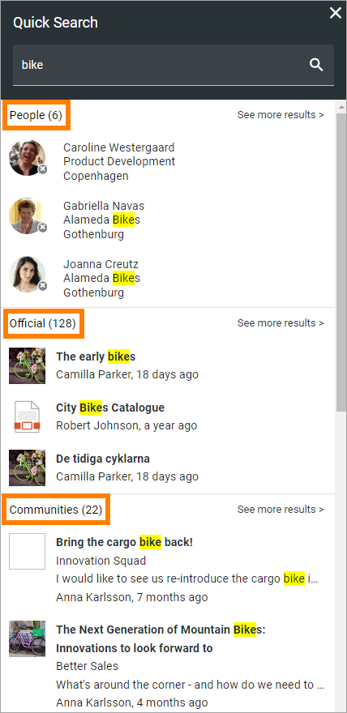
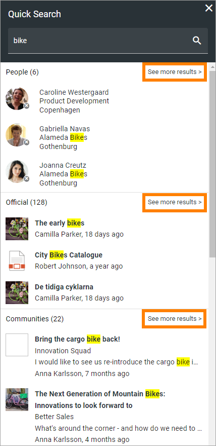
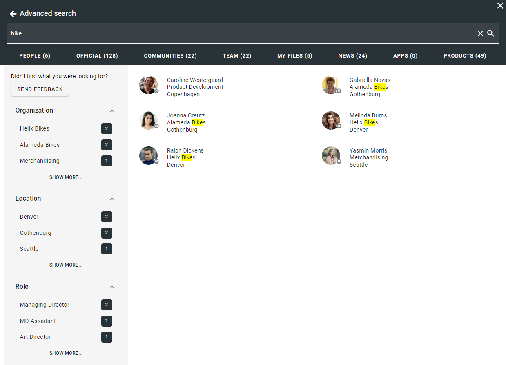
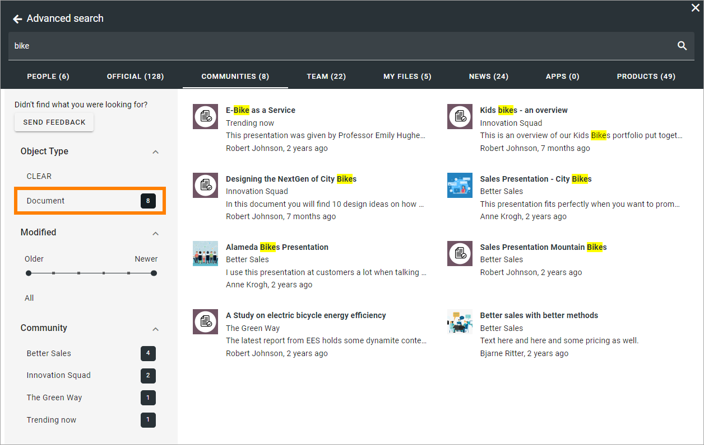

Quick search and Advanced search
===========================================

Using quick search users can find information in a quick and convenient way. How it will work is set up in Omnia admin. 

Here's an example of a search result:

Note the headings "People", "Official" and "Communities".

Previews are available for pages and documents. For a preview, point at the page or document and click this icon:

Here's an example of a preview for a page:

The totalt number of search results are shown for for each category. Here's an example:

Advanced search
****************
To search with more options, users can go to Advanced search by clicking here (the text for this link can be edited):

When conducting an advanced search more tabs are available at the top and refiners can be available. Note the number of search hits for each tab (category).

The refiners available (if refiners are shown) depends on what is available in the search result and the tab selected. Here's an example:

If, for example, the user would be interested in documents in communities, this search results could be shown by selecting "Document" on the COMMMUNITIES tab, in this example.

Promoted search results
------------------------
A search administrator can set up promoted search results using keywords. A promoted search result can be shown this way in Quick search:

.. image:: quick-search-promoted-example.png

And this way in Advanced search:

.. image:: advanced-search-promoted-example.png

Promoted search results are set up in Omnia admin, see: :doc:`Promoted search results </admin-settings/business-group-settings/search/promoted-search-results/index>`

Search feedback
-----------------
It can be possible for users to send feedback on a search result (see the button SEND FEEDBACK in the image above).

For information on how this works for the user, see: :doc:`Send feedback on a search result </user-options/search-feedback-user/index>`

For information on how this works for administrators, see: :doc:`Search feedback </admin-settings/business-group-settings/search/search-feedback/index>`

Settings for search
********************
The settings for search are found in Omnia admin, for a business profile, see: :doc:`Search settings </admin-settings/business-group-settings/search/index>`

