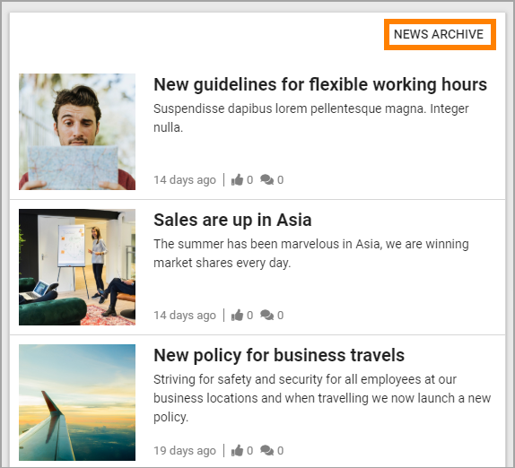
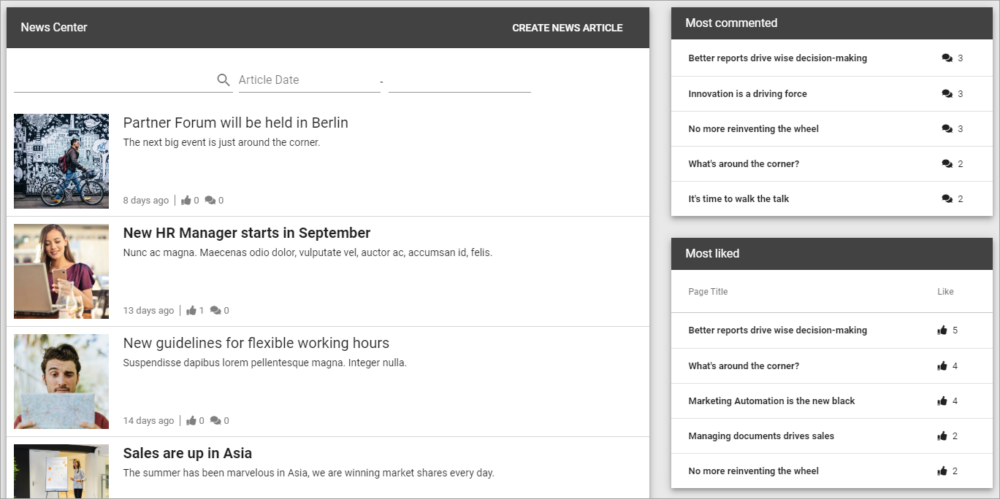

Read News
===========================================

News is very often an important part of a Omnia Intranet implementation. Normally users can read both the latest news and older news. Users can also find News articles through search.

A common solution is that the latest news is available in a list at the start page. Here's an example using the Page Rollup block:

.. image:: news-list-example.paging

The Page Rollup block can be used on any publishing page in Omnia. Another common solution is to make news available in the Notification Panel. Here's an example:

.. image:: news-in-notification-panel.png

To read a News article, click the heading or the image.

The News article can no be read. The user can often read other new news articles here, without having to go back a step, for example:

.. image:: news-read.png

When reading a News article, users can often like, share and comment the article:

..image:: news-comment.png

Liking, sharing and commenting works the same way here as for publishing pages in Omnia, see: :doc:`Like, share and comment </user-options/like-share-comment/index>`

The News Archive
*****************
The most common solution is that users can read all published articles in a News Archive, in a News Center. Users can search for News articles. It's also possible to go to the News Archive and browse the list.

A News Archive can look like this:

The option "Create News Article" is shown for the users with the right permissions only, see: :doc:`Create news </user-options/create-news/index>`

The main lists displays all published News articles, the latest at the top. You can always browse the list to look for a specific News article.

It's also possible to use search. Use the search field to search for words in the heading or content:

.. image:: news-search.png

The list can also be filtered on dates. Use the two fields to set a from and to date, or just a to date:

.. image:: news-filter-date.png

Another common solution is to display two lists to the right of the News list - one for the most commented News articles, and one for the most read:

.. images:: news-commented.png

You can click headings in these lists to read a News article.