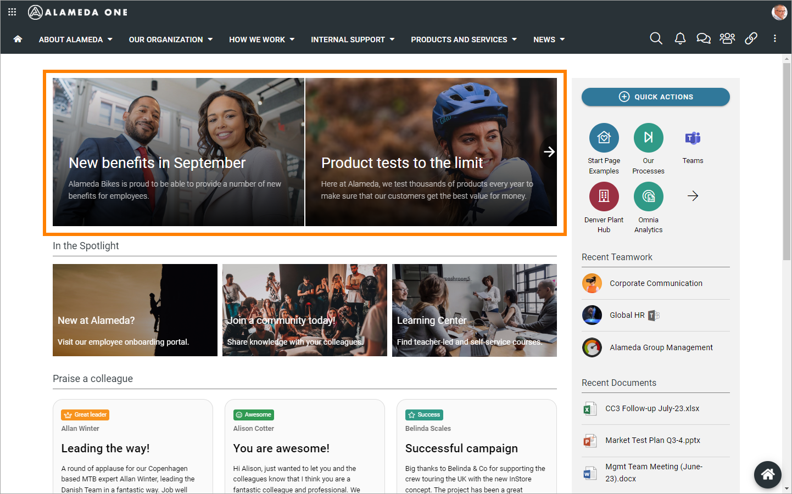
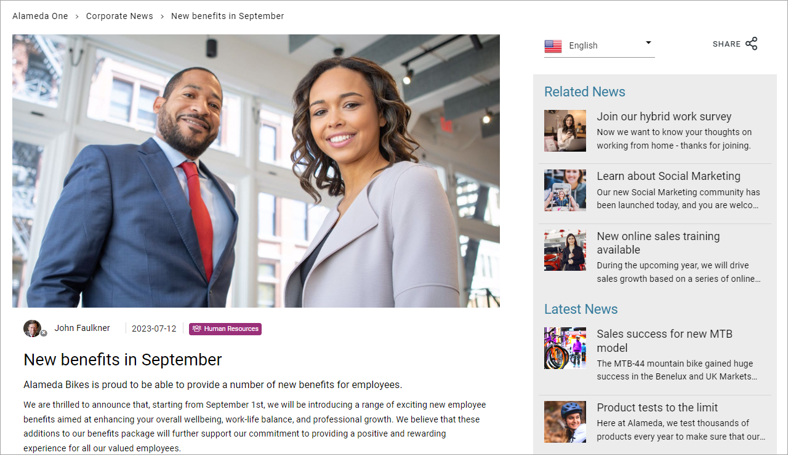
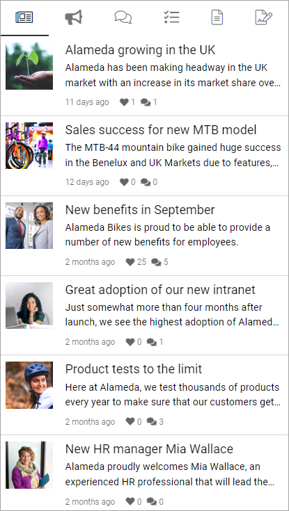
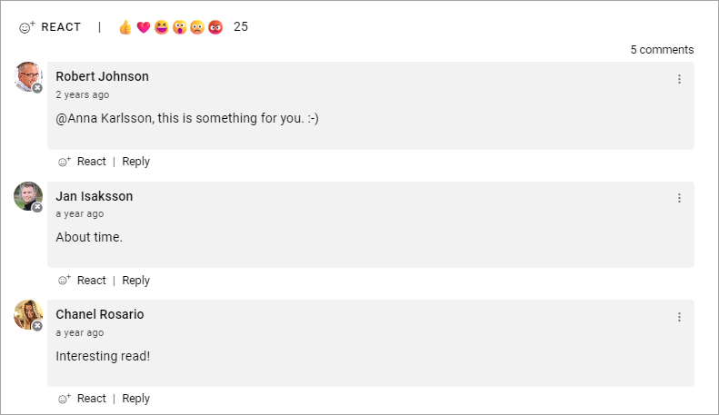
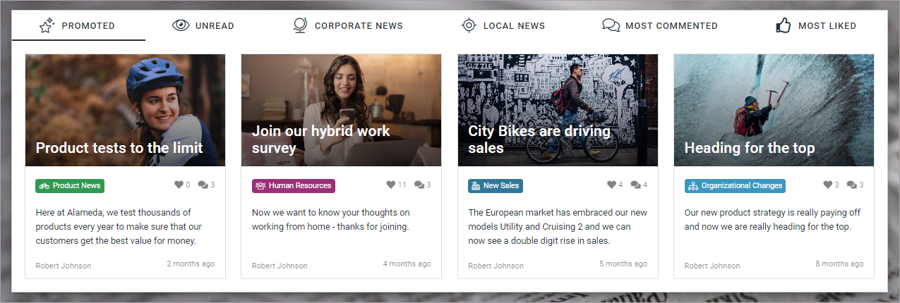
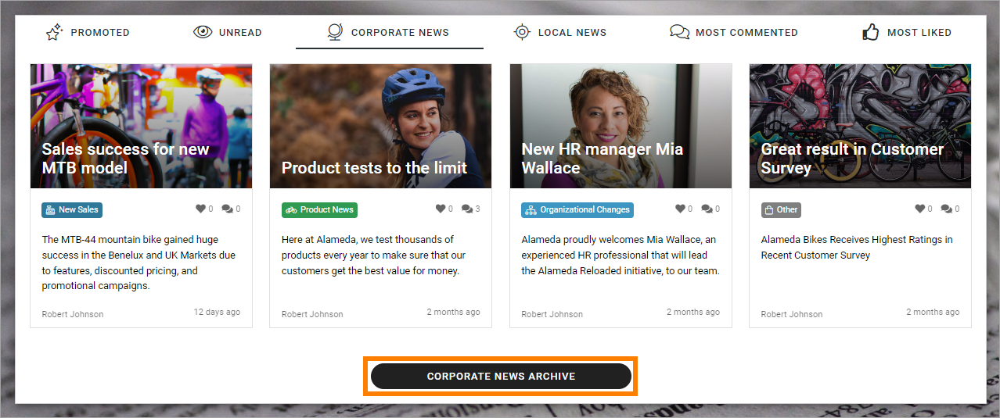
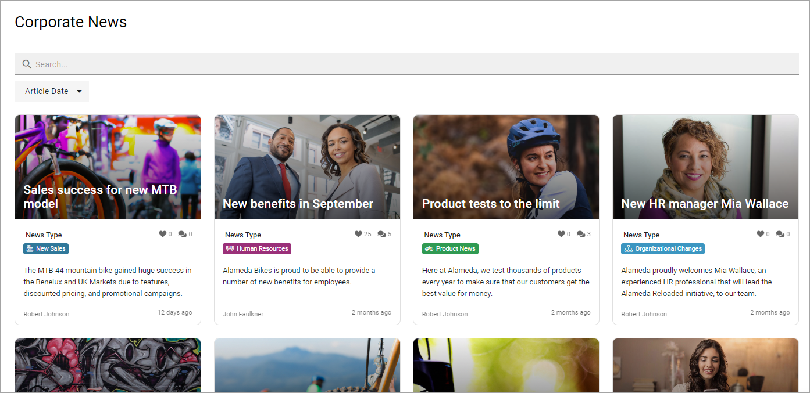

Read News
===========================================

News is very often an important part of an Omnia implementation. How news articles are made available and read can be set up in many ways. Here are a few examples.

Normally you can read both the latest news and older news. You can also find news articles through search using Quick Search and Advanced Search.

A common solution is that the latest news is available in a list at the start page. Here's an example using the Page Rollup block and Dynamic roller for display:

Just click the image for the news you want to read. When reading, it can llok like this:

Note the metadata info indicatig that this news relates to Human Resources. Also note the two lists to the right: Related News and Latest News. You can read additional news by just clicking there.

The Page Rollup block can be used on any publishing page in Omnia in can be setup in a number of ways. 

Another common solution is to make news available in the Notification Panel. Here's an example:

When reading a news article, you can often like (or react in some other way), share and comment the article. Here's an example:

Liking, sharing and commenting works the same way here as for publishing pages in Omnia.

A News Center
******************
A news center can also be setup in a number of ways. Here's an example using card views and where the news articles are divied into four types.

If a news archive is available, it's indicated by a link or button, for example:

In a news archive, you can read older news as well. In this example, you can search for news here and filter the list on dates.

