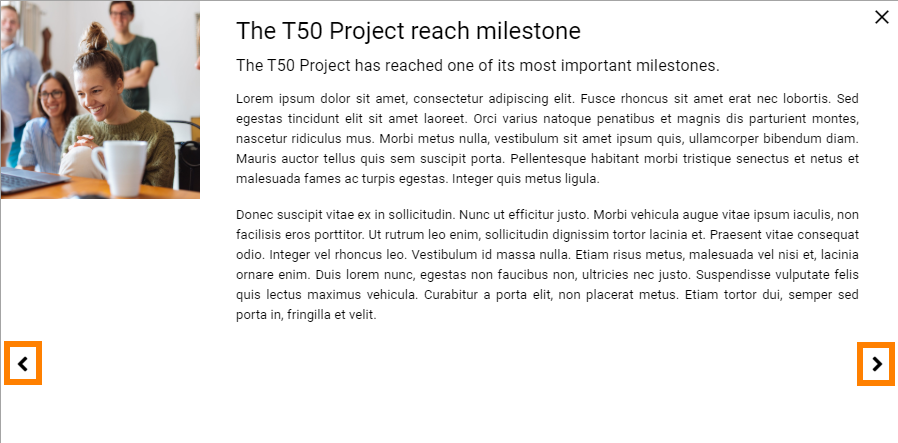
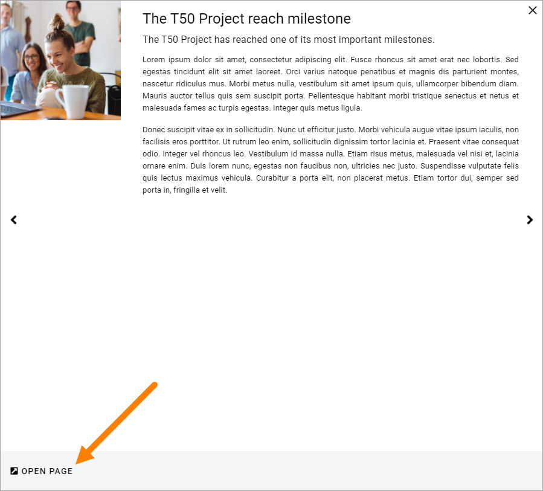
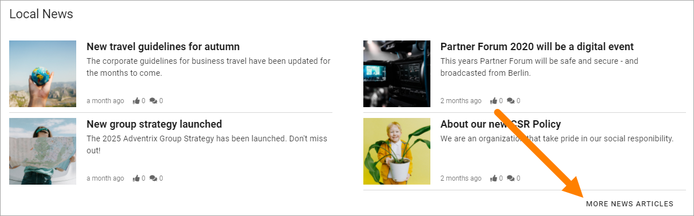
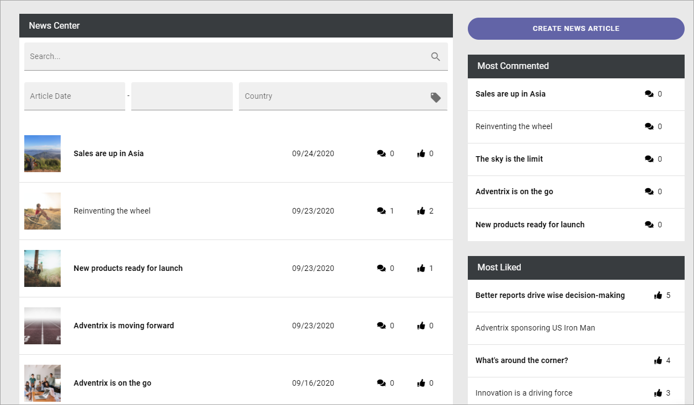
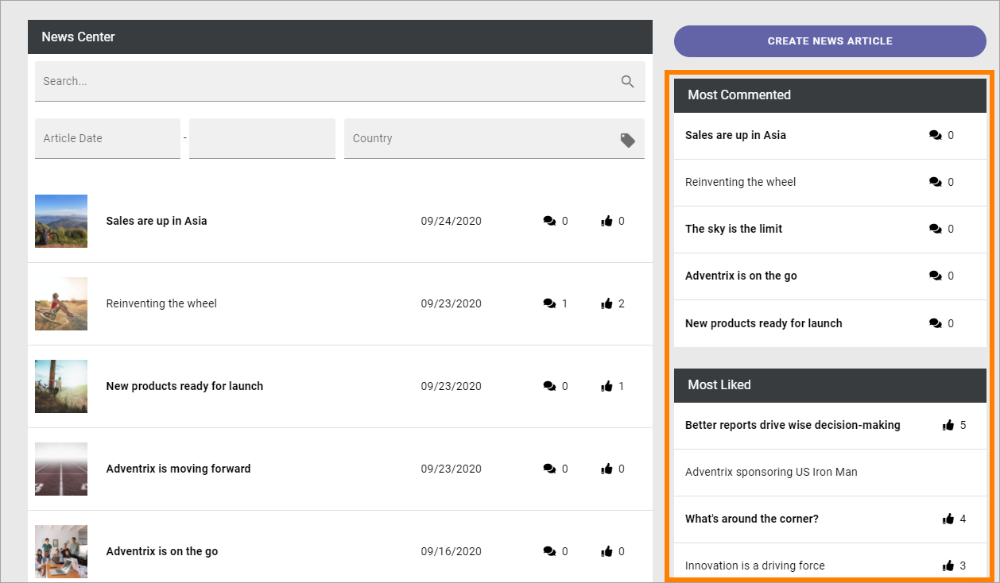

Read News
===========================================

News is very often an important part of an Omnia implementation. Normally you can read both the latest news and older news. You can also find news articles through search using Quick Search and Advanced Search.

A common solution is that the latest news is available in a list at the start page. Here's an example using the Page Rollup block and Dynamic roller for display:

.. image:: news-list-example-v7.png

Just click the image for the news you want to read. When reading, it can llok like this:

.. image:: news-list-example-reading-v7.png

Note the metadata info that this news relates to Human Resources. Also note the two lists to the right: Related News and Latest News.

The Page Rollup block can be used on any publishing page in Omnia. 

Another common solution is to make news available in the Notification Panel. Here's an example:

.. image:: news-in-notification-panel-v7.png

When reading a news article, you can often like (or react in some other way), share and comment the article. Here's an example:

.. image:: news-comment-v7.png

Liking, sharing and commenting works the same way here as for publishing pages in Omnia.

A news list can also be set up to show the news articles in windows, for example:

.. image:: news-window.png

You can then go to other pages shown in this list by cliking here:

And you can go to the news article's page, by clicking "Open Page".

The News Center
******************
The most common solution is that all published articles are available in a News Archive/News Center. You can always search for news articles. It's also possible to go to the news archive and browse the list, by clicking a link. Here's an example:

A News Center can look like this:

The option "Create News Article" is shown for the users with the right permissions only, see: :doc:`Create news </user-options/create-news/index>`

The main list displays all published news articles, the latest at the top. You can always browse the list to look for a specific news article.

Depending on how the News Center is set up it can also be possible to use search or to filter the list. 

.. image:: news-search-new2.png

Another common solution is to display two lists to the right of the News list - one for the most commented News articles, and one for the most read or one for the most liked (in this case most liked):

You can click headings in these lists to read a news article.
