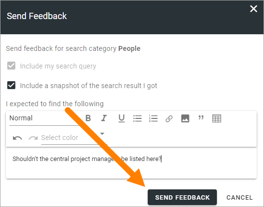

Send feedback on a search result
=====================================

It can be possible to send feedback on a search result, if that option is activated in Omnia admin. A button is then available in all Advanced search results, for example:

To send feedback, do the following:

1. click the button.

This window is then shown:

.. image:: search-feedback-user-example-window.png

2. Decide to include a snapshot of your search result or not (default=include).
3. Type the feedback in the text field.
4. Click SEND FEEDBACK.

An administrator can now have a look at the feedback and take actions, if necessary.
