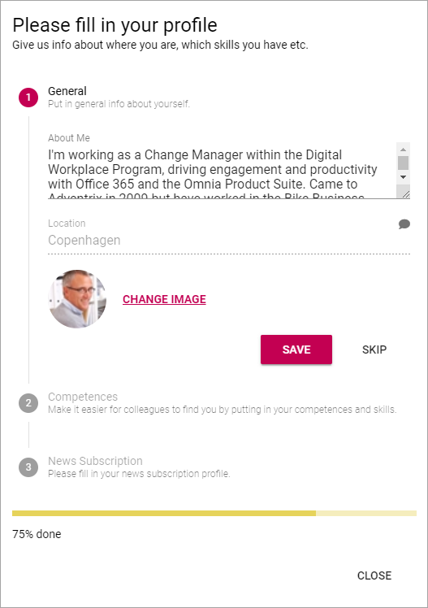
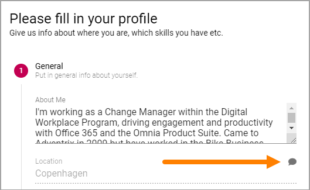
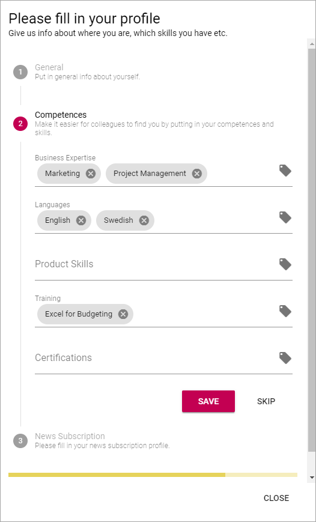
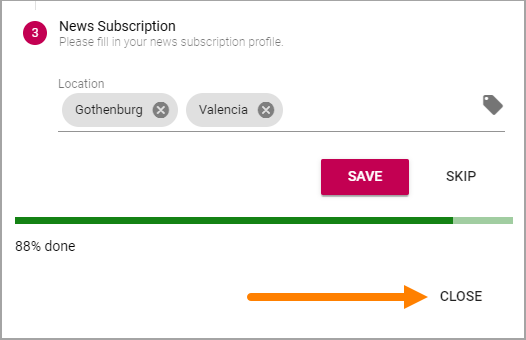

Strengthen Profile
===========================================

To make it easier for users to complete the most important parts of their profile, a Strengthen Profile option can be made available.

The option can be available in the Action Menu:

.. image:: strengthen-profile-menu.png

The option can also be made available through a block, on any page.

Here's an example of what the user will see:

The steps are numbered, the active step marked with a color (in the above example red).

If this icon is present, the user can add a comment:

Do the following:

1. Make the necessary changes.
2. Click "Save" if changes has been made, or "Skip" if not.

3. To go to the next step, click the step.

Here's an example of step 2:

To remove a post in a field, click the x.

.. image:: click-x.png

To add a post to a field, click this icon:

.. image:: click-list-icon.png

A list is shown where you can select the post/posts you want to add, for example:

.. image:: posts-to-add.png

Normally, several posts can be selected.

To close a list, click outside it.

4. Make the necessary changes.
5. Click "Save" if changes has been made, or "Skip" if not.
6. To go to the next step, click the step.

Here's an example of step 3:

.. image:: step3-example.png

7. Do the same here; click the x to remove, click tag icon to add.
8. Save or skip when you're done.
9. To close the option, click "Close".

Settings for Strenghten Profile
*********************************
All settings are done in Omnia Admin, see: :doc:`User Profile Completion </admin-settings/tenant-settings/user-profile-completion/index>`

