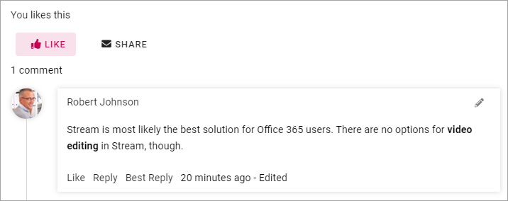
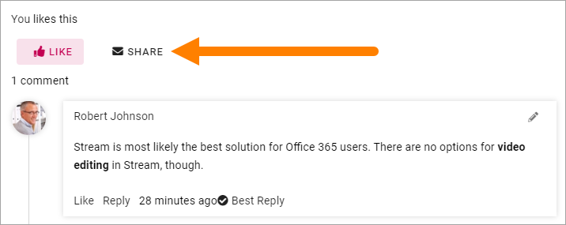

Like, Share and Best reply for discussions
============================================

You can like and share a discussion and like comments. If you are the one that started the discussion, you can tag ONE comment as Best reply.

Like a discussion or a comment
**********************************
The list "Popular" for discussions sorts the list of discussion on likes, so the most liked discussion will be at the top.

To like a discussion, just click "LIKE".

.. image:: discussion-like-1.png

The Like icon now changes and you can use it to unlike the discussion:

You can also like a comment:

.. image:: discussion-like-3b.png

You can change your mind about a comment you have liked, and unlike it.

.. image:: discussion-like-4.png

Share a discussion
****************************
To share a discussion with a colleague, do the following:

1. Click "Share".

2. Add the Email address to the colleague and click "Send".

Best reply
***********
If you started the discussion you can tag one, and only one, comment as Best reply.

.. image:: discussion-bestreply-4b.png

That a comment is tagged as best reply is shown this way:

.. image:: discussion-bestreply-5.png

You can click it to untag the comment for best reply, to tag some other comment.

Best reply can be a very important action if activity points and badges are activiated, see: :doc:`Setting up a community </using-communities/settings/index>`
