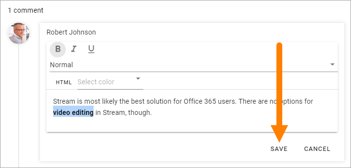

Participate in discussions
===========================

You participate in a discussion by adding comments.

1. Open the discussion.
2. Click in the comment field, type your comment and click "POST".

.. image:: discussion-comment-1.png

Note the formatting options.

You can always edit your own comments, like this:

3. Click the pen and select "Edit".

.. image:: discussion-comment-2.png

4. Edit the comment and save.

Comment another comment
*************************
You can also comment any comment, this way:

1. click "Reply".

.. image:: discusson-comment-4.png

2. Type your reply and click "POST".

.. image:: discussion-comment-5.png

You can add a reply for the reply and continue that way.

You can edit your own replies the same way as with comments, see above.

Using mentions
***************
In the discussion comments you can use mentions to make a colleauge aware of a discussion or send a question. The colleague is notified through email.

A mention is the @ sign and the colleagues name or email address. Here are two examples:

.. image:: discussion-comment-6.png

You can also like, share and tag a comment as Best reply, see: :doc:`Like, Share and Best reply for discussions </using-communities/discussions/like-share-bestreply/index>`
