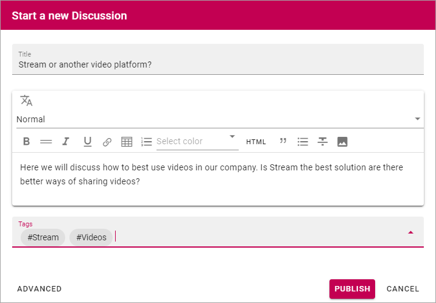

Start a discussion
======================

A community can be set up several ways. In the default setup any collegue can start a discussion. Here's how:

1. Click "START A DISCUSSION".

.. image:: start-discussion-new.png

2. Add the following about the discussion:

.. image:: start-discussion-settings.png

+ **Title**: Add a title (name) for the discussion.
+ **(Text field)**: Use the text field to describe what will be discussed here. Note that you can use some formatting and may even be able to add links and images in the description.
+ **Tags**: You can tag the discussion with existing tags, or create new tags, for example for subscription. Note that tags are "global". A new tag will be available in all knowledge articles and discussions in the community.

3. Click "PUBLISH" to create the discussion.

