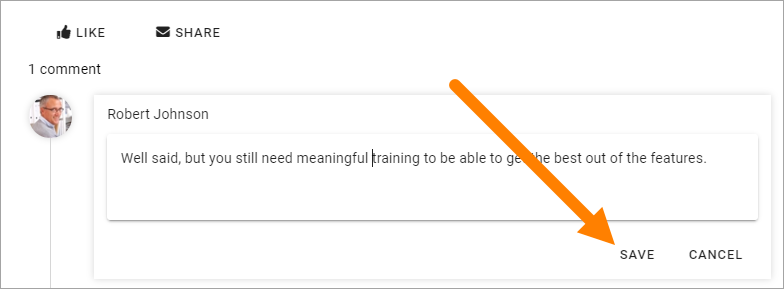
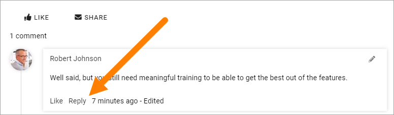

Comment a knowledge article
=============================

Comments can be activated or not for a knowledge article. The colleague creating the article sets that. If activated, you can comment any knowledge article you can read. You can even comment a comment. Here's how:

1. Open the knowledge article.
2. Click in the comment field, type your comment and click "POST".

.. image:: knowledge-comment-1.png

You can always edit your own comments, like this:

3. Click the pen and select edit.

.. image:: knowledge-comment-2.png

4. Edit the comment and save.

Comment another comment
*************************
You can even comment any comment, this way:

1. click "Reply".

2. Type you reply and click POST.

.. image:: knowledge-comment-5.png

You can add a reply for the reply and continue that way.

You can edit you your own replies the same way as with comments, see above.
