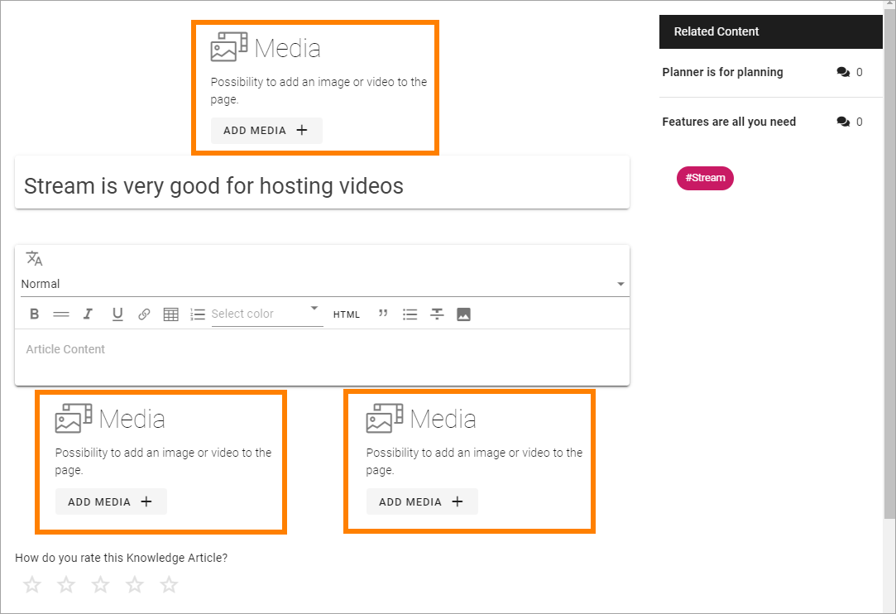
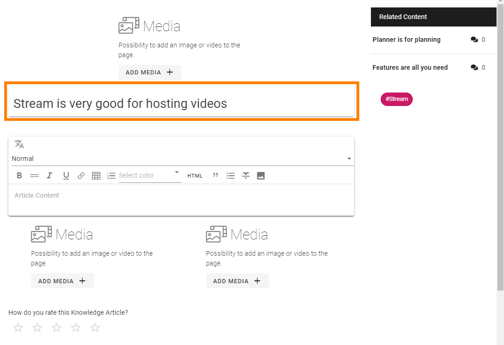
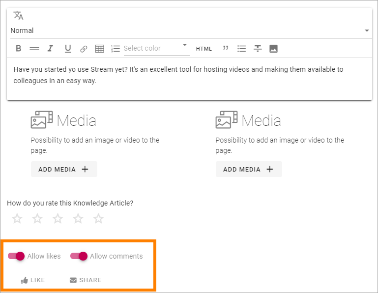
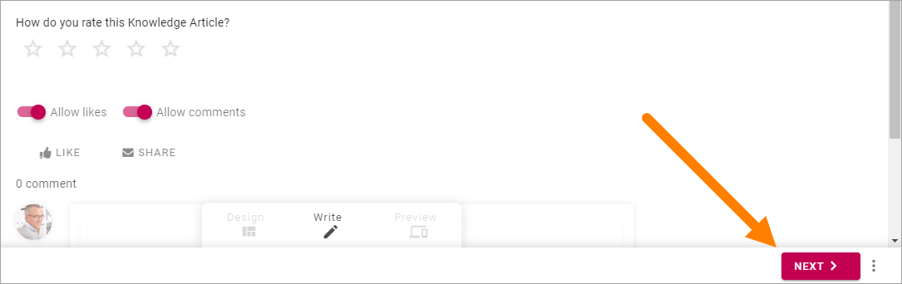
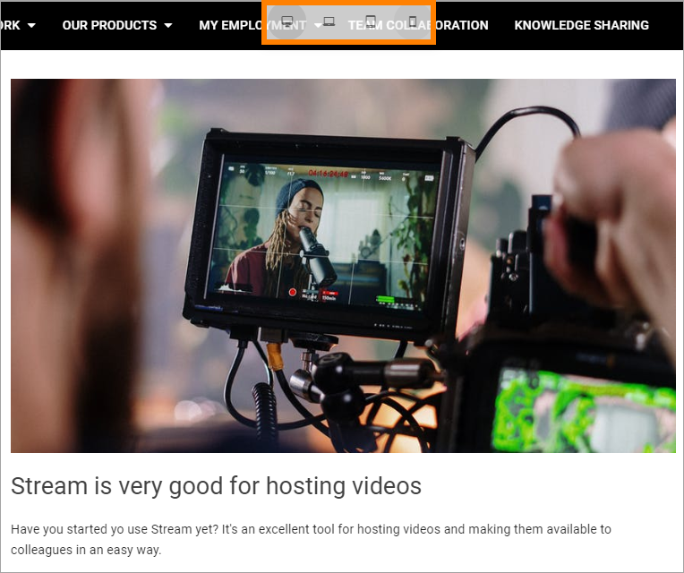

Create a knowledge article
============================

Communities can be set up in several ways but in the default setup, all users of the tenant can create and edit knowledge articles. The same permissions apply as for authors of publishing pages, meaning all options in Write mode are available.

To create a knowledge article in a community, do the following:

1. Click "CREATE ARTICLE".

.. image:: create-article-1.png

2. Type a title for the article. The title will be used for the name of the page, for example shown on the start page for knowledge articles, and as the heading for the page. You can edit the title later if needed.

As the knowledge article actually is a page, an Url is automatically created.

.. image:: create-article-2.png

3. You can also tag the article, for example for subscriptions. You can add one or more existing tags from the list, or type a new tag in the field.

.. image:: create-article-3.png

When you create a new tag, it becomes available for tagging in all communities in the tenant.

4. Click "CREATE".

.. image:: create-article-4.png

5. The next step is to add content to the page.

What you actually can add depends on the template. Here's a common one:

.. image:: create-article-5.png

6. To add an image or a video, click ADD MEDIA in one of those areas.

The media picker starts and you use it this way: :doc:`The media picker </general-assets/media-picker/index>`

You never have to add media if you don't want to, and the same goes for other blocks in the template - if you don't add media or text in a block, the block is not shown for readers.

7. You can edit the heading if it should not be the same as the page name.

Just click in the field to edit.

8. To add content to a text field, click in the field and start typing.

.. image:: create-article-8.png

Note that a number of options for formatting are available (which can differ from what is shown in the image above). It can also be possible to add links to the text (the link icon) or even to add images or videos to the text (the image icon).

9. At the bottom of the page you can decide if you allow likes and comments for the page, which you normally should do (meaning no changes are needed).

Other areas that may be available, as Ratings and Related content, that are part of the template we use here; you should not do anything with them (or you even may not). They are there to be displayed for readers.

When you're done adding content:

10: Click "NEXT".

Here you can add the page's properties. There can be more properties here depending on how the template is set up, but these two will most likely always be available:

.. image:: create-article-11.png

11. Add or remove tags in the top field, and edit the page title if needed.

12. When you're done here, click NEXT in the low right corner.

As the last step before publishing the knowledge page, you can preview it to see how it will look for readers.

.. image:: create-article-12.png

13. Use the icons at the top to preview the page in different sizes. 

Here's an example with a preview for mobile phone:

.. image:: create-article-14.png

14. If you want to edit anything before publishing, click Write here:

.. image:: create-article-15.png

15. To publish the knowledge article, click PUBLISH.

.. image:: create-article-16.png

This is a simple walk through on how to create a knowledge article. Knowledge articles are Omnia pages and therefore have the same author options (Write mode) as other pages.

Concerning all options for publishing (for example information on how to schedule publishing, if that is available), see: :doc:`Publish page changes </pages/publish-page-changes/index>`

