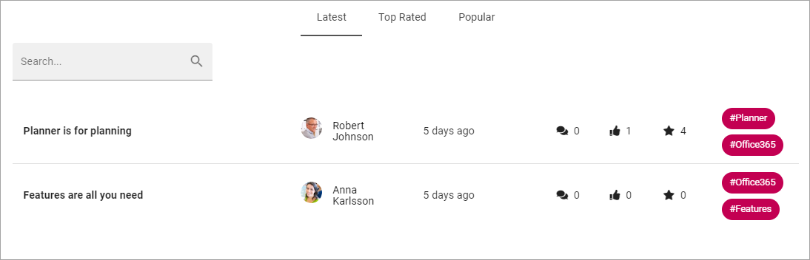
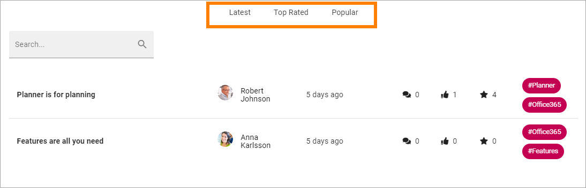
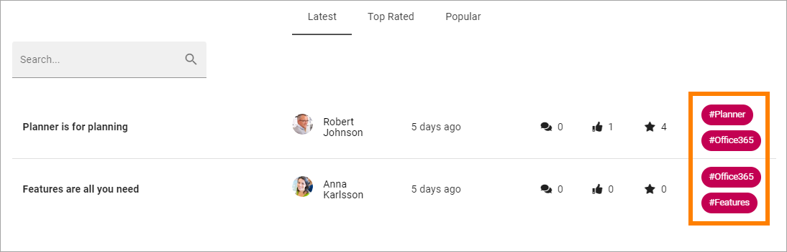
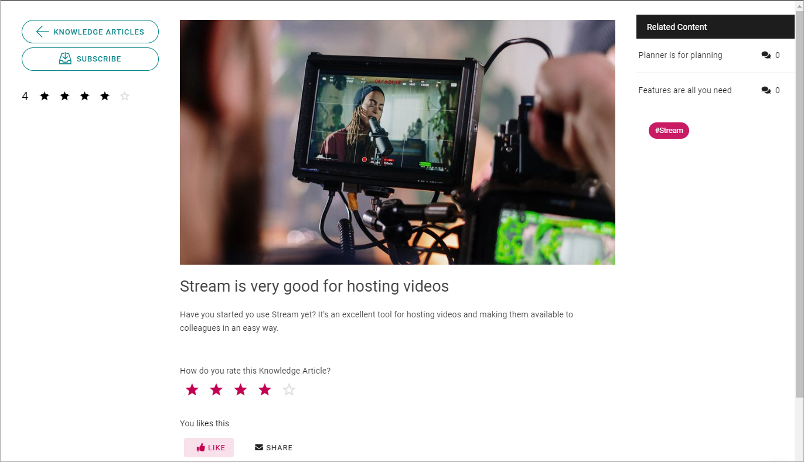

Read Knowledge articles
============================================

A community can be set up several ways but in the default setup all coleagues can read all knowledge articles in all communities in the tenant.

A start page for Knowledge articles can look like this:

All knowledge articles created in this community are listed. The list can be sorted on Latest, Top Rated or Popular. You can also search for articles.

Top rated is when colleagues use the stars to rate an article. Each article has an average rating, and that is used for this list. Popular counts the number of likes for each article.

Also note that the number of comments, likes and rating is shown for every article, here:

.. image:: knowledge-start-notes.png

The words to the right display the tags for the articles. 

You can click a tag to subscribe to all knowledge articles.

**Note!** Tags are global, so when you subscribe to a tag, you subscribe to that tag in knowledge articles and discussions in ALL active communities in the tenant.

To go to a knowledge article, to read it or to comment (or both), click the link (the name).

Here's an example of a Knowledge article:

For more information about a colleague, for example contact information, click the name. The User Profile Card will then open, if it's used within your organization. If it's not, the colleague's Delve page will be displayed.

