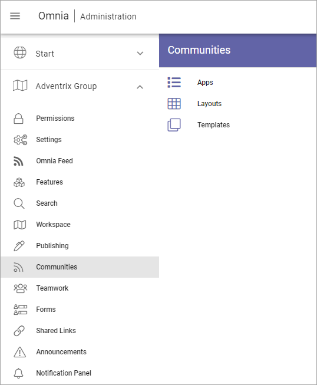
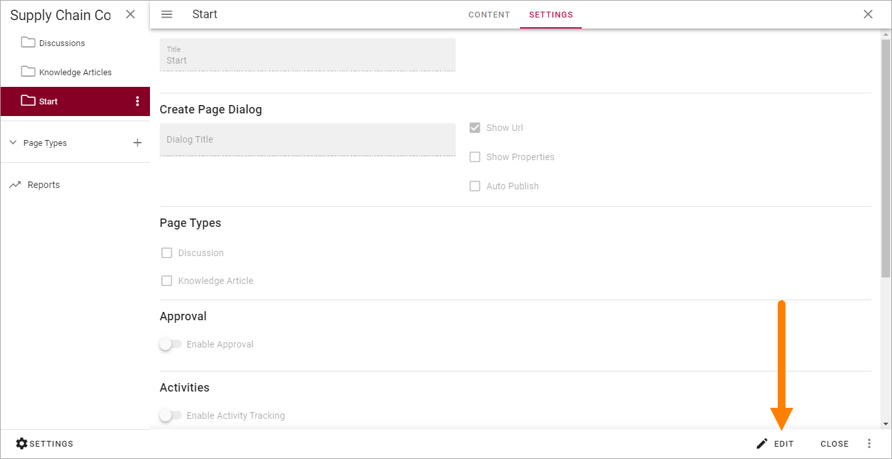
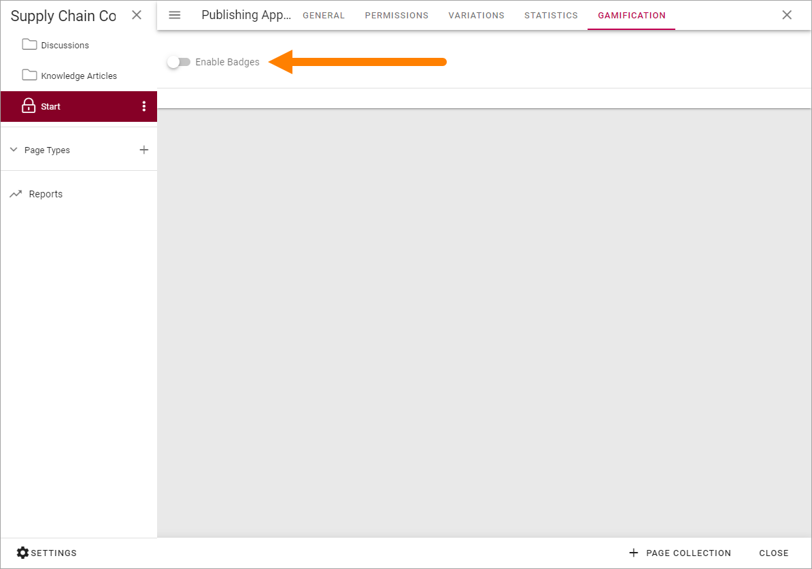
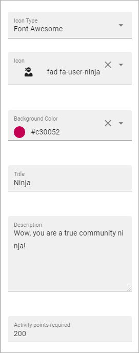

Setting up a community
========================

Setting up a community is pretty straight forward. You need to be either Tenant Administrator or Business Profile Administrator for the business profile where the community should be available.

You also need to have page editor permissions to a suitable page to set upp access to the community.

Creating a community
**********************
Do the following to create a community:

1. Go to Omnia Admin.
2. Open "Communities" in the Business Profile settings.

3. Create at least one template, as describe here: :doc:`Templates for Communities </admin-settings/business-group-settings/communities/communities-65/templates/index>`. 
4. Create a Community Site according to the description on this page: :doc:`Communities Apps </admin-settings/business-group-settings/communities/communities-65/apps/index>`
5. When the site has been created, you can use the link (Title) in Communities to go to the site. (To get the Url, you can also right click on the Title and copy the link address).
6. Setup access to the community some way, using the Url. (More information about that below.)

Setting up access to communities
**********************************
You set up access using the options available in Omnia. Here's an example using banners for access to the various communities available:

.. image:: communities-acccess-example.png

(MY SUBSCRIPTIONS is an action button in this example.)

This is just an example for inspiration. Access to communities can be set up many other ways in Omnia.

Settings for the Community
*****************************
After the community has been created there are some settings you may want to do.

Settings for Activity Points
-------------------------------
You can select to award activity points for certain actions. When activity points is active, you can also choose to use badges, see below.

Activity points are counted within the page collection.

To enable Activity Points, do the following:

1. Go to the Community and edit the start page.

.. image:: community-page-edit.png

2. Click "Edit".

3. Select "Settings", if it doesn't open automatically.

.. image:: community-page-edit-settings.png

4. Click "Enable Activity Tracking". and "Enable Activity Points". 

.. image:: community-page-edit-activity.png

5. Set the points that should be awarded to a user when creating a page (Knowledge page or Discussion page), updating a page etc.

.. image:: community-page-edit-activity-points.png

6. Publish the page.

.. image:: community-page-edit-publish-new.png

Using badges
--------------------
You can choose to award badges to users for reaching certain activity points levels. You must have activated activity points to be able to use badges.

Activity points for badges are counted within the Publishing App.

To activate and create badges, do the following:

1. Go to the Community and edit the start page.
2. Click "Edit".

3. Open the page navigation, if it doesn't open automatically.

.. image:: badges-navigation.png

4. Click "Settings".  

.. image:: badges-settings.png

5. Click "Gamification".

.. image:: badges-gamification.png

6. Click "Enable Badges".

7. Click the plus to create a badge.

.. image:: badges-badges-plus.png

8. Edit the settings for the badge.

.. image:: badges-badges-settings.png

+ **Icon Type**: Select an icon type for the badge.
+ **Icon**: if you selected "Font Awesome", "Microsoft" or "Flags", use the list to select an icon.
+ **ADD ICON**: If you selected "Custom" above you can use any image as the icon. Click ADD ICON and use the Media Picker to select an image. When you have added an image it's shown here and you can edit it or remove it.
+ **Background Color**: You can add a background color for the icon if you wish.
+ **Title**: Add a Title (name) for the badge here.
+ **Description**: You can also type a description if you wish.
+ **Activity Points Required**: Set the number of activitye points required to acquire this badge.

9. Click the tick to save the badge.

Here's an example of badges:

.. image:: badges-badges-example.png

The settings for the Ninja badge looks like this:

Community Page Types
**********************
Two page types are installed when a Community is created:

.. image:: communities-page-types.png

If you have Page Collection permissions you can edit these Page Types to your needs, the same way as you can edit any other Page Type, see: :doc:`Page Types </pages/page-types/index>`

