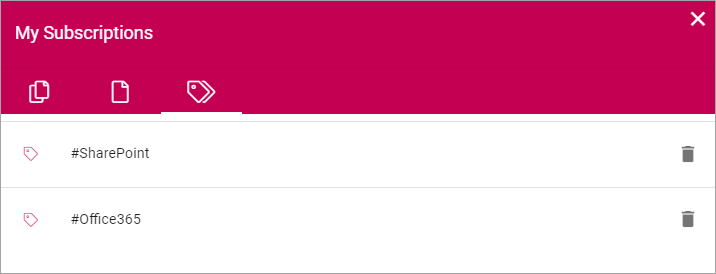

My Subscriptions
==================

Use My subscriptions for an overview of your subscriptions. You can unsubscribe using this as well.

My descriptions can be available in more than one way, for example in the "My Profile" menu.

.. image:: my-profile-menu-1.png

.. image:: my-profile-menu-2.png

Here's an example:

.. image:: my-subscriptions-1.png

The left tab (show in the image above) lists all communities you subscribe to - meaning you subscribe to ALL activities in that community. 

The middle tab lists all knowledge articles and discussion you subscribe to, for example:

.. image:: my-subscriptions-2.png

You can click the title to go to the page or discussion.

The tab to the right displays a list of all tags you subscribe to, for example:

You can unsubscribe to any subscription by clicking the dust bin.

In Omnia 6.7 and later, it will be possible to subscribe to channels, if any are setup. Then a fourth tab will be available:

.. image:: my-subscriptions-67.png

To add a channel, select the tab and click ADD CHANNEL.

.. image:: my-subscriptions-67-add.png

Available channels are shown, for example:

.. image:: my-subscriptions-67-channels.png

Click ADD to add a channel. In the list of selected channels you can click the dust bin if you no longer want to subscribe to that channel.

