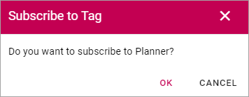

How to subscribe in a community
====================================

You can subscribe on all levels of a community.

You can subscribe to all activities in the community, all knowledge articles and all discussions in a community.

Subscribe to a knowledge article or a discussion
**************************************************
To subscribe to a knowledge article or a discussion, do the following:

1. Go to the knowledge article or discussion.
2. Click SUBSCRIBE.

.. image:: subscribe-article.png

If you already are subscribing, the option says UNSUBCRIBE instead and you can click it to unsubscribe.

.. image:: unsubscribe-article.png

Subscribe to tags
******************
Tags are global for the whole community, so if you subscribe to a tag, you subscribe to all activities in all knowledge articles and all discussions tagged that way. It can be quite a lot.

To subscribe to a tag, just click it when you see it listed to the right, as here:

.. image:: subscribe-tag.png

Then click OK here:

If you click a tag you are already subscribing to, you can choose to unsubscribe.

.. image:: unsubscribe-tag-message.png

Follow and subscribe
***********************
In a list of communities there can be a star present to indicate Follow status. If you follow a community in such a slist, by clicking the star, you also subscribe to the community automatically.
