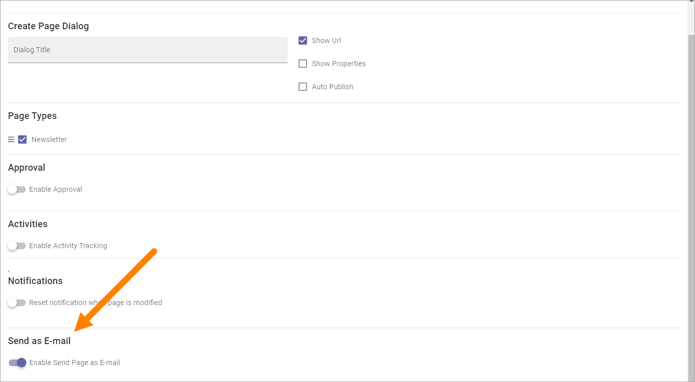
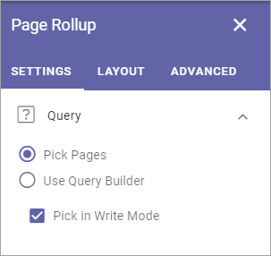
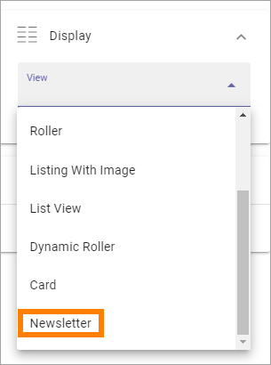

Using newsletters
===========================

There's a number of options and settings in Omnia you can use for a newsletter implementation, to send internally or externally through Email. These options and settings are described here, together with an implementation example.

For an implementation example, see this page: :doc:`Newsletter implementation example </using-newsletters/newsletter-implementation/index>`

A page type for newsletters
*****************************
You will need a page type set up for newsletters. See the implementation example for more information (see link above).

You use the options available in Omnia, see: :doc:`Page types </pages/page-types/index>`

**Important note!** When planning a page type that will be used as a base to send information in Emails, be aware that only these three blocks are supported for Email send outs:

+ Text.
+ Page rollup.
+ Media.

Other blocks can of course be used on the page itself, but will then not be present in the Emails.

Important and useful settings
******************************
To be able to send (newsletter) pages this setting must be activated for the page collection:

When this setting is active, the following tab is displayed in the page settings so newsletter editors can enter the groups/Email adresses to send to:

.. image:: page-setting-newsletter.png

In this field both groups and individual Email adresses can be entered. This tab is available for page editors, even using Write mode.

Page rollup block for newsletters
***********************************
You will need a page rollup block on the newsletter editor's page. When you set up the page rollup, pick pages and pick in Write mode are useful settings.

There's also a view called Newsletter. This view is suitable for Emailing.

More information about the page rollup block is found on this page: :doc:`The Page rollup block </blocks/page-rollup/index>`

