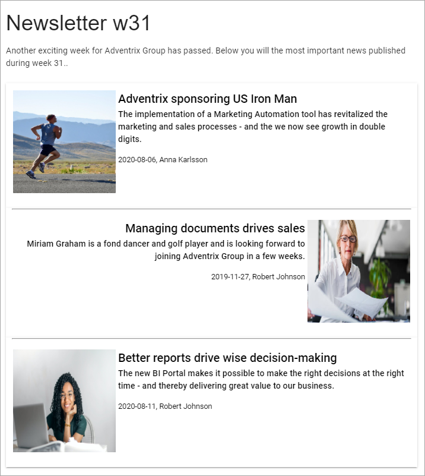

Using Newsletters
===========================

**This part of the documentation is just started. More will be added soon.**

There's a number of options and settings in Omnia you can use for a newsletter implementation, to send internally or externally through e-mail. These options and settings will be listed here.

Important setting
*******************
To be able to send (Newsletter) pages this setting must be activated for the Page Collection:

.. image:: newsletter-page-collection-setting.png

When that setting is active, the following tab is displayed in the page settings:

.. image:: page-setting-newsletter.png

In this field both groups and individual e-mail adresses can be entered. This tab is available for Page Editors using Write mode.

Implementation example
************************
Here's a Newsletter implementation example. First an example of a newsletter archive:

.. image:: newsletter-archive.png

The Page Type is set up with three blocks: a Text block for the heading, an Action Button block for the newsletter editor to use when creating a newslettter page, and finally a Page Rollup block to display the newsletter pages.

The Action Button has the following General settings:

.. image:: newsletter-archive-button-settings-1.png

And the following Style settings:

.. image:: newsletter-archive-button-style-1.png
.. image:: newsletter-archive-button-style-2.png

The Page Rollup block has the following settings for Query:

.. image:: newsletter-archive-page-query.png

There are no settings for Social Period. The settings for Display are the following:

.. image:: newsletter-archive-page-display-1.png
.. image:: newsletter-archive-page-display-2.png

There are no Filter settings. For Page Variations, this setting is made:

.. image:: newsletter-archive-page-variations.png

When a Newsletter Editor creates a newsletter he or she picks the News pages to be sent in the newsletter. Here's an example of a newsletter:

 
