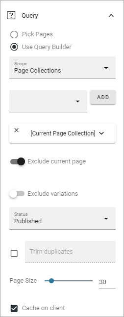
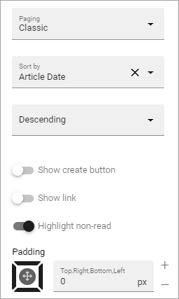
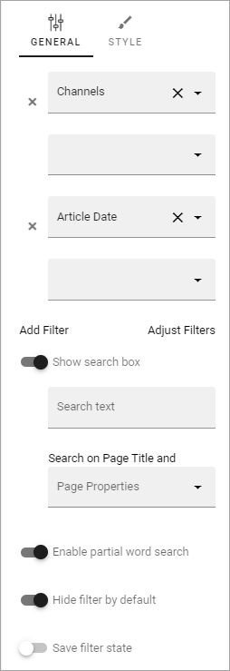
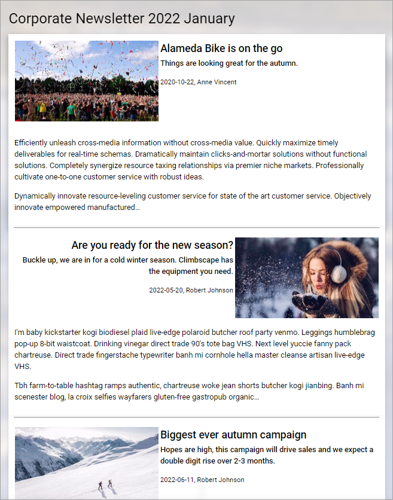

Newsletter implementation example
==============================================

**This page is being updated. Will be finished soon.**

Implementation example
************************
Here's a Newsletter implementation example. First an example of a newsletter archive:

.. image:: newsletter-archive-new.png

The Page Type is set up with three blocks: a Text block for the heading, an Action Button block for the newsletter editor to use when creating a newslettter page, and finally a Page Rollup block to list the newsletter pages. The same Page type is used when en editor creates a newsletter, but then works slightly differently.

The Action Button has the following General settings:

.. image:: newsletter-archive-button-settings-1-new.png

And the following Style settings:

.. image:: newsletter-archive-button-style-1-new-frame.png

The Page Rollup block has the following settings for Query:

The settings for Display are the following:

.. image:: newsletter-archive-page-display-1-new.png

and these:

Regarding the filter settings, the following is set:

No settings are made for Time Period.

Newsletters from the editor's point of view
----------------------------------------------
When a Newsletter Editor creates a newsletter, the first step is to create a new page for the newsletter, in this example by clicking the button CREATE NEWSLETTER, as seen in the image above:

.. image:: cerate-newsletter-1-new.png

The new page can look something like this:

.. image:: create-newsletter-2-new

The editor can now use the blocks set up on the Page Type, in Write mode, or in Design mode. In this implementation example, a text block for the newsletter heading and another text block for the newsletter text is available, as well as a Page Rollup block (that's "Pick Pages".)

He or she enters some text for the newsletter, and picks the News pages to be sent in the newsletter, for example:

.. image:: newsletter-editor-page-picking.png

More information about how to use the Page Picker is found here: :doc:`The Page Picker </general-assets/page-picker/index>`

If it's set up that way, some edits to properties may be needed, and the email recipients must be added, everything available through Write mode and Design mode. The editor just clicks NEXT to cycle through the steps.

.. image:: create-newsletter-3-new.png

When it's time to publish and send, the editor can preview the newsletter before publishing. The editor can also send the newsletter to someone for a last check before sending to the recipients.

.. image:: newsletter-editor-send.png

When all is done, the editor then publishes to send the newsletter. If needed, the newsletter can be saved as a draft, as all other pages, and sent later. If Scheduled Publishing is set up, it can be used for newsletters as well.

You can find more information about publishing a page here: :doc:`Publish Page Changes </pages/publish-page-changes/index>`

Here's an example of a newsletter:

