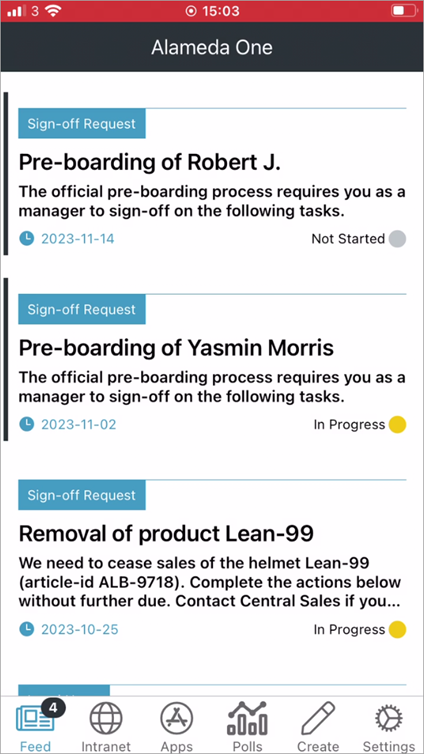
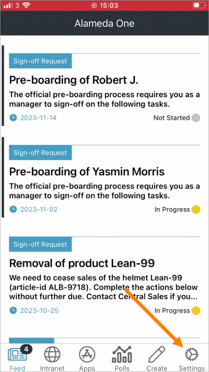
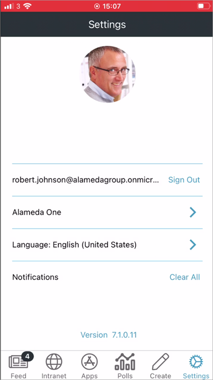
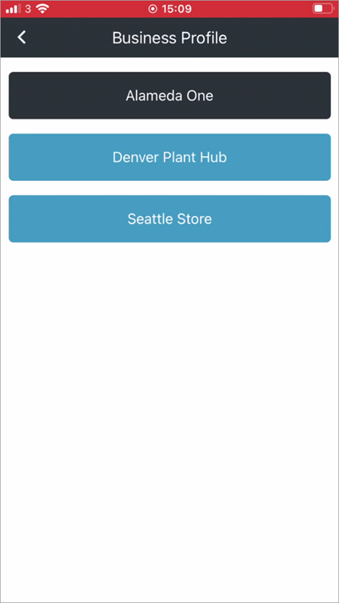
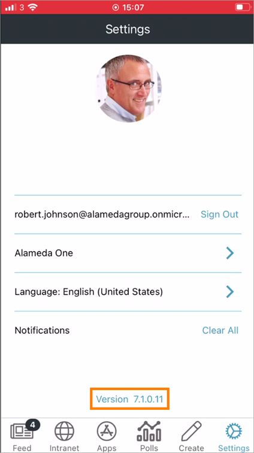
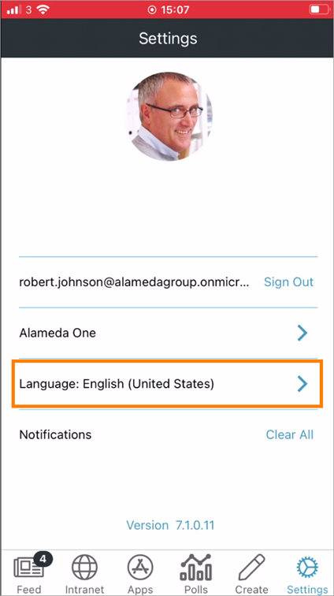
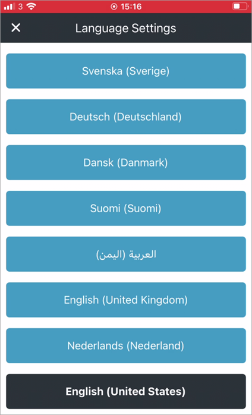
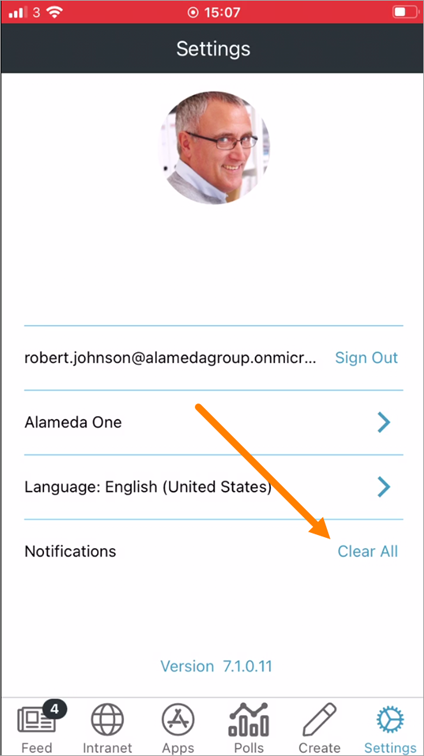

Using Omnia Feed
===================

With Omnia Feed users can stay connected to the organization's Omnia intranet wherever they are. 

Omnia Feed can be set up in many different ways to make it possible for users to read information from their organization's intranet, on their mobile device. A good example is news, but it can be any page(s) really, and anything that can be accessed by a link. 

Here's an example:

Any number of tabs can be set up for access to different resources. A tab can be set up for:

+ A rollup (similar to a Page rollup) to list news or other pages. Sign-off requests can be shown here as well.
+ An embedded link, which can be used to show the home page of an Omnia intranet, or to show some specific Omnia functionality - for example My links or My tasks.
+ A link, which can be used for a link to any web URL or a link to another app on the user's device.
+ An acitivity Feed, which can be the user's "My subscriptions" or a feed from a page collection.

Settings are found in Omnia admin. There are settings for the tenant, mainly used by AM and the Omnia Feed team to set up the tenant, and then settings for each business profile, where for example the tabs are set up. See this page for more information: :doc:`Omnia Feed - business profile settings </admin-settings/business-group-settings/omnia-feed/index>`

For an implementation example, see this page: :doc:`Omnia Feed - implementation example </using-omnia-feed/omnia-feed-implemenation-example/index>`

The Omnia Feed app
*******************
The Omnia Feed app can be downloaded from the usual sources, for example App Store for iPhone.  

Regardless of how Omnia Feed is set up, using settings, a user can log out and select another business profile, if available.

Regarding the feed, note that sign-off requests, that needs actions from you, can be part of the feed.

App settings
---------------
The settings are available here:

Available settings are the following:

Logging out is simply done by selecting "Sign out".

To select another business profile (if available), select the active business profile and choose another one on this page:

Also note that the app version is displayed here:

Select another language
--------------------------
When you start the app for the first time you are most likely able to select language. When using the app you can always change language in the settings:

All languages set up in the tenant are available, for example:

Clearing all notifications
---------------------------
All notifications that are pushed to your device are stored there. If you don't want to save them for later, they can be deleted from the device. They will still be available through the intranet the usual way.

Microsoft Authenticator or similar
---------------------------------------------
If your organization is using Microsoft Authenticator, a company portal, or similar, Omnia Feed will request permission to access the contacts list. This is required for the Omnia app to work with Microsoft Authenticator and similar solutions.

Important note about logged in status
--------------------------------------
If the user chooses to log out, the user will no longer receive push notificatons until logged in again.

If the user is being logged out automically due to an organization policy or similar, the user still receives push notifications for three weeks. After that, the user must log in to continue receiving push notifications.

