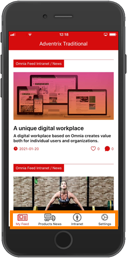
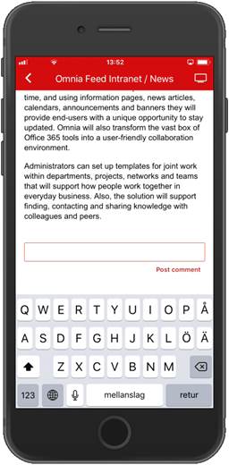
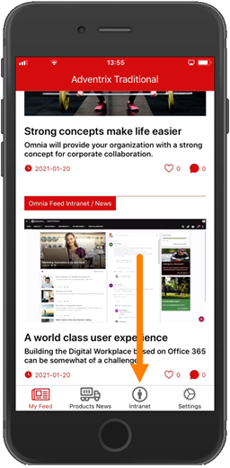

Omnia Feed implementation example
==============================================

In this example:

My Feed and Product News are two different Page Rollups.

When reading news, users can see likes and comments for each News Article. 

.. image:: omnia-feed-likes-new.png

A user can like a News Article by selecting the hearth. To add a comment, the user scrolls down to the end of the article.

In this implementation example, there's also a link to the start page of the Omnia Intranet. It may need an additional login:

