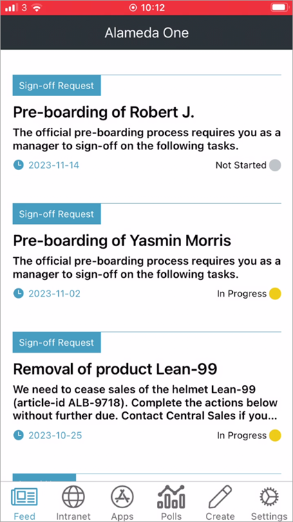
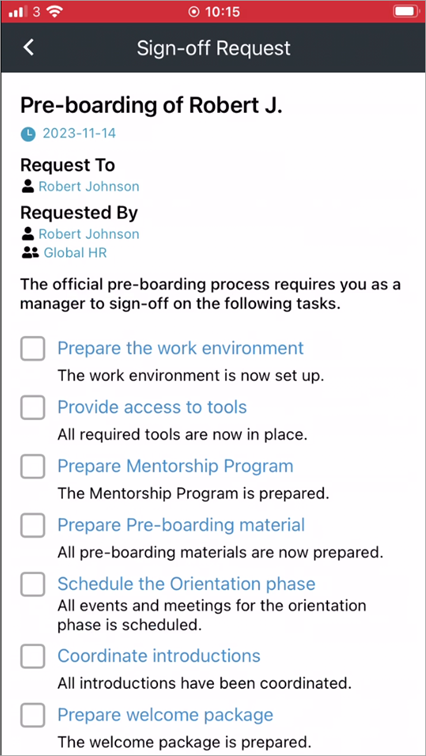
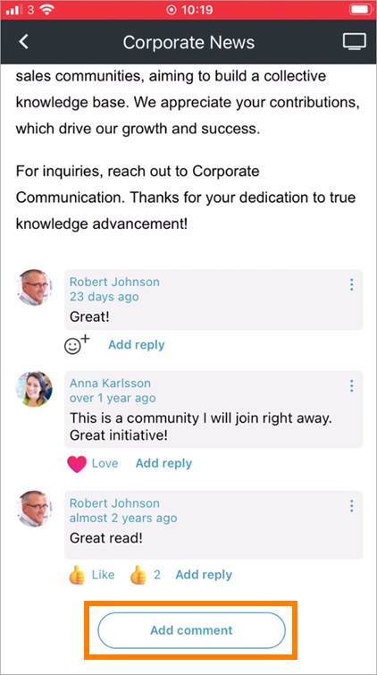
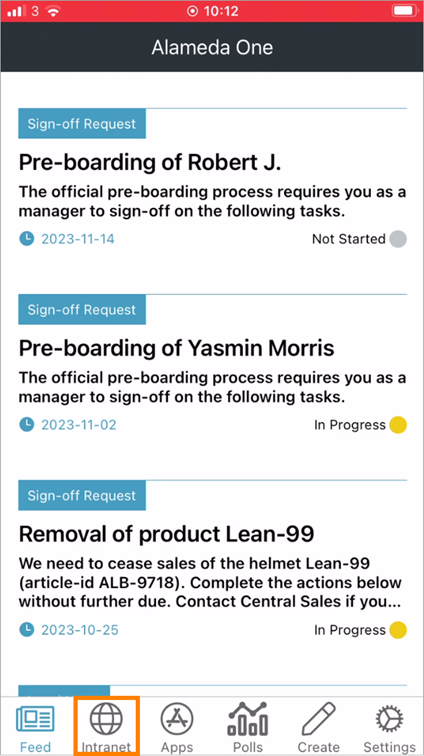
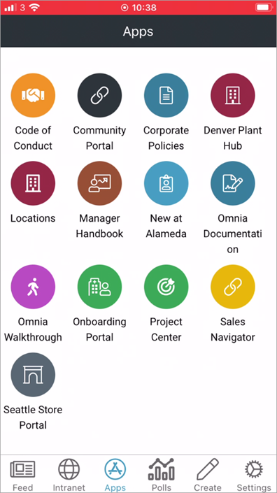
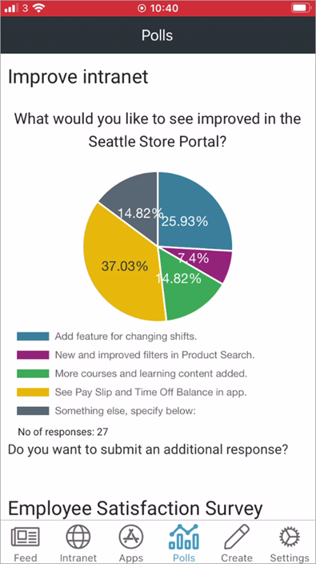
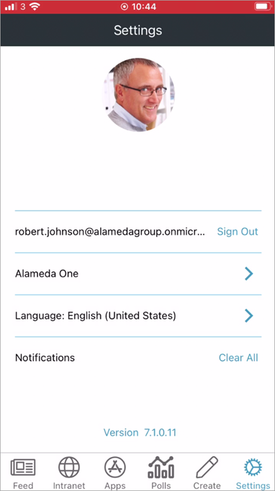

Omnia Feed implementation example
==============================================

**This page is being update. Will be finished soon.**

In this example:

"Feed" is a Query (Rollup) containing corporate news and local news, with sign-off request applicable for the user, also shown.

At the top there are a number of Sign-off requests that needs the user's attention. Here's an example with the actions needed for one of the sign-off requests:

When reading news, users can see likes and comments for each News Article. 

A user can like a news article by selecting the hearth. To add a comment, the user scrolls down to the end of the article.

In this implementation example, there's also a link to the start page of the Omnia Intranet. It may need an additional login:

The third icon from the left displays available apps for the user:

The next icon displays som polls for the user:

The "Create" icon makes it possible for the user to create news, an alert, a poll or a praise, if the user har the right permissions.

.. image:: omnia-feed-create.png

There's alos a number og settings for the user, that's default fo all setups.

