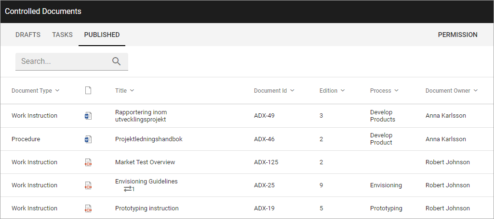

Authoring Controlled Documents
=================================

This section is for Authors of Controlled Documents. The work always take place in a Controlled Documents Library in i Team Site. Who is allowed to author and approve (if approval is needed) is set up in Omnia Admin under Document Management.

When a Team Site has been set up for Controlled Documents authoring, the following will be available for Controlled Document authors:

+ A documents library (Controlled Documents) that only users defined in the author’s permission group can work with.
+ A Send for Comments Workflow.
+ A Publish Workflow.
+ A Tasks list.
+ Workflow History.
+ Document History for drafts.
+ Document History for the published editions.
+ Options for relating to other documents.
+ Options for relating to QMS Processes (if Omnia QMS is activated).
+ Options for creating a new draft from a published document.
+ Options for unpublishing a published document.

In a Team Site set up for Controlled Documents authoring a library, usually called just "Controlled Documents", is available here:

.. image:: controlled-documents.png

In the Controlled Documents library, authors can find three tabs:

"Drafts" is used when creating and editing drafts for new Controlled Documents or when updating an existing document for a new edition. Note that there are several options available for creating a new draft document, see below.

"Tasks" is a list of tasks for the documents – either for review or for publication – both active and finished.

When a document is published (approved for publication) it is removed from Drafts and is available on the "Published" tab. Here the options for creating a new draft, unpublishing and Document History are available.

Most headings can be used to sort the list.

Select section for more information:

.. toctree::
   :titlesonly:

   working-with-drafts/index
   working-with-published-documents/index
   working-with-tasks/index
   send-for-comments/index
   publish-approval-workflow/index
   
